# 数据库镜像

## 参考

* [官方文档](https://www.mysqlzh.com/doc/51.html)
* [博客](http://www.pythontip.com/bigdata/post/18628)
* [同步原理](https://segmentfault.com/a/1190000008663001)

## 1、建立备份账户

~~~mysql
GRANT ALL PRIVILEGES ON *.* TO 'backup'@'localhost' IDENTIFIED BY 'koanruler' WITH GRANT OPTION;
~~~

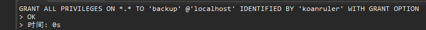

## 2、备份数据库

​		这期间不允许“主数据库”的任何写操作。防止数据不同步。

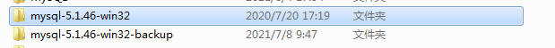

## 3、修改配置表

**主数据库**

​		采用默认配置

		 #server-id=1
		 #log-bin=c:\mysql\log-bin.log 

**备用数据库**

~~~mysql
[mysqld]
server-id	= 2
master-host=localhost
master-user=backup
master-password=koanruler
replicate-do-db=backup
~~~

## 4、重启服务器

~~~powershell
net start MySQL5;
net start MySQL50;
~~~

## 5、结果

果然，没这么好的事情，哪有一次成功的。

​		修改A服务器中的数据，发现B中并没有修改。5为主服务器，50为备用服务器

主服务器中：

备用服务器：

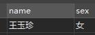

## 6、继续改进

查看从数据库错误日志

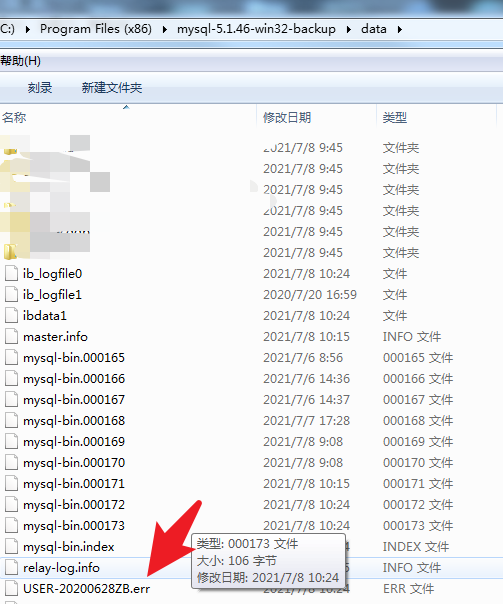

显示错误

~~~tex
210708 10:24:28 [ERROR] Slave I/O: error connecting to master 'backup@localhost:3306' - retry-time: 60  retries: 86400, Error_code: 1045
~~~

### 查询Error Code

​		问度娘了，权限错误。看半天也看不到，算了，问谷哥咯，CV工程师上线

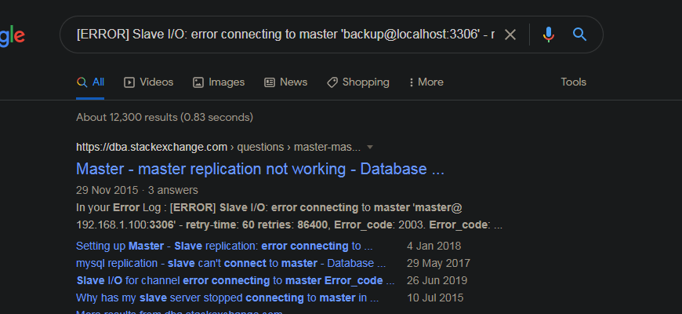

### **查看主数据库登陆表 **

~~~mysql
SELECT USER,HOST,PASSWORD FROM mysql.USER;
~~~

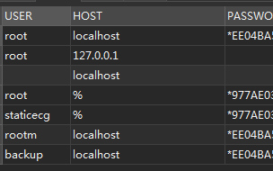

就是你咯

这个说：`localhost`这个 `IP` 的朋友能够使用 一个叫 `backup`的账户登录。

### 查看账户权限

~~~mysql
SHOW GRANTS FOR 'backup'@'localhost';
~~~

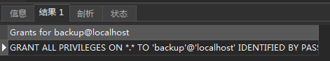

咦，“西红柿”！！！！所有权限都可以啊？？？？咋回事，不按套路出牌啊~

慢！！！！！！！！！！！！！！！！！！！！！！！！！！！！！！！！！！！！！！！！！

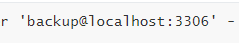这什么玩意，兄弟，你连3307啊，跑3306去干哈

**配置文件**的锅咯，重新修改配置文件

**从数据库**

~~~ini
# Replication Master Server (default)
# binary logging is required for replication
log-bin=mysql-bin
relay-log=KoanRuler-relay-bin
binlog-do-db= #your database#
auto_increment_offset = 2 			# 这里是为了双向写入 # 2号数据库从2开始， # 三号服务器设置3   这样就不重复
auto_increment_increment = 2		# 数据库自增量，目前两个服务器，所以自增设置 2 ，如果三个服务器设置3合适
# required unique id between 2 and 2^32 - 1
# (and different from the master)
# defaults to 2 if master-host is set
# but will not function as a slave if omitted
server-id       = 2
# The replication master for this slave - required
#master-host     =   <hostname>
master-host = localhost
# The username the slave will use for authentication when connecting
# to the master - required
#master-user     =   <username>
master-user = backup
#
# The password the slave will authenticate with when connecting to
# the master - required
#master-password =   <password>
master-password = koanruler
#
# The port the master is listening on.
# optional - defaults to 3307
#master-port     =  <port>
master-port     =  3307
~~~

如果需要双向，那么

**主数据库**需要进行同样的配置，就是反过来的意思  现在 B是主服务器，A是从服务器了。

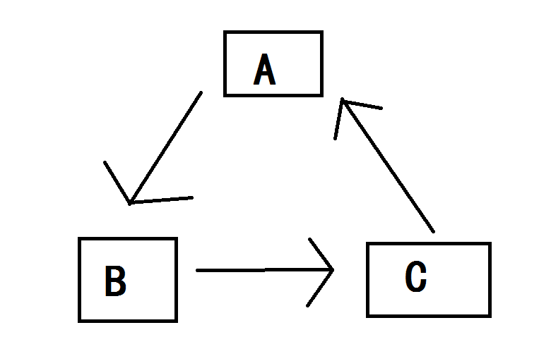

像上面一样，A指向B，B指向C，C指向A，一个循环指向。配置表中

修改完成，继续测试。

还是错误，这里忘截图了、、、、干。。。

**配置再次查看**

主服务器查看配置

~~~mysql
SHOW SLAVE STATUS;
~~~

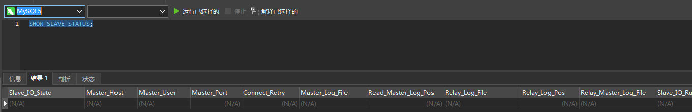

没有任何东西，正常，因为，没配置主服务器。

从服务器查看配置

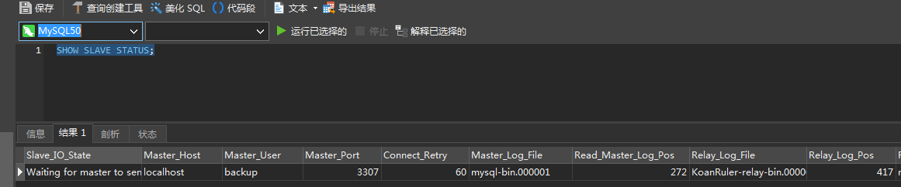

配置，端口3307，正常。

### 查看同步原理

#### 官网

每个从服务器从主服务器接收主服务器已经记录到其二进制日志的保存的更新，以便从服务器可以对其数据拷贝执行相同的更新。

认识到二进制日志只是一个从启用二进制日志的固定时间点开始的记录*非常*重要。任何设置的从服务器需要主服务器上的*在主服务器上启用二进制日志时的*数据库拷贝。如果启动从服务器时，其数据库与主服务器上的启动二进制日志时的状态不相同，从服务器很可能失败。

将主服务器的数据拷贝到从服务器的一个途径是使用LOAD DATA FROM MASTER语句。请注意LOAD DATA FROM MASTER目前只在所有表使用MyISAM存储引擎的主服务器上工作。并且，该语句将获得全局读锁定，因此当表正复制到从服务器上时，不可能在主服务器上进行更新。当我们执行表的无锁热备份时，则不再需要全局读锁定。

由于这些限制，我们建议只有主服务器上的数据集相对较小，或者主服务器上延迟读锁定已经被接受，才可以使用LOAD DATA FROM MASTER。而LOAD DATA FROM MASTER的实际速度随系统的不同而不同，对于执行时间，最好的规则是每1MB的数据用1秒钟。这是一个粗略的估计，但你会发现如果主服务器和从服务器的性能上等价于700MHz Pentium CPU，通过100Mbps的网络进行连接，则该估计相当准确。

从服务器设置为复制主服务器的数据后，它连接主服务器并等待更新过程。如果主服务器失败，或者从服务器失去与主服务器之间的连接，从服务器保持定期尝试连接，直到它能够继续帧听更新。由--master-connect-retry选项控制重试间隔。 默认为60秒。

每个从服务器跟踪复制时间。主服务器不知道有多少个从服务器或在某一时刻有哪些被更新了。

在master机器上，主从同步事件会被写到特殊的log文件中(binary-log);

在slave机器上，slave读取主从同步事件，并根据读取的事件变化，在slave库上做相应的更改。 

是通过 log 的变化，来加入同步。

找到一张图

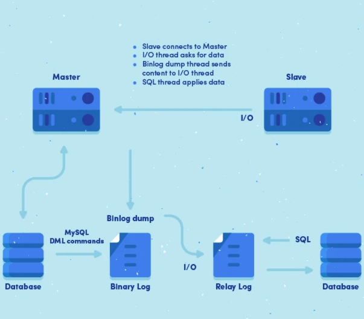

就是说，通过日志的变化来同步！！！！！！！！！！！

写到这里，我Tom喵就Tom喵了。

我第一步直接复制的数据库啊，里面很多日志啊，删除日志试试。

啊啊啊啊啊啊啊啊啊啊啊啊啊啊啊啊啊啊啊啊啊啊啊啊啊！！！！！！！！！

年轻的我，躁动的心！

可以了~

完~

~

