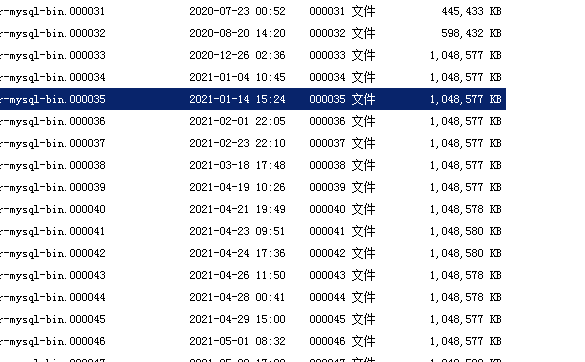
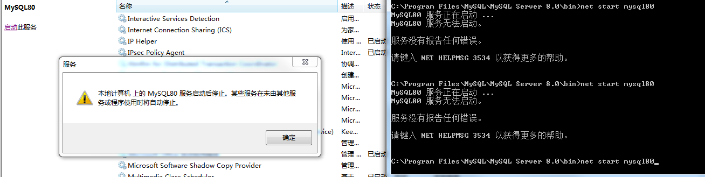
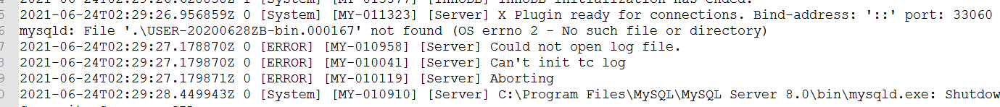

# MySQL binlog

## 起因

​	最近服务器老是出问题，客户端反映数据穿不上来。后来，查看服务器，我去，硬盘爆满，而且最近经常出现这种状况，今天有空了，认真来研究了一下到底是什么原因，后来查到，是 `MySQL binlog` 过多，硬盘数据急剧暴增，导致服务器硬盘被拉爆了。干~~~

## 分析

​		除开重启外，日志暴增的时间节点是在 20210419 前后，之前，每一个月，或者半个月，数据量大的时候可能几天，但也没有出现每天 `1G` 的日志这种情况，回想那天更改的内容，应该是修改了触发器，因为之前设计表的时候未设计好，导致其中三个表需要依靠中间的一个表来过渡，因此，会有大量 `updata` 的过程。所以，问题的主要根源还是锁定在触发器上。

> **`MySQL binlog 简介`**
>
> >  官方文档参考：https://dev.mysql.com/doc/refman/5.6/en/mysqlbinlog.html
>
>  			The server's binary log consists of files containing “events” that describe **modifications** to database contents. The server writes these files in binary format. To display their contents in text format, use the [**mysqlbinlog**](https://dev.mysql.com/doc/refman/5.6/en/mysqlbinlog.html) utility. You can also use [**mysqlbinlog**](https://dev.mysql.com/doc/refman/5.6/en/mysqlbinlog.html) to display the contents of relay log files written by a replica server in a replication setup because relay logs have the same format as binary logs. The binary log and relay log are discussed further in [Section 5.4.4, “The Binary Log”](https://dev.mysql.com/doc/refman/5.6/en/binary-log.html), and [Section 17.2.2, “Relay Log and Replication Metadata Repositories”](https://dev.mysql.com/doc/refman/5.6/en/replica-logs.html). 
>
> **什么时候写binlog**
>
> ​		文档说，描述记录的修改数据库的部分。记录数据修改记录，包括创建表、数据更新等 。。

因为触发器中，`UPDATA`的部分比较多，而且频繁，因此，导致日志量多大。

## 修改方案

### 新增字段，修改触发器

​		因为现在服务器正在使用，且量现在较大，所以，先在本地测试后，等与客户端交互少一点的时候，再进行修改。

### 删除日志

​		暂时是一个行之有效的办法， 因为数据库有备份，因此，删除备份服务器之前的日志。

> 依然先测试，好家伙，打不开了。
>
> 
>
> 方法：
>
> 网站找了一大堆都不适用我这个情况。
>
> * `my.ini`以 ansi 格式保存
> *  `mysqld --initialize `
>
> 都不行，后来打开日志查看
>
> 这个文件被我删除了，我恢复后，就可以了

​	

#### 查看当前设置自动删除时间

为 0 表示不删除。

#### 重新设置自动删除时间

这个临时的修改，如果服务器重启（数据库重启），就会变成原始值 0。

永久修改：  修改配置文件 `my.ini  --> [mysqld]  --> expire_logs_days=7`

