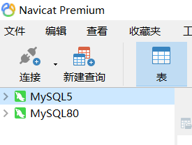

# 多版本数据库安装

记录一下安装多个版本数据库，电脑重装，就是麻烦，什么都又要重新配置，坑啊~~~~

本来已经安装一个版本的数据库`mysql`的（8.*）），但是因为需要，现在新安装一个低版本的，这样就两个数据库版本共存，安装完成后特此记录一下，以便下次快速解决。

## 下载MySQL

https://dev.mysql.com/downloads/mysql/5.7.html

我是在其他电脑上复制过来的，放在之前安装的数据库版本目录下。

## 停止其他数据库服务

~~~powershell
net stop "ServerName"
~~~

## 增加 my.ini文件

增加一个配置文件，因为之前 8.*的版本已经用了 3306端口了，所以这采用 3307端口

~~~ini
[mysqld]
port = 3307
basedir=C:\Program Files\MySQL\mysql-5.1.46-win32
datadir=C:\Program Files\MySQL\mysql-5.1.46-win32\data
max_connections=200
character-set-server=utf8
default-storage-engine=INNODB
sql_mode=NO_ENGINE_SUBSTITUTION,STRICT_TRANS_TABLES
[mysql]
default-character-set=utf8
~~~

## 初始化数据库

会自动创建一个 data 文件夹，如果失败了，手动创建一个

~~~powershell
mysqld --initialize 
~~~

## 安装服务

进入 数据库所在文件夹下的  bin 文件夹，地址栏输入`cmd` ，安装服务，这里要注意和之前的数据库服务区分

~~~powershell
mysqld -install MySQL5
~~~

## 启动服务

~~~powershell
net start MySQL5
~~~

如果启动不了，到注册列表里面改一下，`ImagePath`，

`计算机\HKEY_LOCAL_MACHINE\SYSTEM\CurrentControlSet\Services\MySQL5`

再次启动就可以了。

至此完成咯，`Navicat`打开

