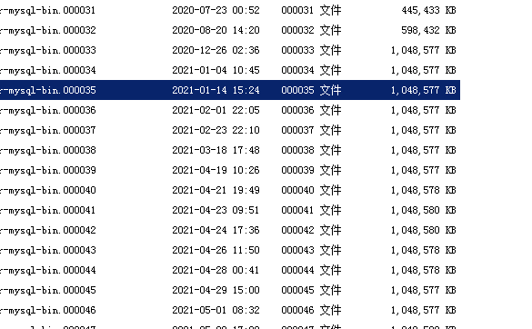

# 1449

## 描述

昨天将服务器数据库数据 (data/)目录下的数据拷贝到本机上后，使用 `Navicat` 连接，在修改数据的时候出现错误

`The user specified as a definer ('staticecg'@'%') does not exist`，

## 解决方案

因为服务器账户是 `staticecg`，而本机没这个账户，那给这个账户授权就可以了。因为本机使用，不需要特殊权限，所以全部权限授予。

~~~mysql
# 授予权限
grant all privileges on *.* to staticecg@"%" identified by "."
> OK

# 刷新权限
flush privileges
> OK
~~~

## 扩展

参考：[MySQL授权命令grant的使用方法](https://www.cnblogs.com/crxis/p/7044582.html)

`MySQL` 赋予用户权限命令的简单格式可概括为：

~~~mysql
grant 权限 on 数据库对象 to 用户

#example
grant select, insert, update, delete on testdb.* to common_user@'%'
grant create on testdb.* to developer@'192.168.0.%';
~~~

# bin log

## 起因

​	最近服务器老是出问题，客户端反映数据穿不上来。后来，查看服务器，我去，硬盘爆满，而且最近经常出现这种状况，今天有空了，认真来研究了一下到底是什么原因，后来查到，是 `MySQL binlog` 过多，硬盘数据急剧暴增，导致服务器硬盘被拉爆了。干~~~

## 分析

​		除开重启外，日志暴增的时间节点是在 20210419 前后，之前，每一个月，或者半个月，数据量大的时候可能几天，但也没有出现每天 `1G` 的日志这种情况，回想那天更改的内容，应该是修改了触发器，因为之前设计表的时候未设计好，导致其中三个表需要依靠中间的一个表来过渡，因此，会有大量 `updata` 的过程。所以，问题的主要根源还是锁定在触发器上。

> **`MySQL binlog 简介`**
>
> >  官方文档参考：https://dev.mysql.com/doc/refman/5.6/en/mysqlbinlog.html
>
> 			The server's binary log consists of files containing “events” that describe **modifications** to database contents. The server writes these files in binary format. To display their contents in text format, use the [**mysqlbinlog**](https://dev.mysql.com/doc/refman/5.6/en/mysqlbinlog.html) utility. You can also use [**mysqlbinlog**](https://dev.mysql.com/doc/refman/5.6/en/mysqlbinlog.html) to display the contents of relay log files written by a replica server in a replication setup because relay logs have the same format as binary logs. The binary log and relay log are discussed further in [Section 5.4.4, “The Binary Log”](https://dev.mysql.com/doc/refman/5.6/en/binary-log.html), and [Section 17.2.2, “Relay Log and Replication Metadata Repositories”](https://dev.mysql.com/doc/refman/5.6/en/replica-logs.html). 
>
> **什么时候写binlog**
>
> ​		文档说，描述记录的修改数据库的部分。记录数据修改记录，包括创建表、数据更新等 。。

因为触发器中，`UPDATA`的部分比较多，而且频繁，因此，导致日志量多大。

## 修改方案

### 增字段，改触发器

​		因为现在服务器正在使用，且量现在较大，所以，先在本地测试后，等与客户端交互少一点的时候，再进行修改。

### 删除日志

​		暂时是一个行之有效的办法， 因为数据库有备份，因此，删除备份服务器之前的日志。

> 依然先测试，好家伙，打不开了。
>
> 
>
> 方法：
>
> 网站找了一大堆都不适用我这个情况。
>
> * `my.ini`以 ansi 格式保存
> * `mysqld --initialize `
>
> 都不行，后来打开日志查看
>
> 这个文件被我删除了，我恢复后，就可以了

​	

#### 查看当前设置自动删除时间

为 0 表示不删除。

#### 重新设置自动删除时间

这个临时的修改，如果服务器重启（数据库重启），就会变成原始值 0。

永久修改：  修改配置文件 `my.ini  --> [mysqld]  --> expire_logs_days=7`

# 多版本数据库安装

记录一下安装多个版本数据库，电脑重装，就是麻烦，什么都又要重新配置，坑啊~~~~

本来已经安装一个版本的数据库`mysql`的（8.*）），但是因为需要，现在新安装一个低版本的，这样就两个数据库版本共存，安装完成后特此记录一下，以便下次快速解决。

## 下载MySQL

https://dev.mysql.com/downloads/mysql/5.7.html

我是在其他电脑上复制过来的，放在之前安装的数据库版本目录下。

## 停止其他数据库服务

~~~powershell
net stop "ServerName"
~~~

## 增加 my.ini文件

增加一个配置文件，因为之前 8.*的版本已经用了 3306端口了，所以这采用 3307端口

~~~ini
[mysqld]
port = 3307
basedir=C:\Program Files\MySQL\mysql-5.1.46-win32
datadir=C:\Program Files\MySQL\mysql-5.1.46-win32\data
max_connections=200
character-set-server=utf8
default-storage-engine=INNODB
sql_mode=NO_ENGINE_SUBSTITUTION,STRICT_TRANS_TABLES
[mysql]
default-character-set=utf8
~~~

## 初始化数据库

会自动创建一个 data 文件夹，如果失败了，手动创建一个

~~~powershell
mysqld --initialize 
~~~

## 安装服务

进入 数据库所在文件夹下的  bin 文件夹，地址栏输入`cmd` ，安装服务，这里要注意和之前的数据库服务区分

~~~powershell
mysqld -install MySQL5
~~~

## 启动服务

~~~powershell
net start MySQL5
~~~

如果启动不了，到注册列表里面改一下，`ImagePath`，

`计算机\HKEY_LOCAL_MACHINE\SYSTEM\CurrentControlSet\Services\MySQL5`

再次启动就可以了。

至此完成咯，`Navicat`打开

