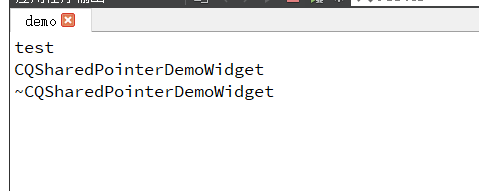
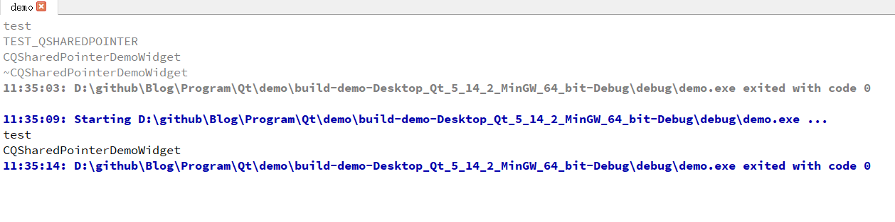

# Detailed Description

`The QSharedPointer is an **automatic**, shared pointer in C++. It behaves exactly like a normal pointer for normal purposes, including respect for constness.`

`QSharedPointer will delete the pointer it is holding when it goes out of scope, provided no other QSharedPointer objects are referencing it.`

`A QSharedPointer object can be created from a normal pointer, another QSharedPointer object or by promoting a [QWeakPointer](https://doc.qt.io/qt-5/qweakpointer.html) object to a strong reference. `

# Thread-Safety

`QSharedPointer and [QWeakPointer](https://doc.qt.io/qt-5/qweakpointer.html) are reentrant classes. This means that, in general, a given QSharedPointer or [QWeakPointer](https://doc.qt.io/qt-5/qweakpointer.html) object **cannot** be accessed by multiple threads at the same time without synchronization.`

# 描述

简单来说，就是一个不用自己释放的指针，采用引用计数的方式，还是线程安全的。

# 测试代码

~~~c++
#include <QWidget>
#include <QDebug>
#include <QSharedPointer>
#include <QApplication>

class CQSharedPointerDemoWidget : public QWidget
{
public:
    explicit CQSharedPointerDemoWidget(QWidget* parent = nullptr, Qt::WindowFlags f = Qt::WindowFlags())
        : QWidget(parent, f)
    {
        qDebug() << __FUNCTION__ ;
    }

    ~CQSharedPointerDemoWidget()
    {
        qDebug() << __FUNCTION__ ;
    }

#define TEST_QSHAREDPOINTER 0

    static void test()
    {
        qDebug() << __FUNCTION__ ;
#if TEST_QSHAREDPOINTER
        qDebug() << "TEST_QSHAREDPOINTER" ;
        QSharedPointer<CQSharedPointerDemoWidget> pWidget(new CQSharedPointerDemoWidget);
#else
        CQSharedPointerDemoWidget * pWidget = new CQSharedPointerDemoWidget;
#endif
        pWidget->show();
    }
};

~~~

# 测试结果

测试 `TEST_QSHAREDPOINTER`

这里因为，出了作用域，没有引用了，所以自动删除了，所以看到界面一闪而过。

否则

就会一直显示界面

# 参考

* [官方文档](https://doc.qt.io/qt-5/qsharedpointer.html#details)

