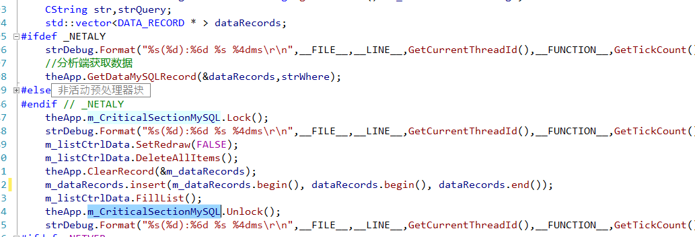
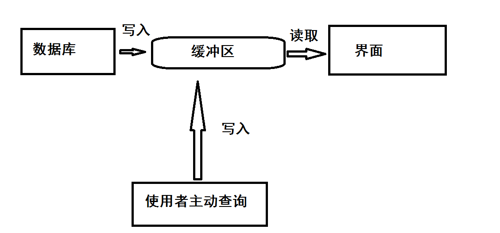
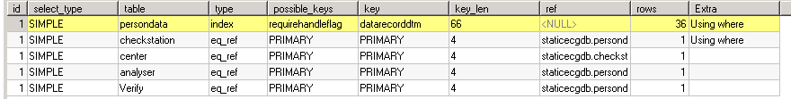
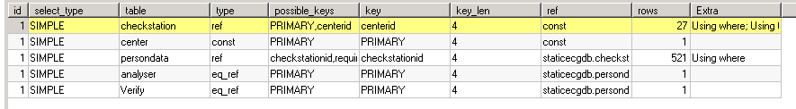

# C/S架构数据库查询设计

## 起因

​		今天维护一个老项目（`MFC`），客户端反映使用起来非常卡顿，后跟日志发现，在查询数据库的部分，耗时比较明显。在查询的时候耗时达`3s`，有时候竟然耗时达 `6-7s`，因为这个项目实时性要求比较高，因此刷新界面，查询数据库又较为频繁。所以，使用体验极为卡顿。

## 分析

​		跟项目代码，发现，在查询部分是直接使用定时器查询。每次获取数据后，赋值给中间变量，再通过中间变量去刷新界面。

​		数据界面和后台逻辑的交互均采用一个数据存储数据。采用单线程的查询方式，必然会导致界面的卡顿。

### 分类

* 轮询数据库的查询，这是后台线程运行查询。这里的读和写会又区分，可以采用 Slim 读写锁来提高效率。
* 使用人员主动查询，这个要求实时

### 方案

* 改为多线程，后台轮询查询，查询后存储在数据结构中，界面去获取数据结构中的值。数据库的查询和界面的部分分离。
* 优化数据库查询语句，增加索引。
* 原来为 `ODBC`，更改为  `WebServer` 模式。
* 先修改本地，然后用一个线程将本地数据更新到服务器。

### 注意事项：

* 线程查询数据库的时候，因为会查询不同的类型（条件语句的改变）。因此，这里需要注意参数的同步。

* 注意中间变量的深浅拷贝和释放。

* 可能考虑到内存中只存一份，所以采用的是指针变量来作为中间变量，要考虑释放的位置。

  

## 设计

### 方案一：多线程

#### 流程图

​		数据库查询数据，写入缓冲区，界面采用定时器从缓冲区获取后刷新界面。

#### 伪代码

~~~c++
// 查询部分
线程 1
{
    while( 程序运行 )
    {
		if( 查询时间到 || 主动查询)
        {
          	if( 查询数据库并有数据 ) 
	      	{
    			加锁;	
    			写入缓冲区;
	    		解锁;    
			}
        }
        
        暂停;
    }	
}

// 获取部分 onTimer()
if( 定时器标志 == 当前定时器 )
{
    加锁;
    读取缓冲区，并刷新界面。
    解锁;    
}
~~~

### 方案二：优化SQL语句

参考：https://dev.mysql.com/doc/refman/5.7/en/explain-output.html

采用  EXPLAIN  命令查看执行计划

~~~mysql
explain select persondata.*,checkstation.name as checkstationname,****  desc limit 0,32
~~~

修改 `SQL`语句后：

#### 20210629更新：

在查询 特定部分 仍然有卡顿

**原来SQL语句**

~~~mysql
select 
persondata.name,persondata.age,persondata.sex,
verify.analyserid as verifyid 
from persondata 
left join checkstation on persondata.checkstationid=checkstation.checkstationid 
where persondata.del=0 
and handlestate in(2,3)
and ( (***)  or (***)   or (***) 
order by persondata.datarecorddtm 
desc limit 0,32
~~~

**更改**

* 修改 in 部分

  > in 会导致全表扫描，放慢速度，修改为 between and
  >
  > ~~~mysql
  > select 
  > persondata.name,persondata.age,persondata.sex,
  > verify.analyserid as verifyid 
  > from persondata 
  > left join checkstation on persondata.checkstationid=checkstation.checkstationid 
  > where persondata.del=0 
  > and handlestate between 2 and 3
  > and ( (***)  or (***)   or (***) 
  > order by persondata.datarecorddtm 
  > desc limit 0,32
  > ~~~
  >
  > 

* 修改 or 部分 ，改为 UNION 

## 最终

* 修改 `SQL`语句
* 数据库镜像处理

# 20210716

数据库镜像前，现在做记录。

因为觉得始终没弄好，心欠欠的。然后通过跟踪数据库进程发现，始终有几个语句会创建临时表，然后写入磁盘。查找客户端代码，始终没找到这部分相应代码，最后问经理说，网页上也查询了这个数据库，我**，坑爹么这不是。后来，对数据库做一个镜像，然后将网页部分查询连接到备份数据库上。我靠，天晴了。