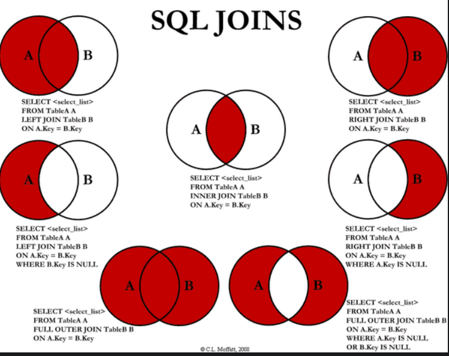
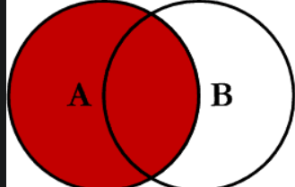
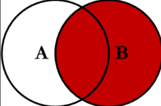
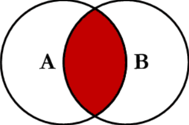
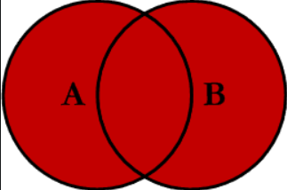

# Background

之前只是看过，但是具体使用得少，这次需要使用，所以加深一下了解。

# 区别联系

* left join(左联接) 返回包括左表中的所有记录和右表中联结字段相等的记录 
* right join(右联接) 返回包括右表中的所有记录和左表中联结字段相等的记录
* inner join(等值连接) 只返回两个表中联结字段相等的行

# 举例验证

## **两表数据**

~~~tex
表A记录如下：
aID　　　　　aNum
1　　　　　a20050111
2　　　　　a20050112
3　　　　　a20050113
4　　　　　a20050114
5　　　　　a20050115
表B记录如下:
bID　　　　　bName
1　　　　　2006032401
2　　　　　2006032402
3　　　　　2006032403
4　　　　　2006032404
8　　　　　2006032408
~~~

## left join

**`SQL`**

~~~sql
select * from A
left join B 
on A.aID = B.bID
~~~

**结果**

~~~tex
aID　　　　　aNum　　　　　bID　　　　　bName
1　　　　　a20050111　　　　1　　　　　2006032401
2　　　　　a20050112　　　　2　　　　　2006032402
3　　　　　a20050113　　　　3　　　　　2006032403
4　　　　　a20050114　　　　4　　　　　2006032404
5　　　　　a20050115　　　　NULL　　　　　NULL
~~~

所影响的行数为 5 行

**说明**

`left join`是以A表的记录为基础的,A可以看成左表,B可以看成右表,left join是以左表为准的.
换句话说,左表(A)的记录将会全部表示出来,而右表(B)只会显示符合搜索条件的记录(例子中为: `A.aID = B.bID`).

B表记录不足的地方均为NULL.

## right join

**`SQL`**

~~~sql
select * from A
right join B 
on A.aID = B.bID
~~~

**结果**

~~~tex
aID　　　　　aNum　　　　　bID　　　　　bName
1　　　　　a20050111　　　　1　　　　　2006032401
2　　　　　a20050112　　　　2　　　　　2006032402
3　　　　　a20050113　　　　3　　　　　2006032403
4　　　　　a20050114　　　　4　　　　　2006032404
NULL　　　　　NULL　　　　　8　　　　　2006032408
~~~

所影响的行数为 5 行

**说明**

仔细观察一下,就会发现,和left join的结果刚好相反,这次是以右表(B)为基础的,A表不足的地方用NULL填充.

## inner join

**`SQL`**

~~~tex
select * from A
innerjoin B 
on A.aID = B.bID
~~~

**结果**

~~~tex
aID　　　　　aNum　　　　　bID　　　　　bName
1　　　　　a20050111　　　　1　　　　　2006032401
2　　　　　a20050112　　　　2　　　　　2006032402
3　　　　　a20050113　　　　3　　　　　2006032403
4　　　　　a20050114　　　　4　　　　　2006032404
~~~

**说明**

很明显,这里只显示出了 `A.aID = B.bID`的记录.这说明`inner join`并不以谁为基础,它只显示符合条件的记录.

## out join

**`SQL`**

~~~sql
SELECT <select_list>
FROM Table_A A
FULL OUTER JOIN Table_B B
ON A.Key = B.Key
# or
SELECT <select_list>
FROM Table_A A
FULL JOIN Table_B B
ON A.Key = B.Key
~~~

**说明**

此 Join 也可以称为 a`FULL OUTER JOIN`或 a `FULL JOIN`。此查询将返回两个表中的所有记录，连接左表（表 A）中与右表（表 B）中的记录匹配的记录。

# 说明

`LEFT JOIN` 操作用于在任何的 `FROM` 子句中，组合来源表的记录。使用 `LEFT JOIN` 运算来创建一个左边外部联接。左边外部联接将包含了从第一个（左边）开始的两个表中的全部记录，即使在第二个（右边）表中并没有相符值的记录。

# 参考

* [sql之left join、right join、inner join的区别](https://blog.csdn.net/weixin_41796956/article/details/85044152)
* [Visual Representation of SQL Joins](https://www.codeproject.com/Articles/33052/Visual-Representation-of-SQL-Joins)

