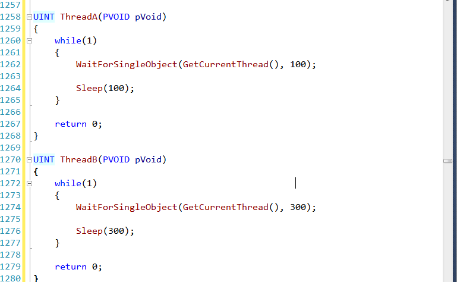
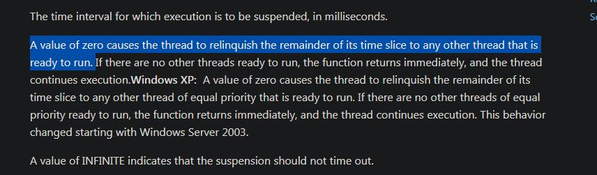

# 谈谈 sleep

​		MFC程序中，之前线程需要暂停一定时间的时候，一直采用的是 Sleep去暂停，今天在测试 C/S 架构定时从数据库获取更新数据的时候发现 Sleep 并不能得到我想要的结果。

​		主要纠结的点在于，Sleep() 后是否会再次进入到这个线程。如果进入线程，用 `WaitForSingleObject`是否好一点。

## Syntax

~~~c++
void Sleep(
  	DWORD dwMilliseconds
);
~~~

## 参数含义

 The time interval for which execution is to be suspended, in milliseconds. 

### 官方文档

https://docs.microsoft.com/en-us/windows/win32/api/synchapi/nf-synchapi-sleep

**作用：**

Suspends the execution of the current thread until the time-out interval elapses.

To enter an alertable wait state, use the [SleepEx](https://docs.microsoft.com/en-us/windows/desktop/api/synchapi/nf-synchapi-sleepex) function.

**时间的准确性：**

To increase the accuracy of the sleep interval, call the **timeGetDevCaps** function to determine the supported minimum timer resolution and the **timeBeginPeriod** function to set the timer resolution to its minimum. 

## 分析

好了，上面已经说清楚一部分了，暂停程序中当前现在线程直到 timeout。就是说，暂停当前 CPU，但是怀就坏在这个暂停，我们知道，Windows是一个抢占式的操作系统，如果只是暂停，那我们换个方式理解，如果我当前线程的优先级比较高，系统任然分配了时间片给这个线程，只是看到这个线程的标志位（因为每创建一个线程，操作系统会拿一块数据结构来存储这个线程的一些信息，这个数据结构的原型，没找到。）后就略过了还是说，根本没有进这个线程。

  

按官方解释来说，如果为 0 则会把其余时间片给其他线程。那么理解就是他会暂停当前线程，把时间片交出去。

再者，根据 《Windows程序设计》的说法，线程属于内核对象

> **线程**
>
> 线程有两部分组成：
>
> 一个是线程的内核对象，操作系统用他来对线程实施管理。内核对象也是系统用来存放线程统计信息的地方；
>
> 一个是线程堆栈，用于维护线程在执行代码时需要的所有函数参数和局部变量；

那么再调用 Sleep() 后，操作系统级别的 线程 信息应该会更改，如果没有达到这个时间计数，应该就不会给他分配时间。

## 结论

​		效果应该是差不多的。