## 起因

​		有两个界面A B，两个界面都有定时器。A定时器 10s 间隔， B定时器 6s 间隔。A界面操作的时候B界面可以不刷新，想象是美好的，结果也还将就，就是有一点奇怪，我在B界面用 A的指针去获取刷新标志，是能正常的，用函数接口去获取，这就错误了。。。。。。。

### 清理解决方案重新生成后

**step1**

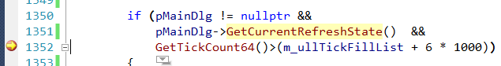

**step2**

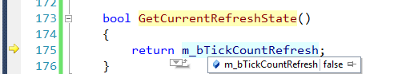

**step3**

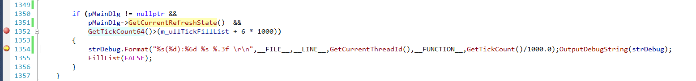

**参考**

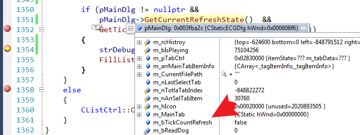

我。。。裂开了呀。

### 更改为成员变量后

**step1**

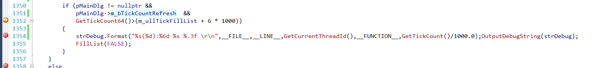

**step2**

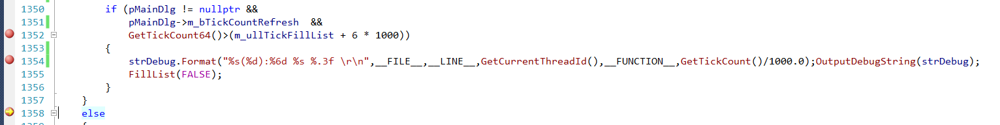

**参考**

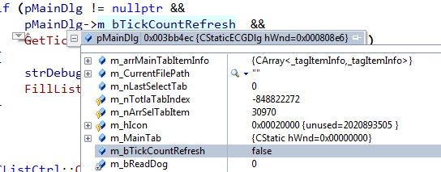

我我我我我哦我我无，无Fuck可说。

，现在，咋整，你告诉我，咋整

我这还是变种过一次的，最开始是 `BOOL`，好家伙，还能怀疑一下是不是 `int`搞错了，我改为 `bool`后，你说，咋整。。。。。。

打开自动窗口，看函数返回值：确实是 true;

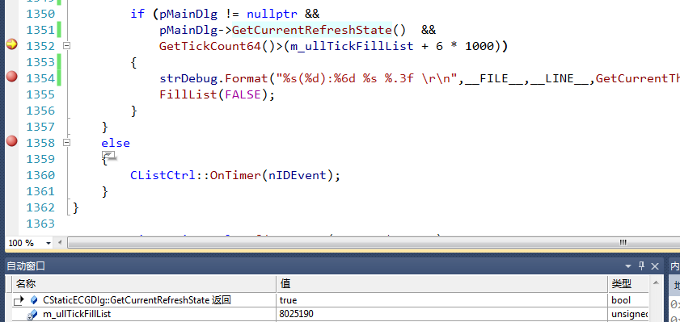

## 分析

### 上网查看

毫无头绪，咋整，上网找呗~~

这一个还有点那么个意思。感觉也不太像啊。**内存冲突~~~**这也倒是一个方向。

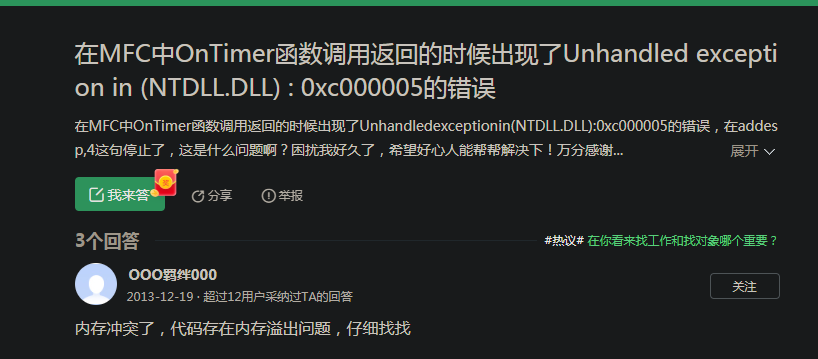

内存冲突：字节对齐方向？？？？

### 查看内存

#### 初始化

##### **step1**

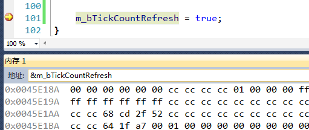

##### step2

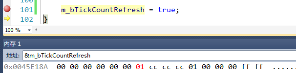

更改的是 01啊，好像也没有错。。。慢慢慢慢慢慢慢慢慢慢慢慢慢慢慢慢慢慢慢慢慢慢 

地址怎么跑那里去了啊

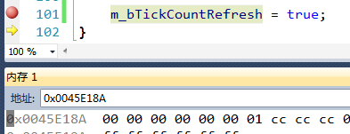

地址不是 `0x0045E18A` ??????????????

就算字节对齐 4 位，也不可能跑那里去啊！！！！！！！！！！！！！！！！！！

**总算初步有了方向，内存地址的值给我更改错了**

#### 稍加更改

前后加两个变量看看内存位置

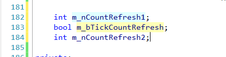

##### step1

取 `m_CountRefresh1`的地址 ？？？？？？？ 明明是 `0x003CE4CE`，好家伙，睁眼瞎啊，8字节，16字节对齐，也不可能给我更改到这个卡尔当去撒。

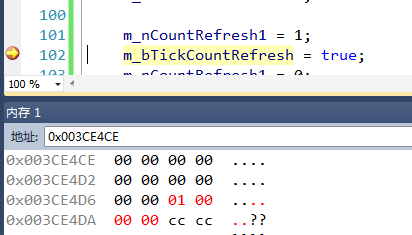

##### step2

再走一步，咋回事

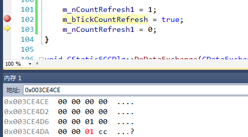

`m_bTickCountRefresh` 实际地址

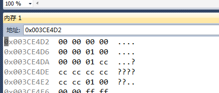

好家伙，原因大概确定了，就是内存给我搞错了。更改一下声明顺序试试

## 更改方案

### 更改声明顺序

将 `m_bTickCountRefresh`放后面，初始化的值对了

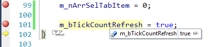

返回值仍然有问题：

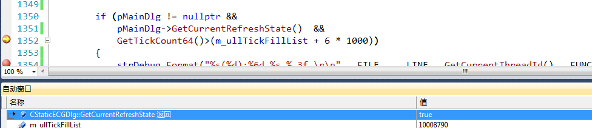

啊啊啊啊啊啊啊啊啊啊啊啊啊啊啊啊，我TM再次裂开~~~，冷静，冷静

### 更改接口

更改为 引用返回~~~~，也有问题

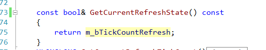

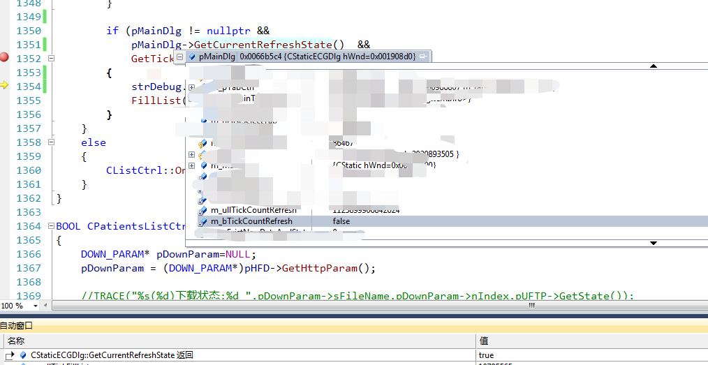

### 更改为public

这下对了，不得已而为之啊，最后的妥协，希望有好心人看到可以帮忙解决解决~~~

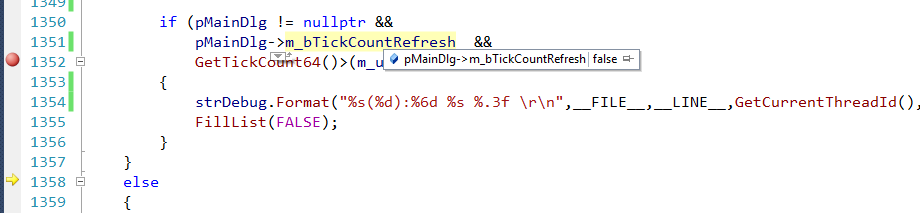

