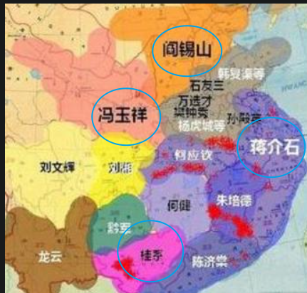

# 中国的红色政权为什么能够存在？  
（一九二八年十月五日）  

> 这是毛泽东为中共湘赣边界第二次代表大会写的决议的一部分，原题为《政治问题和边界党的任务》。   

## 一　国内的政治状况  

　　现在国民党新军阀的统治，依然是城市买办阶级和乡村豪绅阶级的统治，对外投降帝国主义，对内以新军阀代替旧军阀，对工农阶级的经济的剥削和政治的压迫比从前更加厉害。从广东出发的资产阶级民主革命，到半路被买办豪绅阶级篡夺了领导权，立即转向反革命路上，全国工农平民以至资产阶级⑴，依然在反革命统治底下，没有得到丝毫政治上经济上的解放。   
　　国民党新军阀蒋桂冯阎四派⑵，在北京天津没有打下以前，有一个对张作霖⑶的临时的团结。北京天津打下以后，这个团结立即解散，变为四派内部激烈斗争的局面，蒋桂两派且在酝酿战争中。中国内部各派军阀的矛盾和斗争，反映着帝国主义各国的矛盾和斗争。故只要各国帝国主义分裂中国的状况存在，各派军阀就无论如何不能妥协，所有妥协都是暂时的。今天的暂时的妥协，即酝酿着明天的更大的战争。   
　　中国迫切需要一个资产阶级的民主革命，这个革命必须由无产阶级领导才能完成。从广东出发向长江发展的一九二六年到一九二七年的革命，因为无产阶级没有坚决地执行自己的领导权，被买办豪绅阶级夺取了领导，以反革命代替了革命。资产阶级民主革命乃遭遇到暂时的失败。中国无产阶级和农民在此次失败中，受到很大的打击，中国资产阶级（非买办豪绅阶级）也受了打击。但最近数个月来，工农阶级在共产党领导之下的有组织的城市罢工和农村暴动，在南北各地发展起来。军阀军队中的士兵因饥寒而酝酿着很大的不安。同时资产阶级在汪精卫、陈公博一派鼓动之下，亦在沿海沿江各地发展着颇大的改良主义⑷运动。这种运动的发展是新的事实。   
　　中国的民主革命的内容，依国际及中央的指示，包括推翻帝国主义及其工具军阀在中国的统治，完成民族革命，并实行土地革命，消灭豪绅阶级对农民的封建的剥削。这种革命的实际运动，在一九二八年五月济南惨案⑸以后，是一天一天在发展的。   

## 二　中国红色政权⑹发生和存在的原因  

　　一国之内，在四围白色政权的包围中，有一小块或若干小块红色政权的区域长期地存在，这是世界各国从来没有的事。这种奇事的发生，有其独特的原因。而其存在和发展，亦必有相当的条件。第一，它的发生不能在任何帝国主义的国家，也不能在任何帝国主义直接统治的殖民地⑺，必然是在帝国主义间接统治的经济落后的半殖民地的中国。因为这种奇怪现象必定伴着另外一件奇怪现象，那就是白色政权之间的战争。帝国主义和国内买办豪绅阶级支持着的各派新旧军阀，从民国元年以来，相互间进行着继续不断的战争，这是半殖民地中国的特征之一。不但全世界帝国主义国家没有一国有这种现象，就是帝国主义直接统治的殖民地也没有一处有这种现象，仅仅帝国主义间接统治的中国这样的国家才有这种现象。这种现象产生的原因有两种，即地方的农业经济（不是统一的资本主义经济）和帝国主义划分势力范围的分裂剥削政策。因为有了白色政权间的长期的分裂和战争，便给了一种条件，使一小块或若干小块的共产党领导的红色区域，能够在四围白色政权包围的中间发生和坚持下来。湘赣边界的割据⑻，就是这许多小块中间的一小块。有些同志在困难和危急的时候，往往怀疑这样的红色政权的存在，而发生悲观的情绪。这是没有找出这种红色政权所以发生和存在的正确的解释的缘故。我们只须知道中国白色政权的分裂和战争是继续不断的，则红色政权的发生、存在并且日益发展，便是无疑的了。第二，中国红色政权首先发生和能够长期地存在的地方，不是那种并未经过民主革命影响的地方，例如四川、贵州、云南及北方各省，而是在一九二六和一九二七两年资产阶级民主革命过程中工农兵士群众曾经大大地起来过的地方，例如湖南、广东、湖北、江西等省。这些省份的许多地方，曾经有过很广大的工会和农民协会的组织，有过工农阶级对地主豪绅阶级和资产阶级的许多经济的政治的斗争。所以广州产生过三天的城市民众政权，而海陆丰、湘东、湘南、湘赣边界、湖北的黄安等地都有过农民的割据。至于此刻的红军，也是由经过民主的政治训练和接受过工农群众影响的国民革命军中分化出来的。那些毫未经过民主的政治训练、毫未接受过工农影响的军队，例如阎锡山、张作霖的军队，此时便决然不能分化出可以造成红军的成分来。第三，小地方民众政权之能否长期地存在，则决定于全国革命形势是否向前发展这一个条件。全国革命形势是向前发展的，则小块红色区域的长期存在，不但没有疑义，而且必然地要作为取得全国政权的许多力量中间的一个力量。全国革命形势若不是继续地向前发展，而有一个比较长期的停顿，则小块红色区域的长期存在是不可能的。现在中国革命形势是跟着国内买办豪绅阶级和国际资产阶级的继续的分裂和战争，而继续地向前发展的。所以，不但小块红色区域的长期存在没有疑义，而且这些红色区域将继续发展，日渐接近于全国政权的取得。第四，相当力量的正式红军的存在，是红色政权存在的必要条件。若只有地方性质的赤卫队⑼而没有正式的红军，则只能对付挨户团⑽，而不能对付正式的白色军队。所以虽有很好的工农群众，若没有相当力量的正式武装，便决然不能造成割据局面，更不能造成长期的和日益发展的割据局面。所以“工农武装割据”的思想，是共产党和割据地方的工农群众必须充分具备的一个重要的思想。第五，红色政权的长期的存在并且发展，除了上述条件之外，还须有一个要紧的条件，就是共产党组织的有力量和它的政策的不错误。   
## 三　湘赣边界的割据和八月的失败  

　　军阀间的分裂和战争，削弱了白色政权的统治势力。因此，小地方红色政权得以乘时产生出来。但军阀之间的战争不是每天不停的。每当一省或几省之间的白色政权有一个暂时稳定的时候，那一省的统治阶级或几省的统治阶级必然联合起来用尽力量来消灭这个红色政权。在为建立和坚持红色政权所必须的各种条件尚不完备的地方，便有被敌人推倒的危险。本年四月以前乘时而起的许多红色政权，如广州、海陆丰、湘赣边界、湘南、醴陵、黄安各地，都先后受到白色政权的摧残，就是这个道理。四月以后湘赣边界的割据，正值南方统治势力暂时稳定的时候，湘赣两省派来“进剿”的军队，随时都有八九个团以上的兵力，多的到过十八个团。然而我们以不足四个团的兵力和敌人斗争四个月之久，使割据地区一天一天扩大，土地革命一天一天深入，民众政权的组织一天一天推广，红军和赤卫队一天一天壮大，原因就在于湘赣边界的共产党（地方的党和军队的党）的政策是正确的。当时党的特委和军委的政策是：坚决地和敌人作斗争，创造罗霄山脉⑾中段政权，反对逃跑主义；深入割据地区的土地革命；军队党帮助地方党的发展，正规军队帮助地方武装的发展；集中红军相机应付当前之敌，反对分兵，避免被敌人各个击破；割据地区的扩大采取波浪式的推进政策，反对冒进政策。因为这些策略的适当，加上地形之利于斗争，湘赣两省进攻军队之不尽一致，于是才有四月至七月四个月中的各次胜利⑿。虽以数倍于我之敌，不但不能破坏此割据，并且不能阻止此割据的日益扩大，此割据对湘赣两省的影响则有日益加大之势。八月失败，完全在于一部分同志不明了当时正是统治阶级暂时稳定的时候，反而采取统治阶级政治破裂时候的战略，分兵冒进，致边界和湘南同归失败。湖南省委代表杜修经同志不察当时环境，不顾特委、军委及永新县委联席会议的决议，只知形式地执行湖南省委的命令，附和红军第二十九团逃避斗争欲回家乡的意见，其错误实在非常之大。这种失败的形势，因为九月以后特委和军委采取了纠正错误的步骤，而挽救过来了。   
## 四　湘赣边界的割据局面在湘鄂赣三省的地位  

　　以宁冈为中心的湘赣边界工农武装割据，其意义决不限于边界数县，这种割据在湘鄂赣三省工农暴动夺取三省政权的过程中是有很大的意义的。使边界土地革命和民众政权的影响远及于湘赣两省的下游乃至于湖北；使红军从斗争中日益增加其数量和提高其质量，能在将来三省总的暴动中执行它的必要的使命；使各县地方武装即赤卫队和工农暴动队的数量增加质量提高起来，此时能够与挨户团和小量军队作战，将来能够保全边界政权；使地方工作人材逐渐减少依靠红军中工作人材的帮助，能完全自立，以边界的人材任边界的工作，进一步能够供给红军的工作人材和扩大割据区域的工作人材——这些都是边界党在湘鄂赣三省暴动发展中极其重要的任务。   
## 五　经济问题  

　　在白色势力的四面包围中，军民日用必需品和现金的缺乏，成了极大的问题。一年以来，边界政权割据的地区，因为敌人的严密封锁，食盐、布匹、药材等日用必需品，无时不在十分缺乏和十分昂贵之中，因此引起工农小资产阶级⒀群众和红军士兵群众的生活的不安，有时真是到了极度。红军一面要打仗，一面又要筹饷。每天除粮食外的五分钱伙食费都感到缺乏，营养不足，病的甚多，医院伤兵，其苦更甚。这种困难，在全国总政权没有取得以前当然是不能免的，但是这种困难的比较地获得解决，使生活比较地好一点，特别是红军的给养使之比较地充足一点，则是迫切地需要的。边界党如不能对经济问题有一个适当的办法，在敌人势力的稳定还有一个比较长的期间的条件下，割据将要遇到很大的困难。这个经济问题的相当的解决，实在值得每个党员注意。   
## 六　军事根据地问题  

　　边界党还有一个任务，就是大小五井⒁和九陇两个军事根据地的巩固。永新、酃县、宁冈、遂川四县交界的大小五井山区，和永新、宁冈、茶陵、莲花四县交界的九陇山区，这两个地形优越的地方，特别是既有民众拥护、地形又极险要的大小五井，不但在边界此时是重要的军事根据地，就是在湘鄂赣三省暴动发展的将来，亦将仍然是重要的军事根据地。巩固此根据地的方法：第一，修筑完备的工事；第二，储备充足的粮食；第三，建设较好的红军医院。把这三件事切实做好，是边界党应该努力的。   

------------------
　　注　　释   
　　〔1〕毛泽东在这里指的是民族资产阶级。毛泽东在一九三五年十二月作的《论反对日本帝国主义的策略》和一九三九年十二月作的《中国革命和中国共产党》中，对于买办大资产阶级与民族资产阶级的区别，曾作了详细的说明。   
　　〔2〕蒋派指蒋介石派。桂派指广西军阀李宗仁、白崇禧派。冯派指冯玉祥派。阎派指山西军阀阎锡山派。他们曾经联合对张作霖作战，于一九二八年六月占领了北京和天津。   
　　〔3〕张作霖（一八七五——一九二八），辽宁海城人，奉系军阀首领。一九二四年吴佩孚在第二次直奉战争中被打败后，张作霖成为北方最有势力的一个军阀。一九二六年他联合吴佩孚入据北京。一九二八年六月从北京退回东北，在路上被向来利用他做工具的日本帝国主义者所炸死。   
　　〔4〕一九二八年五月济南惨案发生及蒋介石公开对日妥协之后，曾经追随蒋介石参加一九二七年反革命政变的民族资产阶级，有一部分因为自己的利益，开始逐步形成蒋介石政权的在野反对派，他们既不满意蒋介石政权的大地主、大资产阶级的反革命统治，又反对无产阶级领导的人民民主革命。他们发动了一个改良主义运动，幻想在革命和反革命两条道路之外，另找一条有利于中国资本主义发展的道路。当时，同蒋介石争权夺利的汪精卫、陈公博等政客，曾在这个运动中进行投机活动，形成了国民党中的所谓“改组派”。   
　　〔5〕一九二八年蒋介石在英美帝国主义支持下，北上攻打张作霖。日本帝国主义为阻止英美势力向北方发展，出兵山东，侵占济南、青岛和胶济路沿线，截断津浦铁路。五月三日，日本侵略军在济南进行大屠杀，在这前后十几天内，共惨杀中国军民数千人。这次屠杀事件被称为“济南惨案”。   
　　〔6〕中国红色政权在组织形式上，和苏联的苏维埃政权是相同的。苏维埃即代表会议，是俄国工人阶级在一九〇五年革命时创造的一种政治制度。列宁根据马克思主义的原理，从巴黎公社和一九〇五年俄国革命的经验中，得出这样的结论：苏维埃是工农革命政府的最好的组织形式，是从资本主义到社会主义的过渡时期中最适当的国家政权的组织形式。一九一七年俄国十月社会主义革命，在布尔什维克党的领导下，第一次在世界上建立了无产阶级专政的社会主义的苏维埃共和国。在中国，一九二七年革命失败以后，中国共产党以毛泽东为代表所领导的各地人民革命起义，即以代表会议为工农民主政权的组织形式。但是，这时的中国革命仍然处于民主革命阶段，这种政权的性质，是无产阶级领导的反帝反封建的工农民主专政，同苏联的无产阶级专政的政权性质是有区别的。   
　　〔7〕在第二次世界大战期间，原来属于英、美、法、荷各帝国主义统治下的东方许多殖民地，被日本帝国主义者所占领，那里的工人、农民、城市小资产阶级群众及民族资产阶级分子在共产党领导下，利用英、美、法、荷各帝国主义与日本帝国主义的矛盾，组织了反法西斯侵略的广泛统一战线，建立了抗日根据地，进行了艰苦的抗日游击战争，已开始改变了第二次世界大战以前的政治情况。第二次世界大战结束，日本帝国主义被逐出，英、美、法、荷各帝国主义企图继续原来的殖民地统治，但各殖民地人民已在抗日战争中锻炼出了一种相当有力的武装力量，他们不愿意照旧生活下去；而由于苏联的强大，由于除美国以外的一切帝国主义国家在战争中或被推翻或被削弱，更由于中国革命的胜利使帝国主义阵线在中国被突破，因而使整个帝国主义制度已在世界上发生很大的动摇。这样，就使东方各殖民地至少是某些殖民地的人民也和中国差不多一样地有可能长期坚持大小不一的革命根据地和革命政权，有可能长期坚持由乡村包围城市的革命战争，并有可能由此逐步推进而取得城市、取得该殖民地全国范围内的胜利。根据这种新的情况，毛泽东于一九二八年对于在帝国主义直接统治的殖民地条件下这一个问题上所作的观察，已有了改变。   
　　〔8〕这是指一九二七年蒋介石、汪精卫相继叛变革命以后，各地人民在共产党领导下，最初爆发起来的对反革命势力的反击行动。在广州，一九二七年十二月十一日，工人和革命士兵在一部分市郊农民的配合下联合起义，建立过为时三天的人民政权。广东省东部沿海的海丰、陆丰等地的农民，在一九二七年五月和九月举行起义，都曾经建立过革命政权；在这年十月举行的起义中建立的革命政权，一直坚持到一九二八年三月。在湖南省东部，一九二七年九月，起义的农民曾经占据过浏阳、平江、醴陵、株洲一带，醴陵农民并于一九二八年二三月间建立过农村革命政权。湖北省东北部的黄安（今红安）、麻城等地的起义农民，曾经在一九二七年十一月占领黄安县城，建立革命政权二十多天。在湖南省南部，一九二八年一月，宜章、郴县、耒阳、永兴、资兴等县的起义农民，建立过革命政权达三月之久。关于湘赣边界的革命斗争，参见本卷《井冈山的斗争》。   
　　〔9〕 赤卫队是革命根据地中群众的武装组织，不脱离生产。   
　　〔10〕 参见本卷《湖南农民运动考察报告》注〔16〕。   
　　〔11〕罗霄山脉是江西、湖南两省边界的大山脉，井冈山位于罗霄山脉的中段。   
　　〔12〕一九二八年四月，毛泽东率领的军队和朱德率领的军队在井冈山会师后，合编为工农革命军第四军（六月改称红军第四军）。四五月间，第四军在遂川的五斗江、永新的草市坳和永新城，先后打败江西国民党军队的第二、三次“进剿”。六月二十三日，红四军在宁冈、永新交界的七溪岭和龙源口地区，打败江西敌军第四次“进剿”。江西的国民党军队在遭到多次失败以后，又联合湖南的国民党反动派，调集四个师的兵力，对井冈山发动第一次“会剿”。七月间，“会剿”的敌军先后侵占宁冈、永新、莲花等县城。红四军以两个团的兵力出击湖南敌军后方的酃县，以一个团的兵力对付江西敌军，同时发动广大群众到处包围袭击敌军。结果，湖南敌军仓皇退守茶陵；江西敌军也被围困于永新地区。   
　　〔13〕毛泽东这里所说的小资产阶级，是指农民以外的手工业者、小商人、各种自由职业者和小资产阶级出身的知识分子。中国的这类社会成分主要在城镇，但在乡村中也占有相当数量。参见本卷《中国社会各阶级的分析》和本书第二卷《中国革命和中国共产党》。   
　　〔14〕 大小五井山区就是指介于江西西部的永新、宁冈、遂川和湖南东部的酃县四县之间的井冈山，井冈山上有大井、小井、上井、中井、下井等地。   

# 思考

为何能存在：只要帝国主义任然想瓜分中国，在当时中国落后的情况下，各帝国主义必然觉得只是时间问题，既然只是时间问题，那么在攻陷中国后的事情就是他们要考虑的，正如，四大军阀对张作霖有一个短暂的团结，但是，北京，天津打下后，团结就消失了。变成了四方更激烈的斗争，谁都想当这片土地上的王。所以，主席发出，今天的暂时妥协，即酝酿着明天的更大的战争。

> 直白点就是，红色是光明，好的政权，白色就是残酷统治，坏的政权。
>
> 红色政权讲的是中国苏区苏维埃政权，红色代表鲜血，意即革命需要用鲜血换来。
>
> 白色是当时在世界范围内对镇压革命的的统治阶级的称呼，所以也流传到了中国，在当时就是指国民党的政权。

