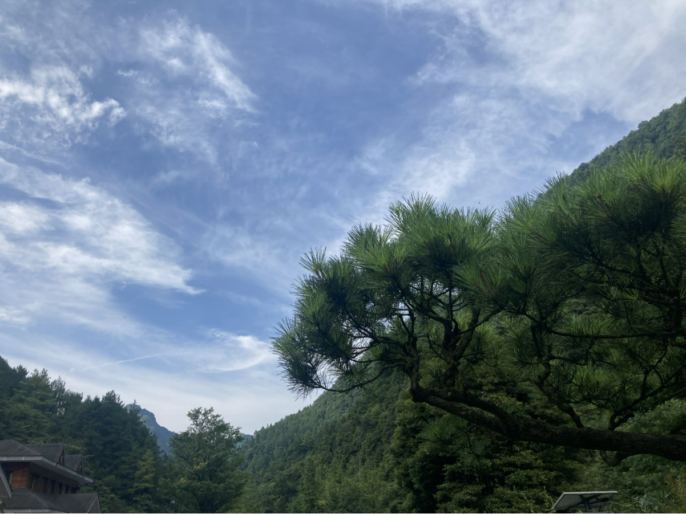
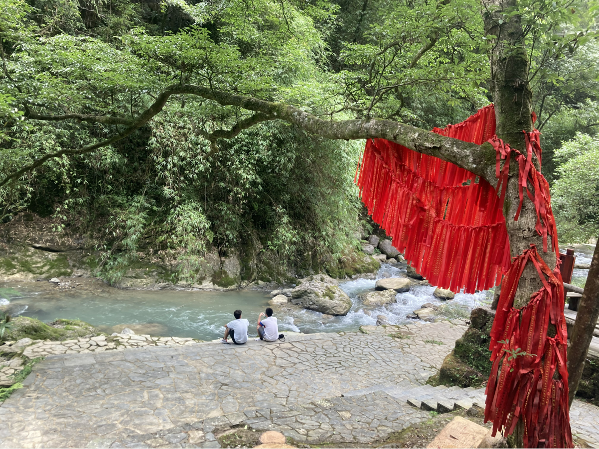
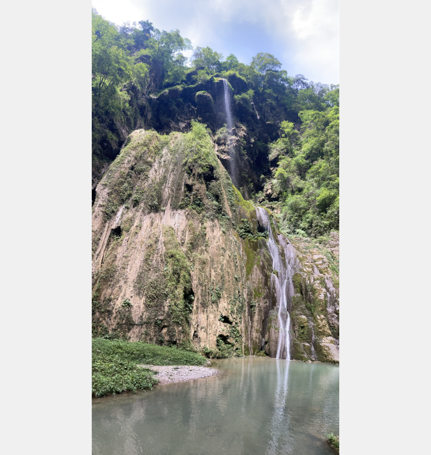
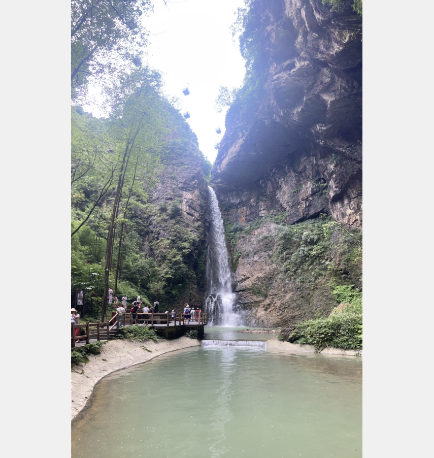

# 20210611

今天整理了一下 github 上的 repository ，决定正式使用 github，之前因为自己有一个租用的服务器，所以，所有的代码都通过 SVN 上传到自己的服务器上了，租用的的到期了续费还是有点贵，所以决定将所有的项目迁移到 github 上。

# 20210613

编程这东西，脑子要放开，重要的还是得记笔记，你不能光看别人的，要学会自己思考，在将自己的思考转换为自己能记下的语言，这才能更好进步，当然，不只是编程，生活也一样。还是得找一个实际的项目，从0开始，搞一个。这样才能在实践中总结，闭门造车还是不行的，多去社区讨论讨论，当然，也不能让自己的视野局限了。给自己时间沉淀

# 20210614

吾爱吾师，吾更爱真理。

# 20210617

随缘应该是在尝试各种方式努力后的接受而不是一种对待事物的态度。

# 20210621

这两天搬家，都没来得及写两片日记，好像也没什么写的，那就这样吧。现在离公司更近一点了，还是要好得多，以前上下班通勤 3 小时，人真的累，现在 10几分钟能到家。真好。

# 20210622

今天骑车到公司，舒服，17分钟，人真的轻松好多。哈哈哈哈哈哈哈哈哈哈， “May the force be with you!” 

# 20210629

今天去打了篮球，舒服，流流汗。好久没这么运动过了，人都要麻木了。

# 20210721

本来说看英文把opencv3看一下的，因为自己也不知道做哪方面的，所以，挨着看一下吧，好家伙，英文还是差一点，对于一些专业名词的解释还是差点意思，因此，还是下手了一本《OpenCV3 》中文版。哈哈哈哈哈哈哈哈哈哈哈，不管怎样，学习到技术才是硬道理。我想了想，光看还是差点，还是应该找一个项目来做做，从实践中去理解，光看，太抽象了。

# 20210719

最后一针疫苗打完，手工，别说手臂还有点疼。还有点晕乎乎的。

今天把github上的东西整理了一下，把服务器上的源码迁移到github上来。

# 20210724

今天带小家伙出了趟远门，算是第一次去旅游咯，就喜欢出去玩，一点不闹。哈哈哈哈哈，真乖

# 20200808

​		当你对一件事一个人不在抱有期望的时候，他能给你带来的也就只有惊喜。可是哪里有人会不抱有希望啊？这让我想起一句话，《围城》里面写的：天下只有两种人。比如一串葡萄到手，一种人挑最好的先吃，另一种人把最好的留到最后吃。照例第一种人应该乐观，因为他每吃一颗都是吃剩的葡萄里最好的；第二种人应该悲观，因为他每吃一颗都是吃剩的葡萄里最坏的。不过事实却适得其反，缘故是第二种人还有希望，第一种人只有回忆。

​		当下的日子，都是最糟糕的。甜的日子在后面，所以，乐观的去迎接往后的日子吧。