# 心电图名词

## 一、心电活动进程

1、每次心电活动时，最早出现的浮动较小的波，称为P波，反映的是心房消极的过程。

   消极：[心肌细胞](https://www.baidu.com/s?wd=心肌细胞&tn=SE_PcZhidaonwhc_ngpagmjz&rsv_dl=gh_pc_zhidao)激动后（之前为静息电位），膜外变为负电位，膜内变为正电位（主要为Na+离子内流，最开始为外正内负 -90mv的电压差），这种极化状态的消除称为除极（-90mv --> +30mv）。

2、再接着是P-R段，反映的是心房复极过程，以及房结室、希氏束、束支的电活动。

   复极：兴奋细胞在除极之后，由于K+的外流使膜电位再次转变为外正内负，恢复到静息状态即静息电位水平。Na+内流减小，细胞膜对K+和Cl-通透增大，主要为K+外流。

3、接着是QRS波，反映心室除极的过程。

4、接着ST，前面直的一段为ST段，后面一个较大的波为T波。本段反映的是除极完毕后，心室的缓慢和快速复极过程。

5、QRS波群起点到T波的终点，是Q-T间期，反映的是心室开始除极至心室复极完毕的全过程。

！！！ 心电分析员和算法设计人员应该能根据心电变化与心脏的传导系统之间的关系以及心室肌除极顺序深入理解不同电极部位或不同病理状态下的QRS波形态的形成原因。

------

## 二：心电产生原理

**0相（去极化期）**

​    心肌细胞受刺激时Na+离子通道打开，外液的Na+离子渗透到内部，所以膜内电压变高（-90mv-->+30mv），时间很短1-2ms

这种极化状态的消除过程称为除极，相当于QRS的前半部分。

**1相（早期快速复极相）**

   心肌细胞除极后，恢复电位的过程称为复极，动作电位到顶后，立即复极。复极到零电位过程称为1相。除极后Na+内流减小，细胞膜对K+和Cl-通透增大，主要为K+外流。使得膜内电压从+20mv-->0mv，这一过程为1相。相当于QRS的后半部分。

**2相（平台期）**

   缓慢复极化的过程。膜内电压下降，与膜外电压形成一个相对稳定的状态，形成一个平台期，时间大约100-150ms。此时，膜上钙通道激活，Ca+外流，K+少量外流。维持在零电位附近保持不变，相当于S-T段。

**3相（快速复极末相）**

   复极后期加速阶段，细胞膜对Ka+的通透性增加，使得细胞内的K+离子外流（外面浓度低），膜内电位快速下降到除极前水平，该过程较长，相当于T波。

**4相（静息期）**

   复极完毕后，电压恢复到静息之前的水平，心室舒张期由此开始。细胞膜内外浓度恢复到之前的水平。相当于T波后期的等电位线。

## 心电网格

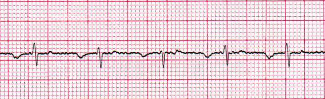

​	一种纵轴为电压，横轴为时间的绘制图形。

​	记录在一种每格为  1mm^2 的小网格上，走纸速度为25mm/s，所以一格代表1/25 = 0.04s(40ms)，而粗线形成的大格子包括5小格，代表0.2s(200ms)，

​	纵向图形表示某一特定波的高度（波幅），标准校准为10mm（10个小格）等于1mV。

## 心电波段命名和测量

​	

一般来说，临床波形曲线通常包括被命名的**波**和**间期**两部分，波的定义在于检查他的高度和深度，即振幅（或电压），间期在于测量相对的时间（或宽度） ，用以解释激动传导的快慢。

* 心电图被命名为段的部分，**PR**或**ST**，其意义在于准确测量其偏离等电位线（基线）所产生的的下降或抬高。

* P 波：为心房除极波，反映左、右心房除极过程中的电位和时间变化。正常 P 波 在 aVR 导联倒置，Ⅰ、Ⅱ、aVF、V3～V6 导联直立，其余导联（Ⅲ、aVL、V1、 V2）可直立、低平、双向或倒置。正常 P 波的时间≤0.11s；电压在肢导联<><>
  * 

* P-R 段：是电激动过程在房室交界区以及希氏束、室内传导系统所产生的微弱电 位变化，一般呈零电位，显示为等电位线（基线）。 

* P-R 间期：自 P 波的起点至 QRS 波群的起点，反映激动从窦房结发出后经心房、 房室交界、房室束、束支及普肯耶纤维网传到心室肌所需要的时间。正常成年 P-R 间期为 0.12～0.20s。 

* QRS 波群：为左、右心室除极的波，反映左、右心室除极过程中的电位和时间变 化。正常成人 QRS 波群时间为 0.06～0.10s。 

* S-T 段：从 QRS 波群终点至 T 波起点的一段平线，反映心室早期缓慢复极的电位 和时间变化。正常情况下，S-T 段表现为一等电位线。在任何导联，S-T 段下移 不应超过 0.05mV；S-T 段抬高在 V1-V3 导联不超过 0.3mV，其他导联均不应超过 0.1 mV。 

* T 波：为心室复极波，反映心室晚期快速复极的电位和时间变化。正常 T 波是一 个不对称的宽大而光滑的波，前支较长，后支较短；T 波的方向与 QRS 波群主波 方向一致。 

* Q-T 间期：从 QRS 波群的起点至 T 波终点，代表左、右心室除极与复极全过程的 时间。Q-T 间期的正常范围为 0.32～0.44s。 

## 心律计算

### 一般计算法

 * P波和QRS 波规律出现

   则先测出 **R-R** 段或者**P-P** 段的时间间隔，以s为单位，然后用60s除以测得的时间间隔，就可获得此份心电图的心律（HR）：HR = 60 / T (PPorRR) 。

* 不规律出现

  可先输出3个大格子（15个中方格）内P或者R的个数，然后乘 20 ，即可得出心房颤动患者一分钟的心率。

​	

# 心电图与心脏搏动关系

上房下室

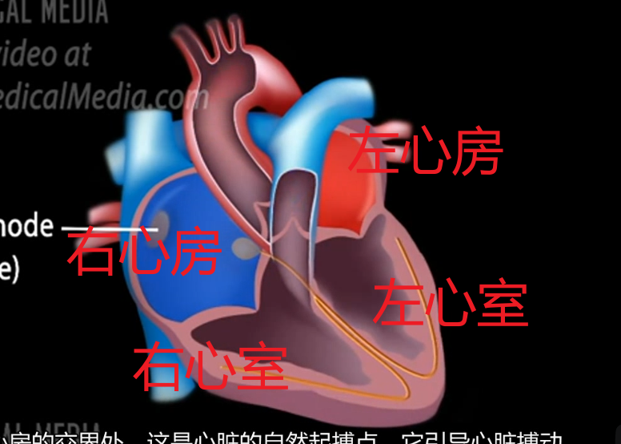

## 名词解释

> 说白点，除极就是上升，复极（去极化）就是下降
>
> 因为：除极的时候，外液的Na+离子渗透到内部，所以膜内电压变高（`-90mv`-->+`30mv`），所以，振幅变大，所以，上升。
>
> 极化（polarization），指事物在一定条件下发生两极分化，意思是原来是平衡的，但受了刺激，所以，电位发生变化 。

## 过程

**1、当心房充盈，窦房结发出冲动，电信号传遍了整个心房，并促使他们去极化（恢复正常电位）。**

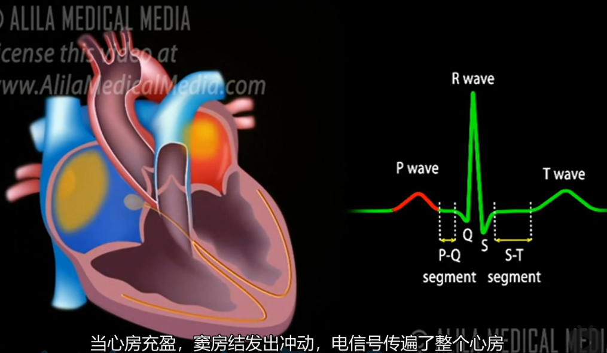

**2、P波开始后约 `100ms`左右，心房收缩，`PQ`段表示信号从窦房结传到房室结的时间。**

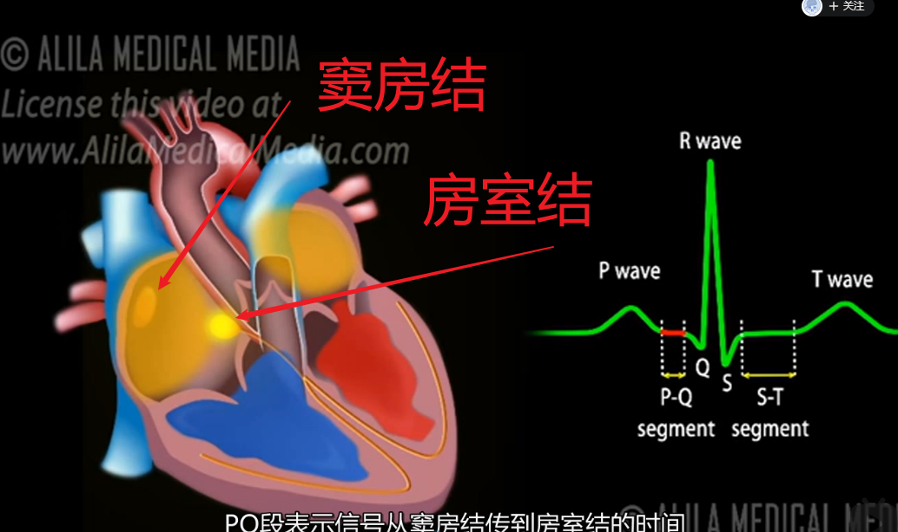

>  `QRS`波群标志房室结发出冲动，代表心室去极化的全过程。

**3、Q波对应于室间隔的去极化**

**4、R波对应于心室肌的去极化**

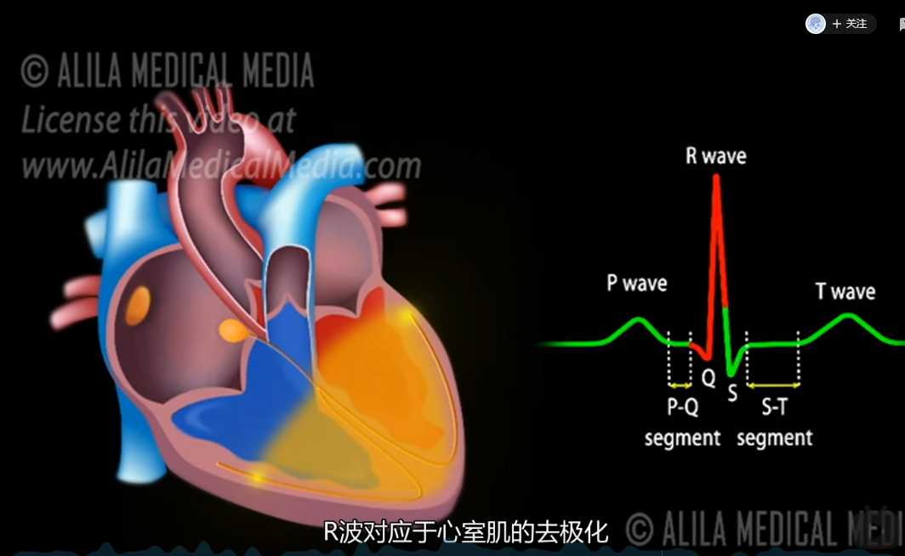

**5、S波对应心室除极的最后一个阶段，心室肌底部，心房复极也在这里发生，但是被 QRS 波群遮住了。**

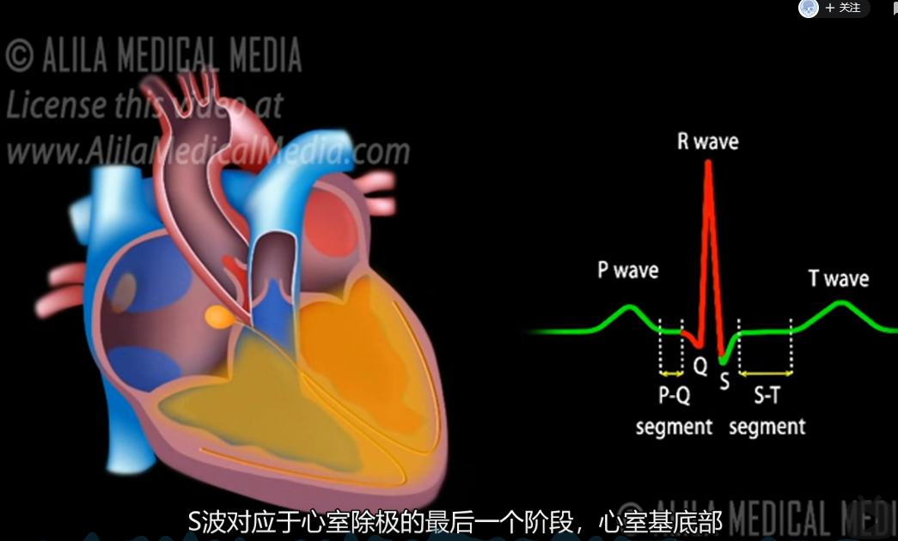

**6、ST段，反映了心肌动作电位的平台期，表示心室收缩和泵血**

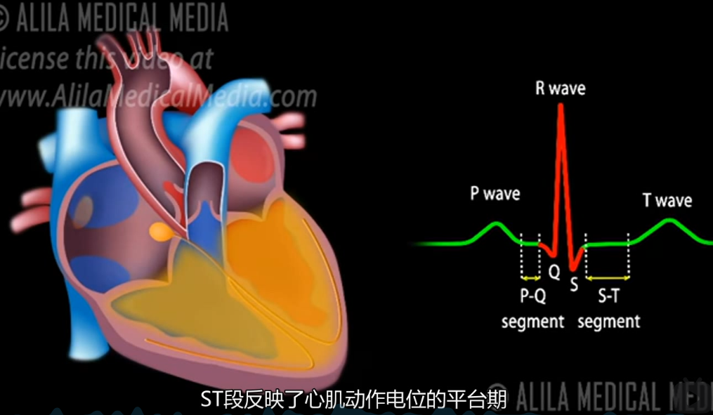

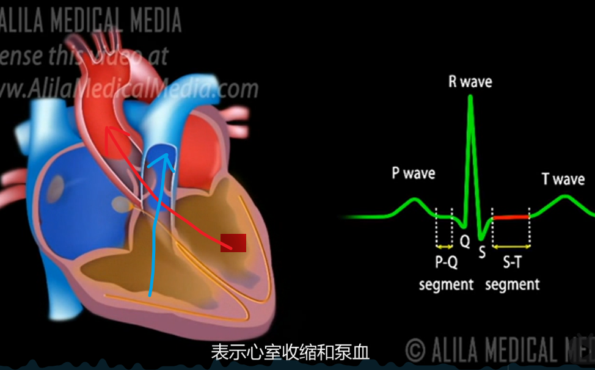

**7、T波表示心室舒张，或者心室复极前的心肌舒张。**

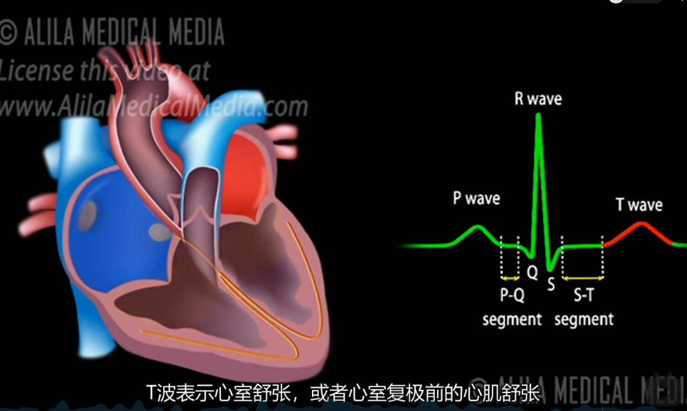

## 心电图

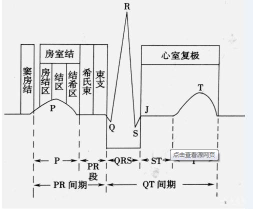

# 心电图接法

## 心电图接法

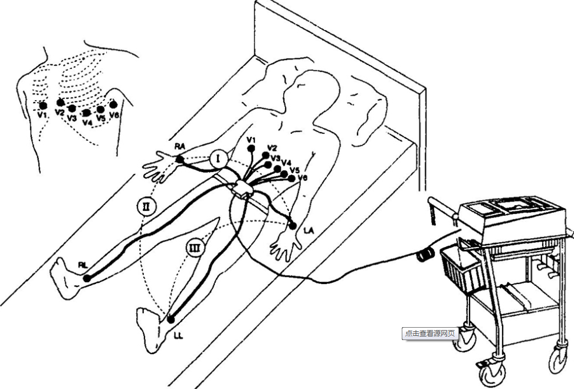

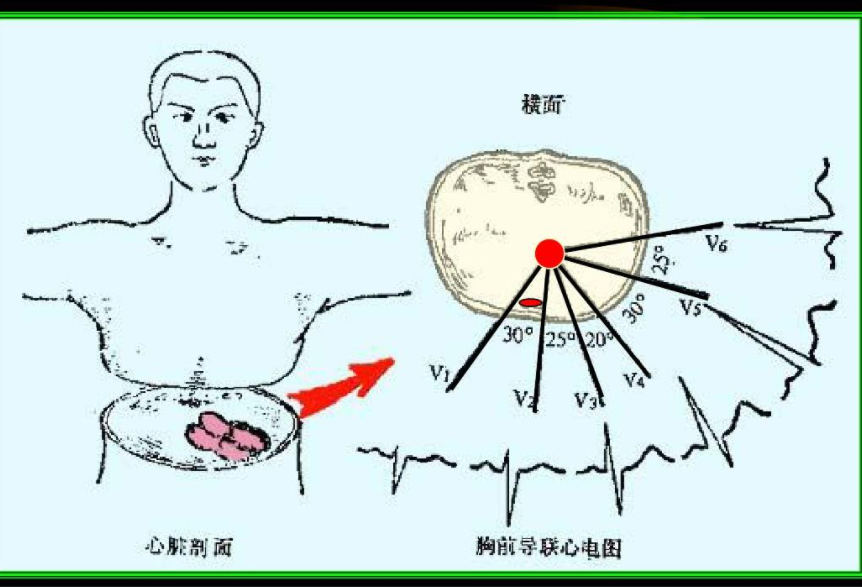

`v1、v2、V3、v6`是胸导心电图

`v4、v5`是导联直立

`I、II、III`是指P波波动强度

`aVR,aVL,aVF`是加压肢体导连

# 心电图诊断

- **ST段：**ST段异常抬高多见于急性心肌梗死、急性心包炎等；若异常压低，多见于慢性冠心病、心内膜下心肌梗死、急性心肌炎、心室肥大、心房肥大等。
- **Q-T间期：**Q-T间期延长见于心肌梗死、冠状动脉供血不足、低钾血症、低钙血症、药物的影响，也可见于遗传性原发性Q-T间期延长。
- **P-R间期：**中老年患者P-R间期延长常见于房室传导阻滞。
- **T波：**如果T波明显增高，可能是心肌梗死早期或者是高钾血症。T波低平或倒置可见于冠心病心肌缺血、高血压、围绝经期综合征（女性更年期）电解质紊乱、心肌炎、心肌病、神经功能异常、药物影响等。
- **U波：**U波倒置见于高血压、心肌缺血、左室负荷过重或电解质改变等。U波明显增高见于血钾过低。

## 窦性心律的特征：

* 每一个P波后都跟随着`QRS`波；

* PR间期正常且固定；

* P波形态正常；

* R-R间期应相等，如果不等则称为不规则心律。

##  **电轴** 

  心电轴要看Ⅰ导联和`aVF`导联。心电轴正常时，两导联的`QRS`波均向上。 

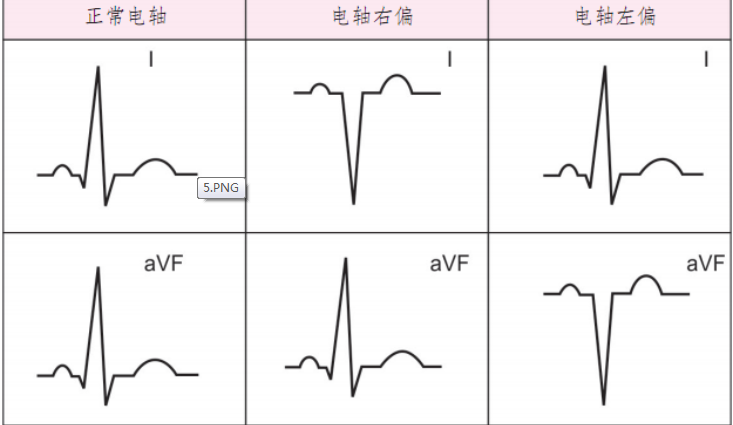

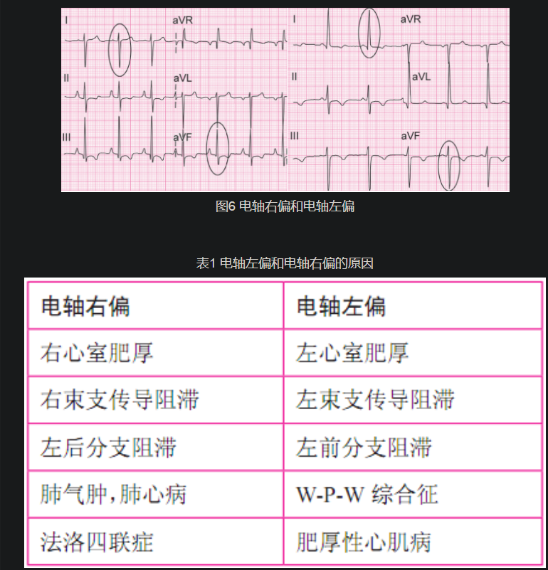

## P波

 P波代表右心房和左心房的除极。此过程通常需要0.08~0.11 s（2~3 mm）。**P波形态在Ⅱ导联最明显。** 

 窦房结位于右心房，因此右心房首先开始除极，因此 P波的初始部分是右心房除极所致，后面部分是由左心房除极所致。P波形态随导联而变化，取决于起搏点的位置。 

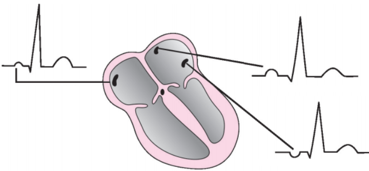

​																										 图8 不同的P波形态取决于起搏作用的区域 

 **二尖瓣型P波：**Ⅱ导联P波宽度＞0.12 s并有切迹（M型），两峰之间的距离大于或等于0.04 s。左心房扩大，左心房除极时间稍大于右心房。因此，我们看到有切迹及宽的P波。左心房异常的原因包括：二尖瓣狭窄、二尖瓣反流及主动脉瓣狭窄。 

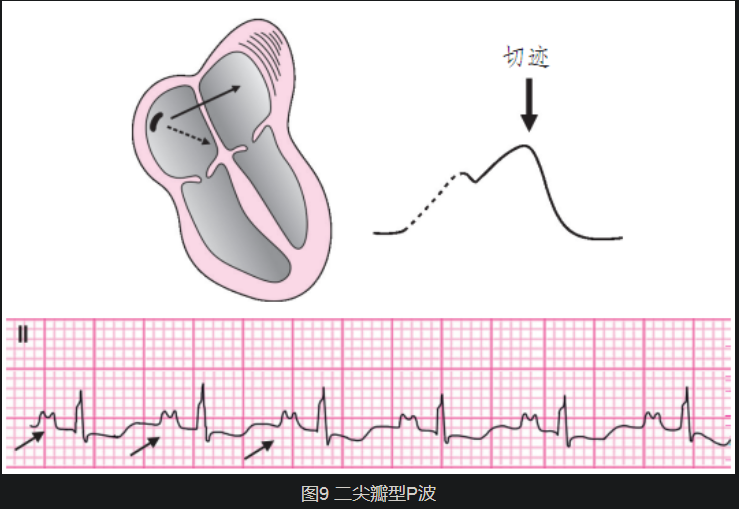

**肺性 P波：**Ⅱ导联P波高尖，高度＞2.5 mm。右心房扩大，右心房除极时间所需时间延长。因此P波变高。右心房异常的原因包括：支气管哮喘、肺气肿、肺栓塞、法洛四联症、房间隔缺损和肺动脉瓣狭窄。 

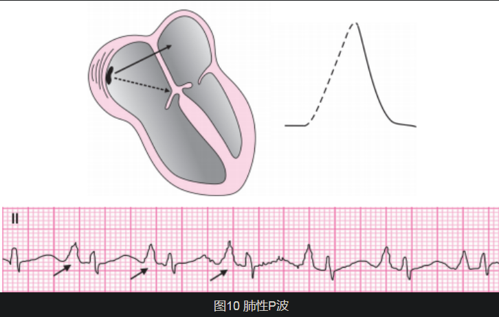

**P波倒置：**P波倒置常见于起搏或原始冲动起源于房室结或以下。因此，心房除极波逆向传播而引起P波倒置。P波倒置代表结性节律或交界区节律及室性节律。

 **心房内传导延迟（IACD）：**通常代表心房内非特异性传导问题，由心房扩大所致，但未扩大到形成二尖瓣型P波或肺性P波的表现。但是，V1和V6导联见到双向P波有助于区别左心房和右心房扩大。 

 如果V1导联双向P波的前半部分高于V6导联P波的前半部分，那么有可能是右心房扩大。如果V1导联的P波后半段宽＞0.4 s，且高＞1 mm，那么很可能是左心房增大。 

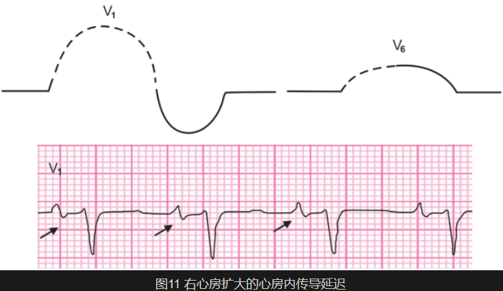

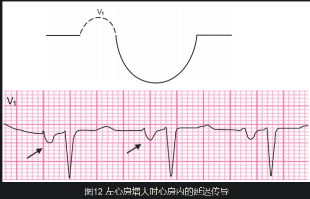

## P-R间期

 正常的P-R间期是0.12~0.20 s （3~5 mm）；P-R间期是对心脏的节律性最好的评价。 

 P-R间期缩短：＜0.11 s（3 mm），可见于逆行性P波、LGL综合征、WPW综合征等。 

 P-R间期延长：＞0.20 s （5 mm），可见于房室传导阻滞。 

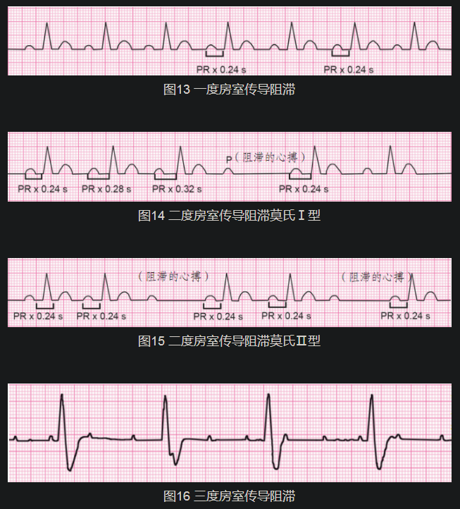

##  **QRS波群** 

 QRS波群代表心室去极化。正常时限＜0.12 s。 

 心肌梗死：病理性Q波振幅≥1/3 QRS波且Q波时限≥0.03 s提示心肌梗死或心肌坏死。 

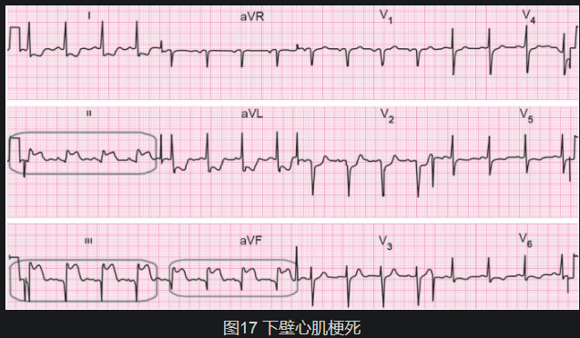

 左室肥厚：（1）Sokolow-Lyon标准：V1导联S波深度+V5或V6导联R波高度=35 mm，或者V5或V6导联R波高度＞26 mm（更敏感）；（2）胸前任一导联＞45 mm；（3）aVL导联R波＞11 mm；（4）I导联R波＞12 mm；（5）aVF导联R波＞20 mm。 

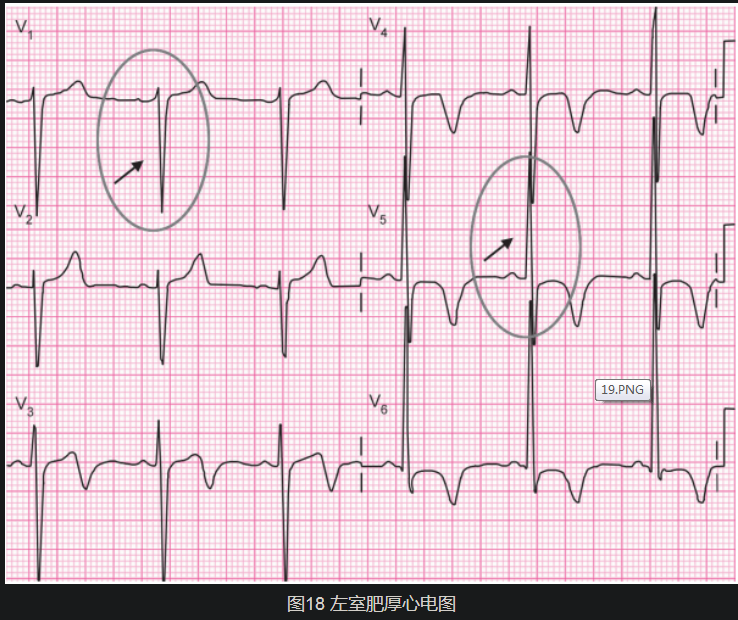

 右室肥厚：（1）V1导联R/S＞1（较敏感）；（2）V1导联的R波+V5或V6导联的S波>11 mm（Sokolow-Lyon标准）；（3）aVR导联R波＞5 mm；（4）V1导联R波>7 mm；（5）V1导联S波<2 mm。 

##  **ST-T异常** 

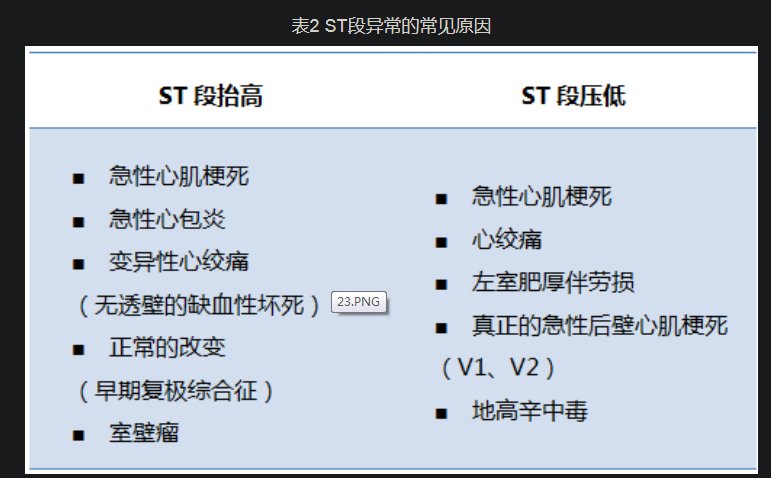

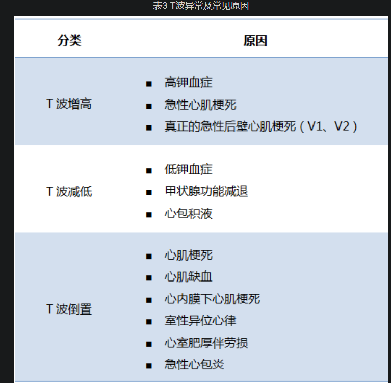

##   **QT 间期** 

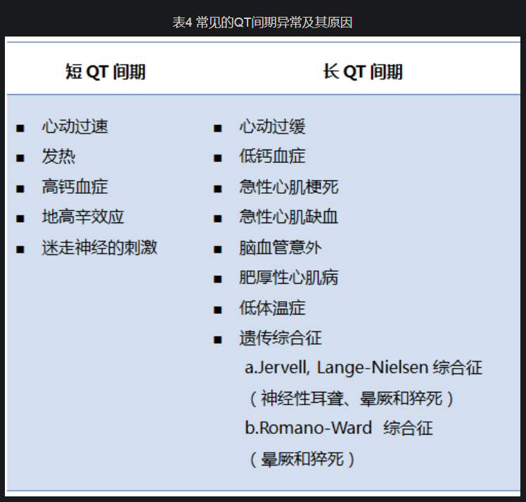

## 详细

1.P波

形态：P波的形态在大部分导联上一般呈钝圆形，有时可能有轻度切迹。心脏激活动起源于窦房结，因此心房除极的综合向量是指向左、前、下的，所以P波方向在Ⅰ、Ⅱ、aVF、V4-V6导联向上，aVR导联向下，其余导联呈双向、倒置或低平均可。

时间：正常人P波时间一般小于0.12s。

振幅：P波振幅在肢体导联一般小于0.25mV，胸导联一般小于0.2mV。

2.P－R间期 

P－R间期 代表心房开始除极至心室开始除极的时间。P－R间期正常范围是0·12－0·20S，心率越快P－R间期越短，反之越长。

3.QRS波群

QRS波群代表左右心室肌除极时的时间与电位变化。正常成年人QRS波群时间为0·06～0·10S，不超过0·11S，QRS波群形态较恒定，RV1～RV5逐渐增高，而S波逐渐减小。

4.R峰时间

过去称为类本位曲折时间或室壁激动时间，指QRS起点至R波顶端垂直线的间距。如有R波，则应测量至R峰；如R峰呈切迹，应测量至切迹第二峰。正常人R峰时间在V1、V2导联不超过0.04s，在V5、V6导联不超过0.05s。

5.Q波

除aVR导联外，正常人的Q波时间小于0.04s，Q波振幅小于同导联中R波的1/4.正常人V1、V2导联不应出现Q波，但偶尔可呈QS波。

6.J点 

QRS波群终末与ST段起始的交点称为J点。J点大多在等电位线上，通常随ST段的偏移而发生移位。有时可因心室除极尚未完全结束，部分心肌已。还可由于心动过速等原因，使心室除极与心房复极并存，导致心房复极波（Ta波）重叠于QRS波群的后段，从而发生J点下移。

7.ST段

自QRS波群终点至T波起点间的线段。正常的ST段多为一等电位线，有时亦可有轻微的偏移，但在任一导联，ST段下移一般不超过0.05mV；ST段上抬在V1-V2导联一般不超过0.3mV，V3不超过0.5mV，在V4-V6导联及肢体导联不超过0.1mV。

8.T波

代表心室肌快速复极的电位变化。正常者T波方向与QRS主波方向一致。振幅在以R波为主导联中，T波振幅不应低于同导联R波的1/10。

9.Q－T间期

Q－T间期的长短与心率快慢有密切关系，心率快Q－T间期短，反之则长。心率在60-100次/分时，QT间期的正常范围为0.32-0.44s。

10.U波

是T波之后0·02～0·04S出现的一个小波，方向与T波相同。

## **正常数值范围**

| 名称     | 正常值                       | 备注                                                         |
| -------- | ---------------------------- | ------------------------------------------------------------ |
| 正常心率 | 60~100bpm                    | 对应的RR间期为1s~0.6s，心率<60bpm的为“窦性心动过缓”，心率>100的为“窦性心动过速”。 |
| PR间期   | 120~200ms                    | PR期间>200ms的报“一度房室传导阻滞”；PR期间<120ms的报“短PR间期” |
| QRS间期  | <120ms                       | 大于此值有诊断意义；振幅（正、负向波的绝对值相加）：肢导<0.5mv和（或）胸导<0.8mv报“左室低电压”（较少见），小孩可不记。 |
| QT间期   | 340~430ms                    | 跟心率很相关，此为对应60~100bpm的QT间期正常最高值            |
| QTc间期  | <440ms                       | Tc为心率校正的QT间期=QT/√RR,临界QTc值为440~460ms，>460ms判断为QT延长，<350ms为缩短 |
| ST段     | -0.05~0.3mv                  | 超过正常范围下移常见于心肌缺血或劳损，上移多见于急性心肌梗塞、急性心包炎等 |
| P波幅度  | ≤0.25mv,≤0.11s               |                                                              |
| Q波幅度  | ≤同导联1/4R波振幅 宽度≤0.04s |                                                              |
| QRS波群  | 0.5mv~2.0mv                  |                                                              |
| T波幅度  | ≥同导联1/10R波幅度           | 胸前导联T波幅度高达1.2mv~1.5mv，T波低平或者倒置常见于心肌缺血、低血钾等。 |
| U波      | 0.2～0.3mv                   | 振幅很小，在胸前导联特别是V3较清楚                           |