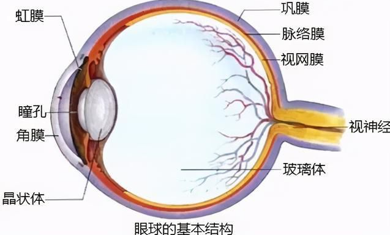
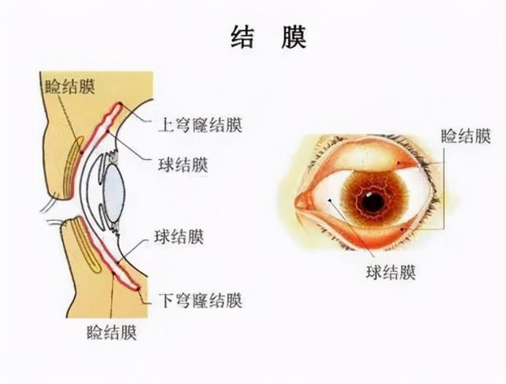

 人的眼球表面有一层透明的膜，叫结膜。衬在眼睑内面的为睑结膜，贴在眼球前的为球结膜。结膜的下方就是白色致密的巩膜。人老珠黄是眼睛新陈代谢的异常现象。结膜和巩膜都会有色素沉着。 

角膜是眼球的第一道防线，但其防护力有限。在长期受到紫外线、风沙等刺激之后，眼部的淋巴循环或者血液循环减慢，有些代谢废物不能顺利排出，就产生色素沉着的不良反应。结膜上皮出现老化现象，色素在结膜层集聚成块状黄斑，从表面上看，白眼球出现微微凸起的暗黄色物质，黑眼球变得更加混浊。

 人类受到外界环境刺激是日积月累的，老年人更容易产生结膜色素沉着现象，因而，也就有了"人老珠黄"一说。 

## 不要把「眼里的光没了」归结为婚姻，归结为历尽沧桑。

[结婚之后为什么眼里的光慢慢没了？ - 月见目闲的回答 - 知乎](https://www.zhihu.com/question/486476826/answer/2128206878 )

