# 向先辈们致敬

最近看到电影《长津湖》要上映了，以前只是听说这次战役很惨烈，但却没有真正的去了解一下这次战役，趁这次电影上映之前，先去了解一下历史。以缅怀先烈们，感谢他们为新中国确立在国际上的重要地位而做出的重要贡献。

**向一切为中华人民共和国的成立以及稳定做出巨大牺牲的先辈致敬**

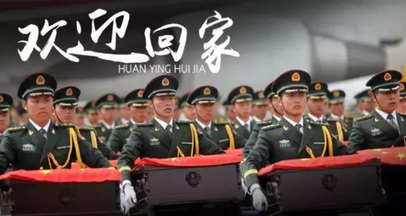

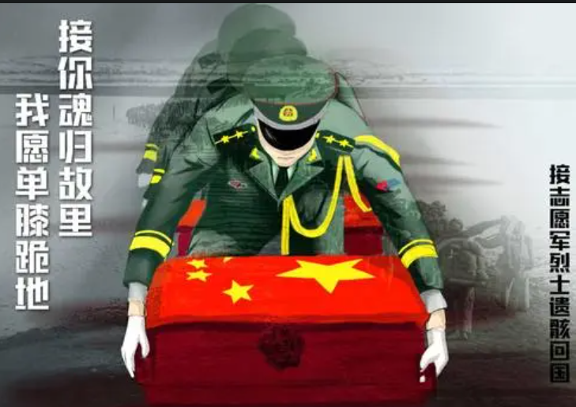

## 概述

**地点：**朝鲜战场---长津湖

**时间：**1950年11月27日至12月6日共进行了十天。

**双方：**志愿军和联合国军

> 志愿军：第9兵团司令员宋时轮、副司令员陶勇，由20军、26军和27军组成，共15万人，实际参战人数 ~67000
>
> > **第20军：第58师，第59师，第60师，第89师**
> >
> > **第26军：第76师，第77师，第78师，第88师**
> >
> > **第27军：第79师，第80师，第81师，第94师**
>
> 联合国军：共10万人 实际参战 ~30000  800余架飞机。
> ​	美国方面：第10军，陆战1师，第3，第7步兵师
> ​	韩国方面：首都师和第三师
> ​	英军海军陆战队和陆战特遣队

**天气：**零下40°

**地图：**

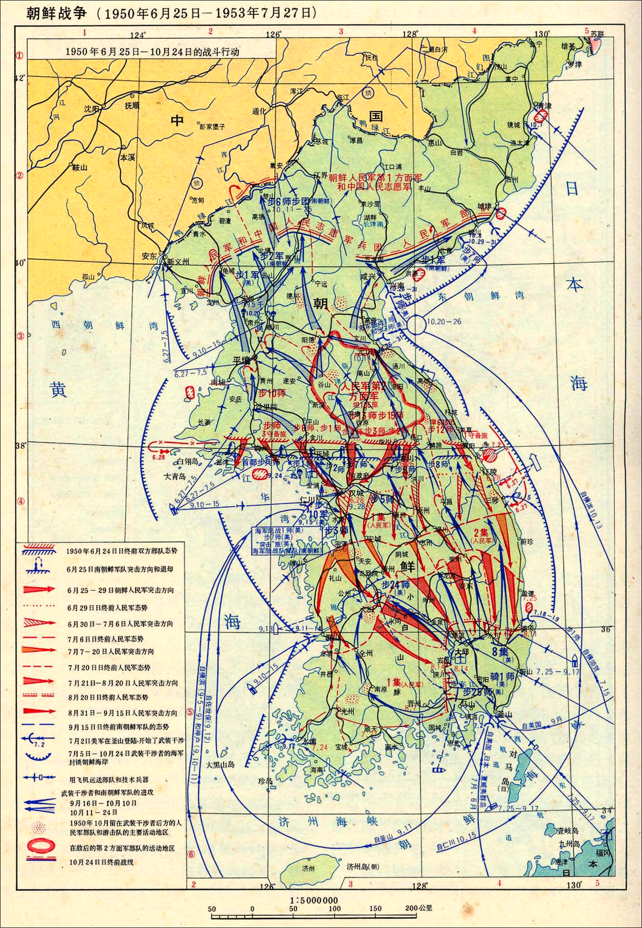

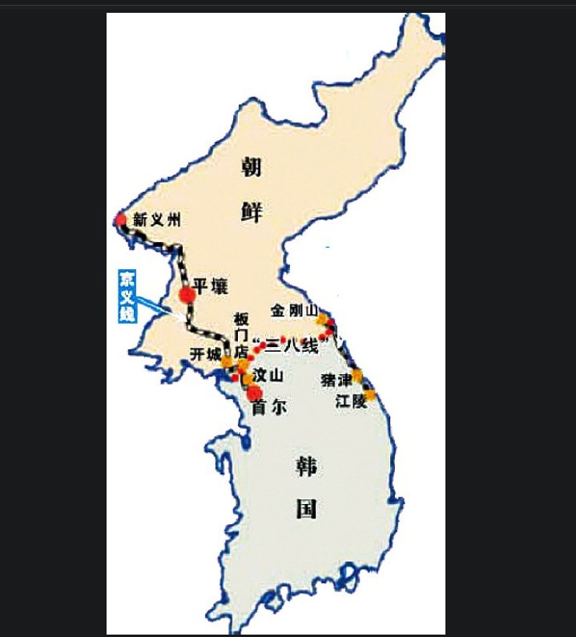

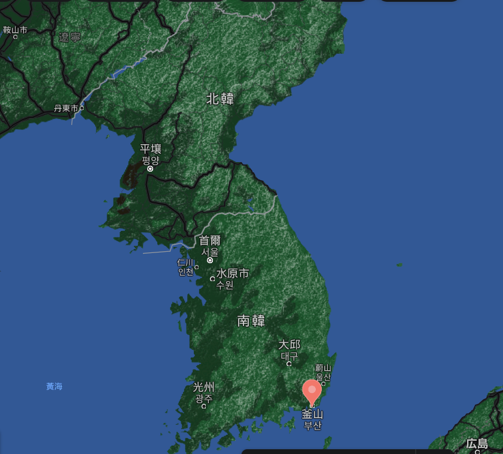

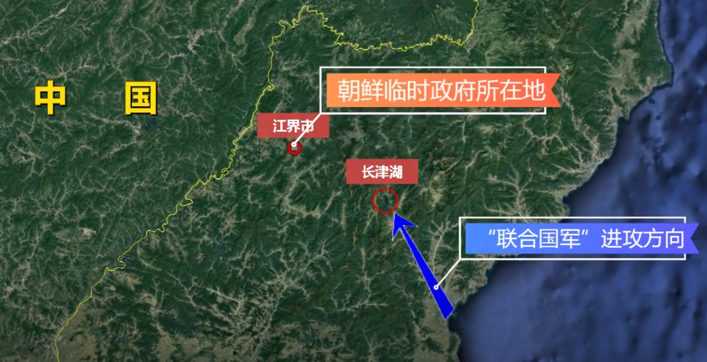

红色我我军防守地，左右到分别为 20 27 26军，蓝色为美军进攻方向

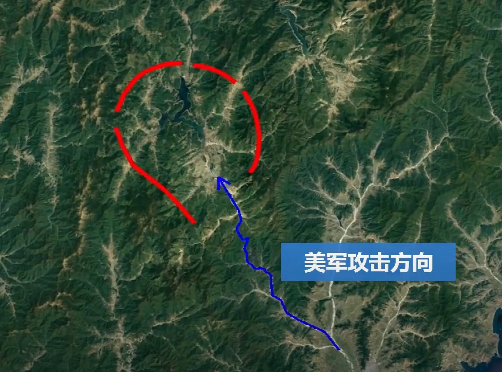

​		1950年，美军第10军，仁川登陆后，9月攻入汉城后，联合国军越过38线，进入朝鲜，意图在1950年底重新统一朝韩。中华人民共和国在对联合国发出一系列警告之后介入冲突。有毛主席调第九兵团入朝鲜战斗，志愿军42军受命向北撤退，意图将联合国军诱至长津湖。但是第九兵团是为解放台岛而准备的加强兵团，总人数高达15万人。所以，衣服哪里准备得有这么厚的，打台湾的。所以，大多数都是很薄的衣服就进入朝鲜了。11月11日，第九兵团就秘密如朝鲜，哪里来得及凑这么多衣服。气温达零下40°。

​		11月17日第9兵团悄悄进入长津湖地区到长津湖后，三军进行埋伏，具体埋伏如下。

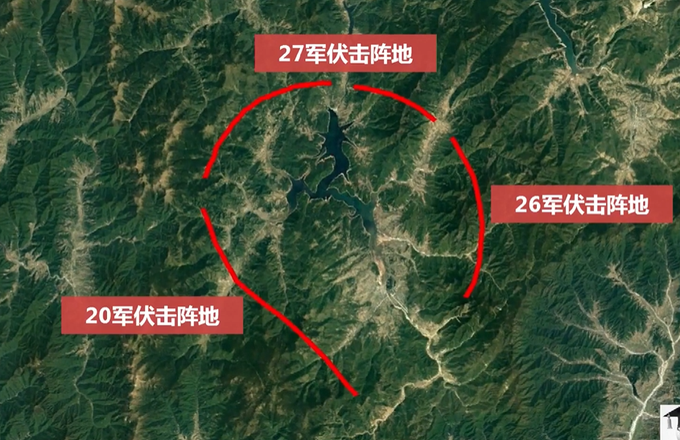

美军到达长津湖后，分别驻扎在这几个点，美国第10军指挥官[爱德华·阿尔蒙德](https://zh.wikipedia.org/wiki/爱德华·阿尔蒙德)少将在11月21日制定了一个计划。该计划要求美国第1海军陆战师从柳潭里向西推进，美国[第7步兵师](https://zh.wikipedia.org/wiki/第7步兵師)派出一个[团级战斗队](https://zh.wikipedia.org/w/index.php?title=团级战斗队&action=edit&redlink=1)在新兴里保护其右翼。美国[第3步兵师](https://zh.wikipedia.org/wiki/第3步兵师)在保障后方地区安全的同时也保护其左翼。[[24\]](https://zh.wikipedia.org/wiki/长津湖战役#cite_note-FOOTNOTEAppleman199014-30) 这时第10军已被分散在长达400英里（640千米））的战线上了。

>  这个和刘备被七百里火烧连营有点像了，我们这次是把他们中间打断，然后，分成小股力量逐个击破。

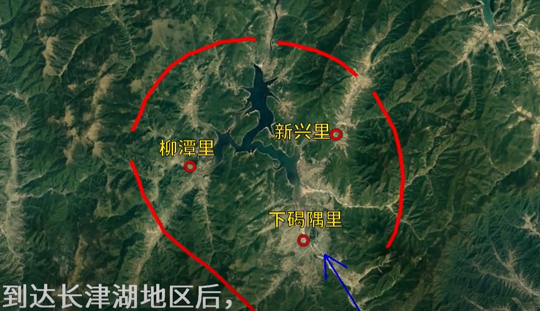

27日黄昏，志愿军开始发起进攻，由于美军比较分散，所以，把美军分成了很多小股力量再打。因此，美军落荒而逃，向南撤退。当退到死鹰岭的时候，本来我们在这里埋伏了人的，但是没有收到丝毫的阻击。因为我们**117团6连的125名战士**，全部冻死在了这里。致敬。

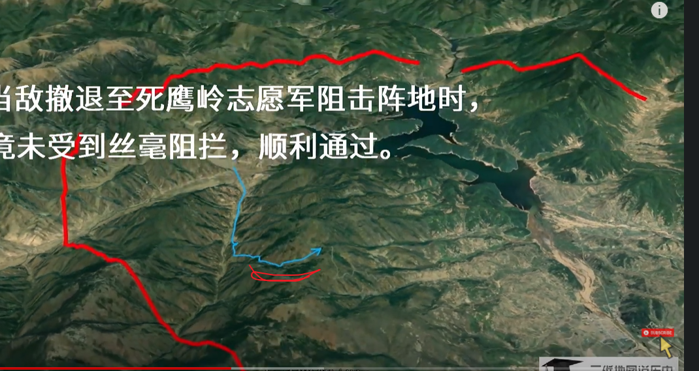

战士宋阿毛这样写道。

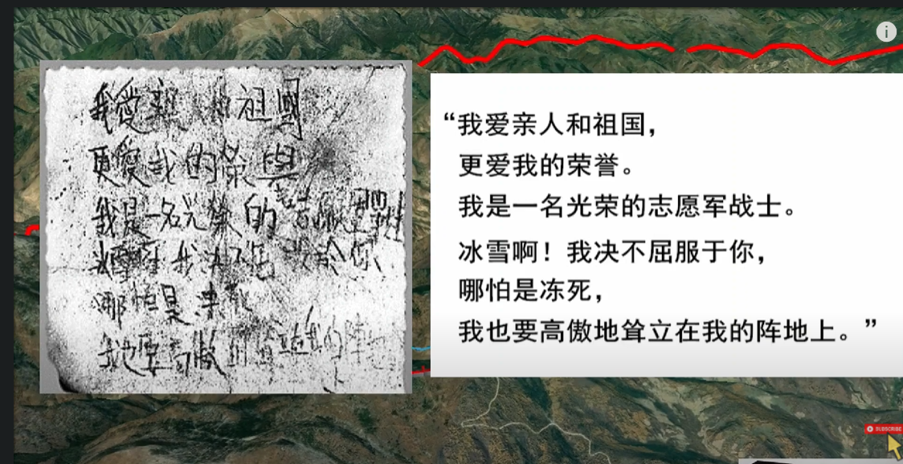

在美军继续撤退的时候，在下碣隅里的小高岭狙击战的时候，172团3连连长杨根思（28岁），抱起炸药包，拉燃导火索，跳向了敌群。

> 杨根思和黄继光，是特级英雄

美军继续撤退，到了下碣隅里的时候，美军把他们的衣服食物，全烧了。真可惜。志愿军入朝没棉衣，没热饭吃。然后继续南逃，到达古土里。

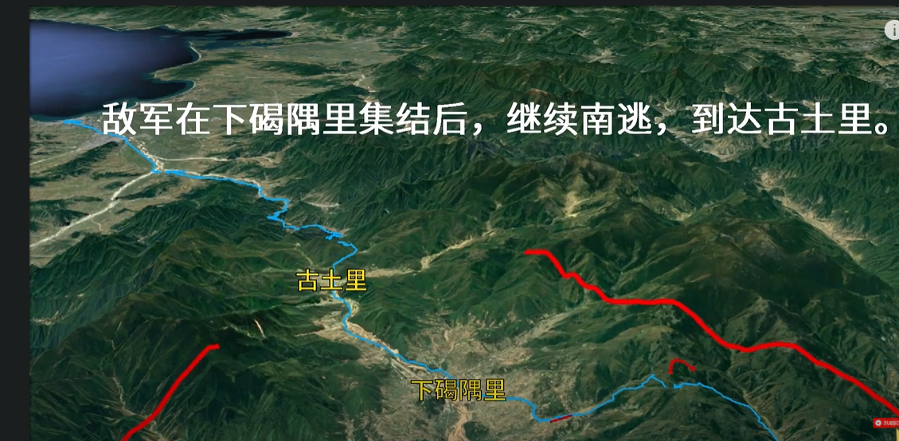

古土里往南6公里，有一个水门桥，水门桥通过后，他们就可以直接到海边，所以，12月1日，志愿军小分队就把桥提前炸了，但是美国工兵1天就把修好了。修好了又炸，美军又修，后来志愿军直接把桥墩炸了，但是美军直接运来了整桥组件，把桥修好了？？？？？我擦，这是真牛皮

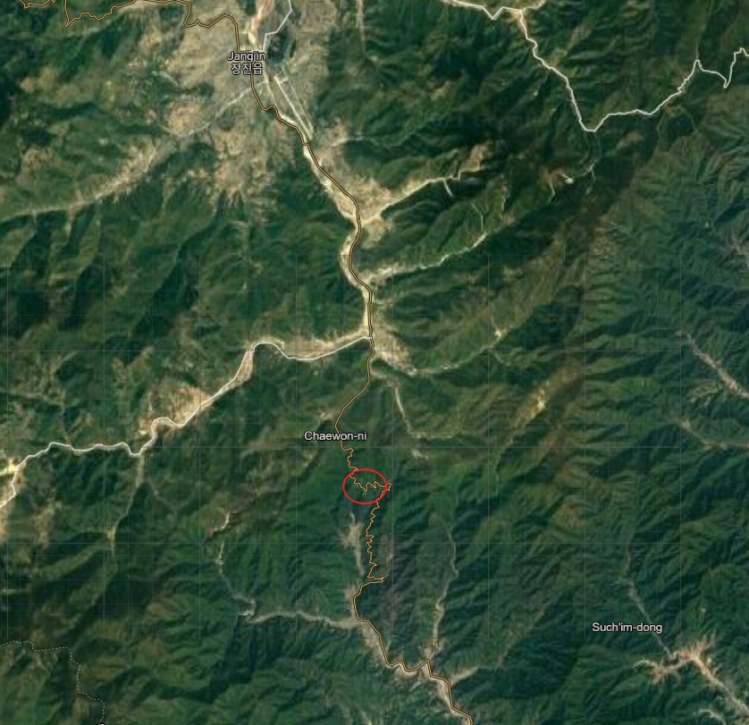

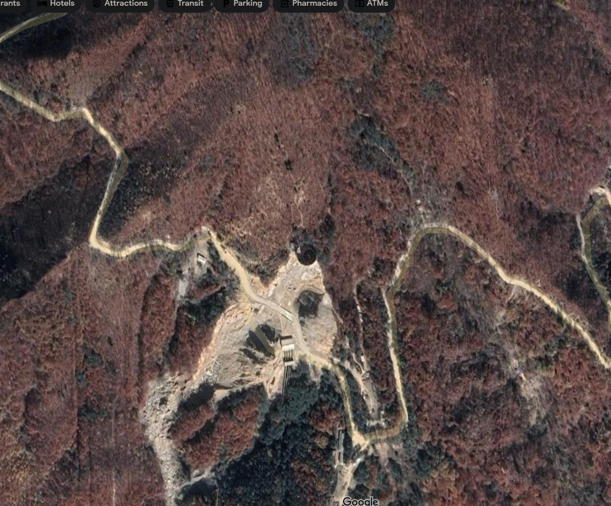

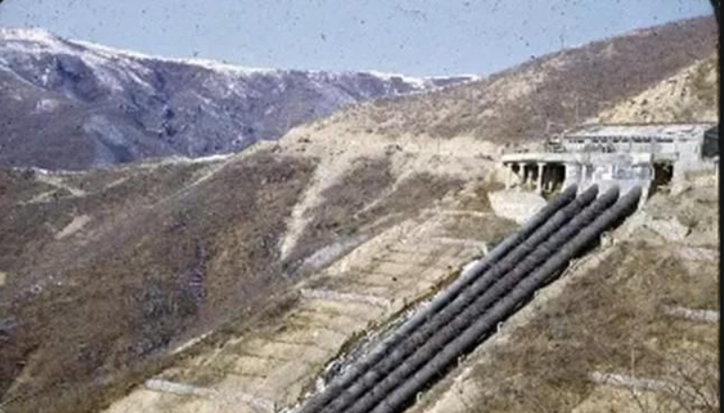

当美军大部队来得时候，水门桥担任爆破和狙击任务的180团1营2连没能发起冲锋，负责阻击的100多名战士，全部冻僵在阵地上，正是这次没能阻击，所以，没能全歼灭美军。

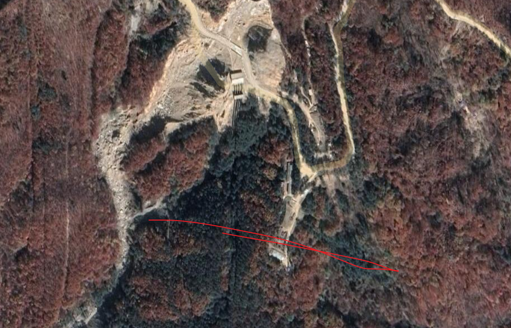

美军通过后，继续难逃，在12月24日，在兴南港乘船逃跑，圣诞前夜。

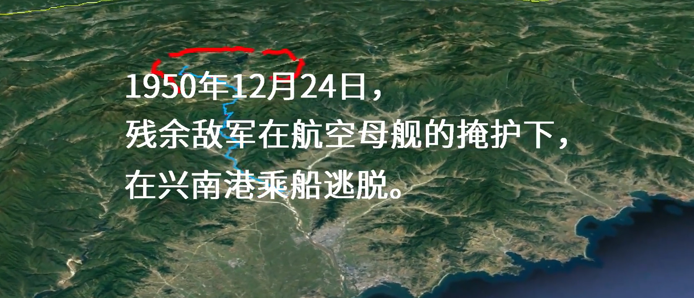

25日，志愿军，占领兴南港，为后来的停战谈判奠定了基础。这是入朝的第二次重大战役,

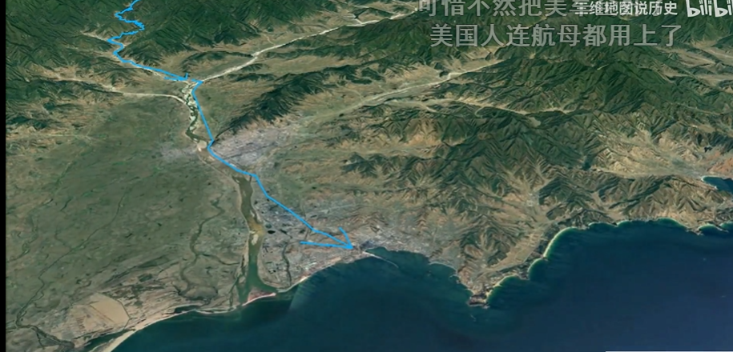

中国在战役中掳获的美国陆军第31团团旗，至今还陈列在北京的军事博物馆中，以纪念这场战役。*北极熊旗*

## 伤亡人数

**中方：**

**19,202 战斗伤亡**
**28,954 非战斗伤亡**
**总共48,156人[[6\]](https://zh.wikipedia.org/wiki/长津湖战役#cite_note-FOOTNOTEXue_&_Li_Part_Four2000徐焰:"第九兵团战斗减员19202人，冻饿减员28954人；减员总数48156人。"-10)**
**联合国方估计：**
**29,800 战斗伤亡**
**20,000+非战斗伤亡**

**这些都不是一个个数据，而是一条条鲜活的人命，你们是最可爱的人。**

 美方辣鸡：

**美方资料**：
1,029 死亡
4,894 失踪
4,582 负伤
7,338 非战斗伤亡
损失15辆坦克
总共17,843人[[8\]](https://zh.wikipedia.org/wiki/长津湖战役#cite_note-FOOTNOTEAppleman1990345,_347-12)[[注 5\]](https://zh.wikipedia.org/wiki/长津湖战役#cite_note-13)[[9\]](https://zh.wikipedia.org/wiki/长津湖战役#cite_note-FOOTNOTEAppleman1990348-14)
**中方估计**：
13,900[[10\]](https://zh.wikipedia.org/wiki/长津湖战役#cite_note-FOOTNOTEXue_&_Li_Part_Four2000-15)

# 思考

**向中国人民志愿军致敬**

抗美援朝时期中国部队的平均年龄是28岁左右。

损失太大了，主要是衣服，28954的非战斗伤亡，其中很大一部分估计都是由于保暖问题。

把美军分成小股力量击破，这是最重要的，美军集中，火力不一定拼得过。

水门桥那里，美军很快能修好桥，这里也值得借鉴，当然，美军的机械化工业化肯定要先进得多。

后勤补给，一定要到位。兵马未动，粮草先行，当然，这次对美作战，军情似火。

# 参考

1、[三维地形图带你直观了解长津湖战役，这场战役究竟有多惨烈？为何战后双方将领都不愿提及？](https://www.bilibili.com/video/BV14C4y147ye?from=search&seid=9074160648842624361)

2、[`wiki` 长津湖](https://zh.wikipedia.org/zh-hk/%E9%95%BF%E6%B4%A5%E6%B9%96%E6%88%98%E5%BD%B9)

3、[關鍵戰役：長津湖之役](https://www.youtube.com/watch?v=D0Z3yPvHgbI&t=1042s)

