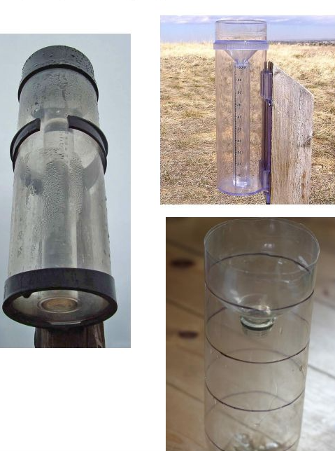
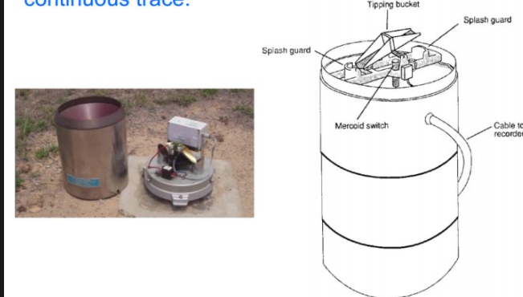
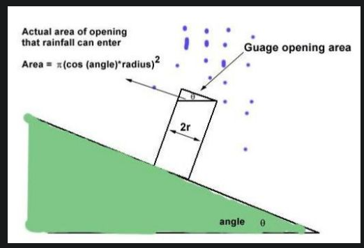
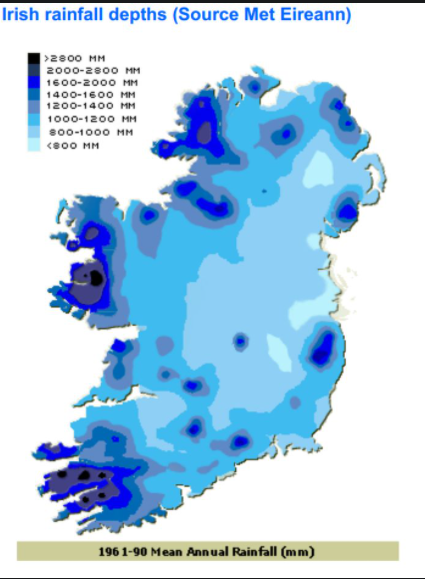
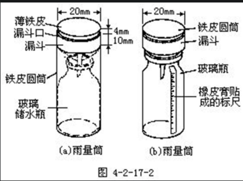

# 河南加油！！！！！！！！

# 河南加油！！！！！！！！

# 河南加油！！！！！！！！

# 降雨量

[知乎--> Calvin Zhang ](https://www.zhihu.com/question/20113398)

## 雨量记录的方法

雨量常常用 降水深度【depth of liquid】 来表示，如果再给出一定区域相对于海平面的投影的面积就可以计算出总的降雨量【the total volume of precipitation 】所以选定雨量的测试点就显得尤为关键了，需要考虑它所处的位置以及所有点的分布，经常会用到雷达和卫星来确定。在这里主要说一下测量方法，主要分为人工测量和自动测量。

### 人工测量

主要使用传统的雨量计，大概长这样

那个圆形漏斗用于确定一个选定的水平面。然后用收集的雨量除以收集的开放面积（就是那个漏斗的圆形的面积）就可以知道每平方米的降雨量了，但是我们平时见到的降水量的单位都是 `mm`，那是因为省略了之后的`/m³`。
有时候我们还会见到 升/h 那又是是怎么回事呢？
因为`1mm/m³`的水量刚好等于1 升 所以 100毫米的降水就等于100升/小时。
然后我们每天记得去读数就好了，然而，每周或者每月读一次数据的也很常见。

### 自动测量

主要用翻斗测量仪，大概长这样：

原理其实很简单，就是在上面那个“跷跷板”一样的东西，当它上面的雨量达到一个定值（比如 `0.2mm` 或 `0.5mm`）它就跳动一下，然后有个电子记录仪就记下点了多少下之类的，然后用电脑处理成雨量数据。

这种测量仪在综合测量仪上（同时会测量风向，风速，湿度 之类的）

## 放置位置

接下来我们看看雨量测量器的放置都有哪些需要注意的方面。
最好放置在平地上。
很多时候我们都不得不放在一个斜坡上，不过没关系，这时候收集雨量的面积就不是量筒的横截面面积了，而是，，，算了看图容易理解：

一个地区内连成系统的雨量测量仪，海拔高度要应保持一致。
一定地区的雨量不是均匀分布的对吧，比如边缘雨小中心雨大，所以我们需要测量网络，然而不在同一水平高度的测量数据之间又无法进行比较。所以尽量保持测量筒的水平高度一致。
比如这个爱尔兰的雨量分布图，可是750多个人工雨量测量点的统计数据，它们就是雨量系统的测量结果。

我国气象部门一般采用的降雨强度标准为：
1、小雨：12小时内雨量小于5毫米，或24小时内雨量小于10毫米；
2、中雨：12小时内雨量为5-14.9毫米，或24小时内雨量为10-24.9毫米；
3、大雨：12小时内雨量为15-29.9毫米，或24小时内雨量为25-49.9毫米。

暴雨的定量标准，各地并不一致，视具体情况而定。气象上大致规定暴雨按强度分三级：

1、暴雨：12小时雨量等于和大于30毫米，或24小时雨量等于和大于50毫米；
2、大暴雨：12小时雨量等于和大于70毫米，或24小时雨量等于和大于100毫米；
3、特大暴雨：12小时雨量等于和大于140毫米，或24小时雨量等于和大于250毫米。

雨量是用雨量器和雨量杯来计算的，雨量器是个圆柱形的开口筒，筒口面积在我国多为314平方厘米（直径20厘米）。为了防止降水蒸发，中上部呈一漏洞型，下部放一储水瓶。

为观测方便与上述口径配套有一特制量杯，雨量杯的口径为4厘米，因此每一毫米降水量在雨量杯上的长度为25毫米。为了连续记录液态降水量，水文气象部门多使用虹吸式雨量计或翻斗式遥测雨量计。它们的记录纸，不但记录了总降水量，还可以判定不同时段的降水量或降水强度。

就`20cm`的杯子接的水，倒入`4cm`的杯子的高度

