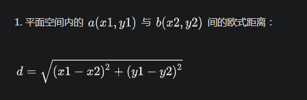

# 概述

最近做一个项目，需要用才相似度方面的算法，因此做一个记录。

以下为常用的相似度算法：

1. 欧式距离（Euclidean Distance）

2. 余弦相似度（Cosine）

3. 皮尔逊相关系数（Pearson）

4. 修正余弦相似度（Adjusted Cosine）

   

# 应用

比如，推荐算法，推荐给你搜索比较相近的东西，比如，图片是否一样，太多了，所以，还是有必要了解了解。

# 欧式距离

 Euclidean Distance 

一种简单的距离算法，就是欧式空间中两点间的距离。就是距离越近，那么越相似。

## 代码实现

~~~c++
	double diffx = x1 - x2;
	double diffy = y1 - y2;
	double dis = sqrt(diffx * diffx + diffy * diffy);
~~~

#  余弦相似度

Cosine

一种计算两个点之间夹角的方式，夹角越接近，那么，差异越小

平面上的向量的夹角，利用内积公式

所以定义的公式，求一个定积分

> 内积：两个张量（含矢量）相乘以后，其总阶数减少了，或曰缩小了。形象地看，是向“内”收缩了。
>
> 外积：两个张量（含矢量）相乘以后，其总阶数增加了，或曰扩大了。形象地看，是向“外”扩张了。

>
>
> cos(a, b) = (**a**·**b)** / (|**a**||**b**|) 
>
>如果只在1维的情况，那么
>
>分子：` a·b == a*b == x1*x2`
>
>分母：`|a|== a*a == a² `

## 代码实现

~~~c++
    float getMold(const vector<float>& vec){   //求向量的模长
        int n = vec.size();
        float sum = 0.0;
        for (int i = 0; i<n; ++i)
            sum += vec[i] * vec[i];
        return sqrt(sum);
    }

    float getSimilarity(const vector<float>& lhs, const vector<float>& rhs){
        int n = lhs.size();
        assert(n == rhs.size());
        float tmp = 0.0;  //内积
        for (int i = 0; i<n; ++i)
            tmp += lhs[i] * rhs[i];
        return tmp / (getMold(lhs)*getMold(rhs));
    }
~~~

# 欧和余区别

余弦相似度计算的向量的夹角，它并不关心向量的绝对大小。

欧式距离体现的是数值上的绝对差异。

夹角余弦更能**反映两者之间的变动趋势**，两者有很高的**变化趋势相似度**，而欧式距离较大是因为**两者数值有很大的区别**，即两者拥有很高的**数值差异**。 

# **皮尔逊相关系数**

Pearson Correlation Coefficient

先上公式

还是有点复杂

慢慢一步一步理解，但首先理解几个概念，**方差，标准差，协方差**。

## 方差

 **方差**是衡量随机变量或一组数据时离散程度的度量。  

**概率论中方差**：用来度量随机变量和其数学期望（即均值）之间的偏离程度。

**统计中的方差**（样本方差）：是各个样本数据和平均数之差的 平方和 的平均数。在许多实际问题中，研究方差即偏离程度有着重要意义。

### 公式

每个数，偏离平均值的差然后求平方，在求和，最后除以总数。

为什么表偏离程度，可以通过向量来看，如下图。

## 标准差

 标准差反映数据的波动幅度，同一组人群，标准差越大，意味着变异越大。 

偏离中心的幅度越大，标准差越大。

#### **公式**

标准差是**方差**的平方根，标准差的公式如下：u表示期望

偏离中心的距离。

来，看英文，毕竟这玩意，老外发明的，咱们还是看看老外怎么取名字

**Standard deviation**

## 方差和标准差差别

 既然有了**方差**来描述变量与均值的偏离程度，那又搞出来个**标准差**干什么呢？ 

我们看看，方差的结果是 **2次幂** 的，而标准差的结果是 **1次幂** 的，这就是说，量纲是不一样的，那用方差就不好和常规的数值进行比较啊！！！

所以，搞一个标准差来，就可以和正常数值进行比较了。比如和平均值比较。

### **比如说：**

 在NBA中，平均数据用来衡量一个球员的战斗力，比如场均得分，盖帽，抢断，助攻等。 天王山之战，必须要拿下这场比赛，我肯定要找几个最近发挥稳定的上场啊，不能找个 `JR`来上场啊（`James`怒拍大腿）。所以，怎么去看他最近发挥是否稳定了？那这个时候就需要，计算他的标准差了，各个值偏离平均值的程度。综合计算。方差肯定是不行的啊，没法比较，量纲不一样，所以，只有开根号了。

## 协方差

Covariance

表征两个变量的变化过程中，是同方向变化，还是反方向变化，且同向和异向的程度。

>  通俗的说，协方差分析就是在方差分析得基础上加上几个协助变量；或者说，方差分析其实就是协方差分析，或是协方差分析的一种特殊情况。 　协方差分析是加入协变量的方差分析，**协变量实际上就是我们所说的控制变量**，你的调查研究中如果有一些你并不真正关心、但有可能对因变量有影响的变量，你可以将其作为协变量，这就意味着你控制了该变量对因变量的效应，从而可以考察自变量与因变量的真实关系。 　
>
> 协方差分析出了要设定协变量这一点，其他方面与一般的方差分析没有太大区别。 　
>
> 协变量是连续变量 　
>
> 方差分析是不能控制这种无关的连续变量的，所以协方差分析能够得到更可靠的研究结果 
>
> 可以理解为，多个变量对结果的影响
>
> 你看公式，方差只有一个 X 的影响，而 协方差有 Y的影响，那我是不是还可以加上 Z 或者 A，B，C。。。的影响。就是比喻对这个数据有影响的所有 N 个维度的都纳入进来计算。

**比如：**

你女朋友走东，你要走西，那方向就不同了。这协方差就是负的，反了。如果，你不服气，你还加速跑，好家伙，那协方差就更大了。

那再来，你女朋友往东走，你也往东走，这时候，协方差就是正的，但是，你如果也不服气，就是不追上去，和她速度一样屁颠屁颠的走在她后面，那你们协方差就为0了。变化相同

### 公式

每个时刻的“X值与其均值之差”乘以“Y值与其均值之差”得到一个乘积，再对这每时刻的乘积求和并求出均值（其实是求“期望”，但就不引申太多新概念了，简单认为就是求均值了）。

列几张图，直观的感受一下。

### 总结

如果协方差为正，说明X，Y同向变化，协方差越大说明同向程度越高；如果协方差为负，说明X，Y反向运动，协方差越小说明反向程度越高。

## 皮尔逊

**皮尔逊**

分子部分: 每个向量的每个数字要先减掉向量各个数字的平均值, 这就是在中心化.

分母部分: 两个根号式子就是在做取模运算, 里面的所有的 r 也要减掉平均值, 其实也就是在做中心化.

> 中心化的意思是说, 对每个向量, 我先计算所有元素的平均值avg, 然后向量中每个维度的值都减去这个avg, 得到的这个向量叫做被中心化的向量. 机器学习, 数据挖掘要计算向量余弦相似度的时候, 由于向量经常在某个维度上有数据的缺失, 预处理阶段都要对所有维度的数值进行中心化处理
>
> 
>
> 中心化，距离中心的距离

**协方差**

> 表征两个变量的变化过程中，是同方向变化，还是反方向变化，且同向和异向的程度。

**标准差**

> 标准差反映数据的波动幅度，同一组人群，标准差越大，意味着变异越大。 

**皮尔逊**

对比上面的公式，可以看到，皮尔逊的结果就是，协方差的结果 / 标准差的结果。

### 扩展

虽然协方差能反映两个随机变量的相关程度（协方差大于0的时候表示两者正相关，小于0的时候表示两者负相关），但是协方差值的大小并不能很好地度量两个随机变量的关联程度，例如，现在二维空间中分布着一些数据，我们想知道数据点坐标X轴和Y轴的相关程度，如果X与Y的相关程度较小但是数据分布的比较离散，这样会导致求出的协方差值较大，用这个值来度量相关程度是不合理的，如下图：

为了更好的度量两个随机变量的相关程度，引入了Pearson相关系数，其在协方差的基础上除以了两个随机变量的标准差，容易得出，pearson是一个介于-1和1之间的值，当两个变量的线性关系增强时，相关系数趋于1或-1；当一个变量增大，另一个变量也增大时，表明它们之间是正相关的，相关系数大于0；如果一个变量增大，另一个变量却减小，表明它们之间是负相关的，相关系数小于0；如果相关系数等于0，表明它们之间不存在线性相关关系。《数据挖掘导论》给出了一个很好的图来说明：

在继续看看这个公式

**皮尔逊**

**余弦相似度**

有没有发现什么区别，就是 **皮尔逊就是余弦相似度在某一个维度上的缺失的补充**

这里也解释了，为什么皮尔逊的结果是在 (-1,-1) 之间。

## 补充

写到这里，有必须再写一下 皮尔逊和余弦相似度了

在看看余弦相似度的优缺点：

> 余弦相似度计算的向量的夹角，它并不关心向量的绝对大小。

因为只关心夹角的大小，所以，如果同向，即使纵方向有差距，但是其实余弦相似度为 都为 1 ，不能反映差别的大小，所以。再增加一个 Y  方向的维度，这就变成了皮尔逊。

如下图。

我擦，那再增加一个维度，不就变成 `Guido` 了 （狗头）。

那么。修正 **修正余弦相似度**是不是就是有点这个意思了。

# **修正余弦相似度**

修正余弦相似度就是在余弦相似度上的补充，因为，余弦对数值不敏感，所以，导致了结果的误差。就需要修正这种不合理的地方。

# 总结

欧式距离，对一维的相似度很敏感，但是，对于二维的处理，她就差得多了， 所以，可以采用余弦相似度，但是余弦相似度也优缺点啊。他对方向挺敏感，但是对数值不敏感啊，所以，有了修正余弦相似度和皮尔逊相关系数，用以对余弦相似度某个维度上缺失的补充。