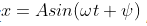
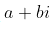
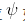
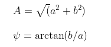
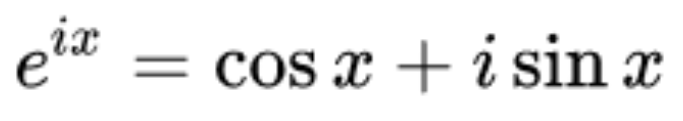
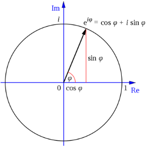

傅里叶变换是将一个信号分解为多个信号之和的形式，并且是正弦或余弦信号叠加的形式。决定一个正弦波，需要频率、振幅和相位，三者缺一不可，其中频率由x轴给出，而振幅和相位可以由复数准确表达。对于 复数 ，其振幅 A 和相位  如下：（注：`MATLAB`中`fft`函数的结果即采用这样这种方式表达） 

三角函数和复函数转换见欧拉公式。

# 频谱

时域信号经过傅里叶变换，就可以得到信号的频谱。频谱由两部分构成：

*  幅度谱 ： 对信号轮廓和形状的描述； 
*  相位谱 ： 对信号位置的描述。不同位置的同形状的信号，幅度谱一样，相位谱则不同。 

# 功率谱和能量谱

 要区分功率谱和能量谱，首先要清楚两种不同类型的信号：功率信号和能量信号。我们从一个具体的物理系统来引出能量信号和功率信号的概念。已知阻值为R的电阻上的电压和电流分别为`v(t) `和` i(t)`，则此电信号的瞬时功率为：` p(t) = v2(t)/R = i2(t)R`。在作定性分析时，为了方便起见，通常假设电阻R为1欧姆而得到归一化 `(Normolized)` 的功率值。作定量计算时可以通过去归一化，即将实际的电阻值代入即可得到实际的功率值。将上面的概念做一个抽象，对信号 `x(t)` 定义其瞬时功率为 `|f (t)|²`，在时间间隔 `(-T/2，T/2) `内的能量为: 

​																							`E = int(|f(t)|² ,-T/2,T/2)`           (1)

上式表示对`|f (t)|²`积分，积分限为`(-T/2，T/2)`。

该间隔内的平均功率为：

​                                  														  `p = E/T `               (2)

 当且仅当`f(t)`在所有时间上的能量不为0且有限时，该信号为能量信号，即(1)式中的 T 趋于无穷大的时候 E 为有限。 典型的能量信号如方波信号、三角波信号等。

但是有些信号不满足能量信号的条件，如周期信号和能量无限的随机信号，此时就需要用功率来描述这类信号。 

 当且仅当`x(t)`在所有时间上的功率不为0且有限时，该信号为功率信号，即 (2) 式中的 T 趋于无穷大的时候 p 为有限。 

 系统中的波形要么具有能量值，要么具有功率值，因为能量有限的信号功率为0，而功率有限的信号能量为无穷大。 

 一般来说，周期信号和随机信号是功率信号，而非周期的确定信号是能量信号。 

----------------------

 		对于能量信号，常用能量谱来描述。所谓的能量谱，也称为能量谱密度，是指用密度的概念表示信号能量在各频率点的分布情况。 也即是说，对能量谱在频域上积分就可以得到信号的能量。能量谱是信号幅度谱的模的平方，其量纲是焦/赫。  

 		对于功率信号，常用功率谱来描述。所谓的功率谱，也称为功率谱密度，是指用密度的概念表示信号功率在各频率点的分布情况。也就是说，对功率谱在频域上积分就可以得到信号的功率。从理论上来说，功率谱是信号自相关函数的傅里叶变换。  在工程实际中，即便是功率信号，由于持续的时间有限，可以直接对信号进行傅里叶变换，然后对得到的**幅度谱的模求平方，再除以持续时间来估计信号的功率谱。** 

# 量纲

E： 焦耳 （j）

P：瓦特（W）

T：小时（H）

# 扩展

用电量：

千瓦时：KM * H   =   度 （J） 

