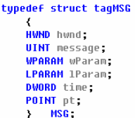
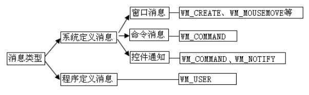
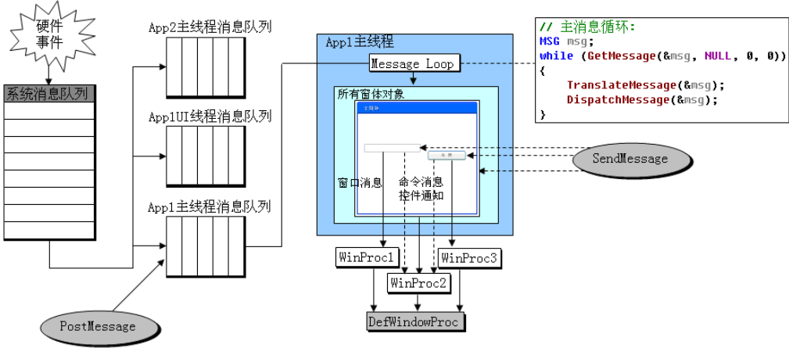
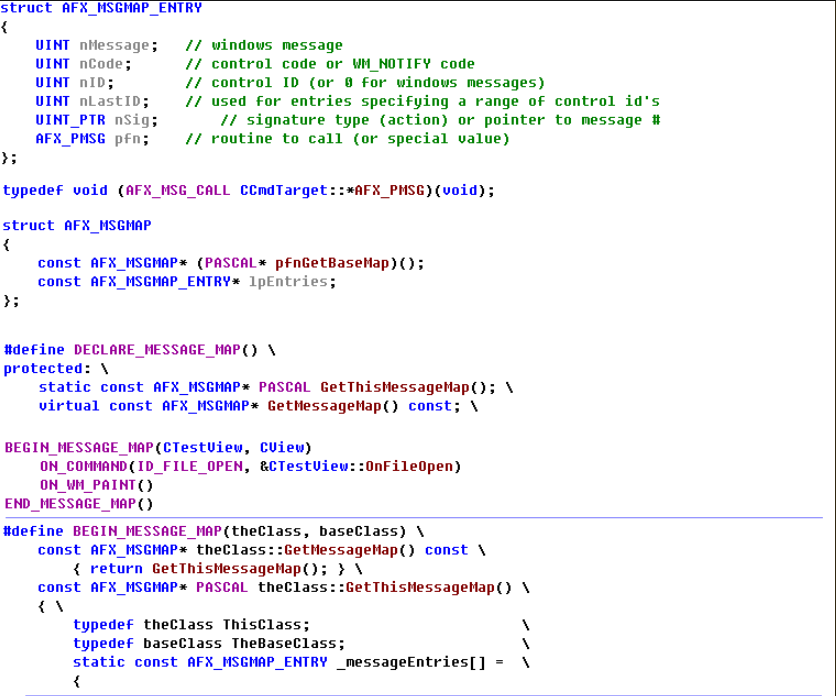
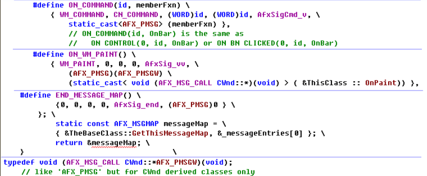
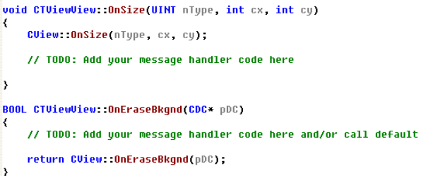
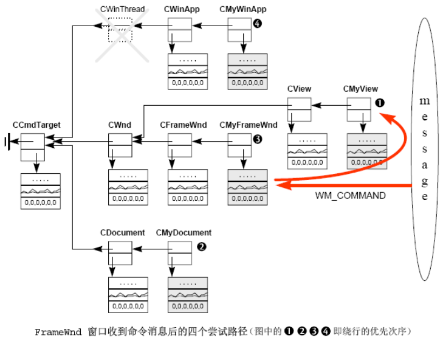
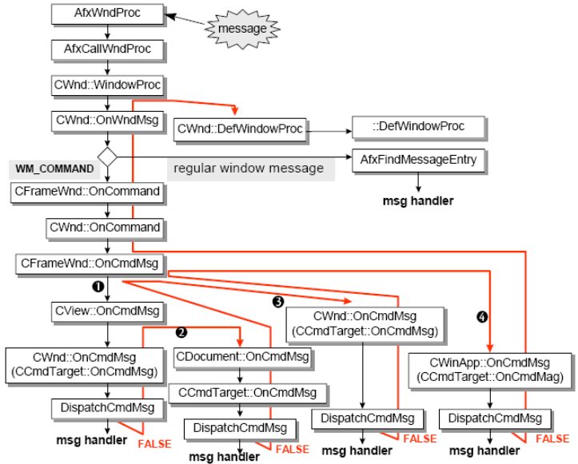
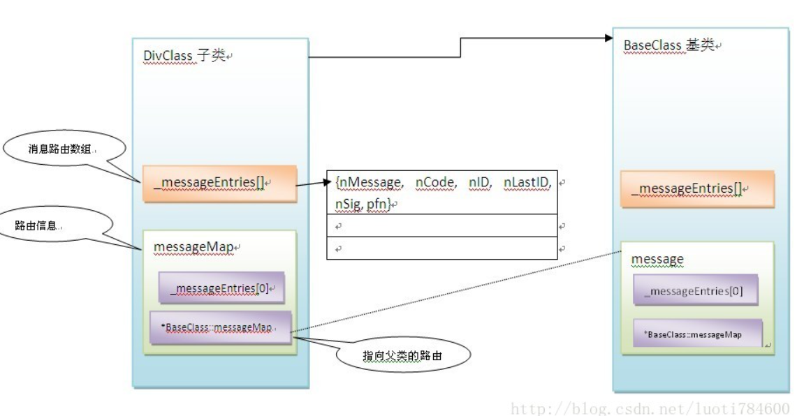

# 消息机制简介

## `MFC`信号机制

### **消息分类与消息队列**

`Windows`中，消息使用统一的结构体（`MSG`）来存放信息，其中`message`表明消息的具体的类型，而`wParam`，`lParam`是其最灵活的两个变量，为不同的消息类型时，存放数据的含义也不一样。time表示产生消息的时间，pt表示产生消息时鼠标的位置。

#### 类型分类：

**(0) 消息ID范围**

系统定义消息ID范围：`[0x0000, 0x03ff]`
用户自定义的消息ID范围： 
`WM_USER: 0x0400-0x7FFF` (例：`WM_USER+10`) 
`WM_APP(winver> 4.0)`：`0x8000-0xBFFF` (例：`WM_APP+4`) 
`RegisterWindowMessage：0xC000-0xFFFF`【用来和其他应用程序通信，为了ID的唯一性，使用`::RegisterWindowMessage`来得到该范围的消息ID 】

**(1) 窗口消息**

即与窗口的内部运作有关的消息，如创建窗口，绘制窗口，销毁窗口等。

可以是一般的窗口，也可以是`MainFrame`,`Dialog`控件等。 

如：`WM_CREATE, WM_PAINT, WM_MOUSEMOVE, WM_CTLCOLOR, WM_HSCROLL`等

**(2) `WM_COMMAND`**

当用户从菜单选中一个命令项目、按下一个快捷键或者点击工具栏上的一个按钮，都将发送`WM_COMMAND`命令消息。 `LOWORD(wParam)`表示菜单项，工具栏按钮或控件的ID；如果是控件`HIWORD(wParam)`表示控件消息类型。

`#define LOWORD(l) ((WORD)(l))`

`#define HIWORD(l) ((WORD)(((DWORD)(l) >> 16) & 0xFFFF))`

**(3) `WM_NOTIFY`**

随着控件的种类越来越多，越来越复杂（如列表控件、树控件等），仅仅将`wParam`，`lParam`将视为一个32位无符号整数，已经装不下太多信息了。 为了给父窗口发送更多的信息，微软定义了一个新的`WM_NOTIFY`消息来扩展`WM_COMMAND`消息。`WM_NOTIFY`消息仍然使用MSG消息结构，只是此时`wParam`为控件ID，`lParam`为一个`NMHDR`指针，不同的控件可以按照规则对`NMHDR`进行扩充，因此`WM_NOTIFY`消息传送的信息量可以相当的大。

> 注：`Window 9x `版及以后的新控件通告消息不再通过`WM_COMMAND` 传送，而是通过`WM_NOTIFY `传送，但是老控件的通告消息， 比如`CBN_SELCHANGE `还是通过`WM_COMMAND` 消息发送。

**(4) 自定义**

 `windwos`也允许程序员定义自己的消息，使用`SendMessage`或`PostMessage`来发送消息。

#### 队列分类：

**(1) 队列消息(Queued Messages)** 
消息会先保存在消息队列中，消息循环会从此队列中取出消息并分发到各窗口处理，如：`WM_PAINT，WM_TIMER，WM_CREATE，WM_QUIT`，以及鼠标，键盘消息等。其中`WM_PAINT，WM_TIMER`只有在队列中没有其他消息的时候才会被处理，`WM_PAINT`消息还会被合并以提高效率。其他所有消息以先进先出 `FIFO`）的方式被处理。

**(2) 非队列消息(`NonQueued Messages`)** 
消息会绕过系统消息队列和线程消息队列，直接发送到窗口过程进行处理 
如：`WM_ACTIVATE, WM_SETFOCUS, WM_SETCURSOR，WM_WINDOWPOSCHANGED`

### 消息分层

**Windows系统的整个消息系统分为3个层级：**

  ① `Windows`内核的系统消息队列

  ②` App`的`UI`线程消息队列

  ③ 处理消息的窗体对象

`Windows`内核维护着一个全局的系统消息队列；按照线程的不同，系统消息队列中的消息会分发到应用程序的`UI`线程的消息队列中；

应用程序的每一个`UI`线程都有自己的消息循环，会不停地从自己的消息队列取出消息，并发送给`Windows`窗体对象；

每一个窗体对象都使用**窗体过程函数（`WindowProc`）**来处理接收到的各种消息。

~~~c++
LRESULT CALLBACK WindowProc(HWND hWnd, UINT message, WPARAM wParam, LPARAM lParam)
{
    PAINTSTRUCT ps;
    HDC hdc;

    switch (message)
    {
    case WM_COMMAND:
        break;
    case WM_PAINT:
        hdc = BeginPaint(hWnd, &ps);
        // TODO: 在此添加任意绘图代码...
        EndPaint(hWnd, &ps);
        break;
    case WM_DESTROY:
        PostQuitMessage(0);
        break;
    default:
        return DefWindowProc(hWnd, message, wParam, lParam);
    }
    return 0;
}
~~~

 需要的话，在`WindowProc`中，可以用`::GetMessageTime`获取当前消息产生的时间，用`::GetMessagePos`获取当前消息产生时鼠标光标所在的位置。 

(1) 各个**窗口消息**由各个窗体（或控件）自身的**`WindowProc`（虚函数）**接收并处理。

(2) **`WM_COMMAND`命令消息**统一由**当前活动主窗口的`WindowProc`接收**，经过绕行后，可被其他的**`CCmdTarget`对象**处理。

(3) **`WM_COMMAND`控件通知**统一由**子窗口（控件）的父窗口的`WindowProc`**接收并处理，也可以进行绕行被其他的**`CCmdTarget`对象**处理。

> 例如：`CFormView`具备接受`WM_COMMAND`控件通知的条件，又具备把`WM_COMMAND`消息派发给关联文档对象处理的能力， 所以给`CFormView`的`WM_COMMAND`控件通知是可以让文档对象处理的。）

 另外，**`WM_COMMAND`控制通知**会先调用`ReflectLastMsg`反射**通知子窗口（控件）**，如果子窗口（控件）处理了该消息并返回TRUE，则消息会停止分发； 否则，会继续调用`OnCmdMsg`进行命令发送（如同`WM_COMMAND`命令消息一样）。  

>  注：`WM_COMMAND`命令消息与`WM_COMMAND`控件通知的相似之处：
> `WM_COMMAND`命令消息和`WM_COMMAND`控制通知都是由`WindowProc`给`OnCommand`处理，
> `OnCommand`通过`wParam`和`lParam`参数区分是命令消息或通知消息，然后送给`OnCmdMsg`处理。
> 事实上，`BN_CLICKED`控件通知消息的处理和`WM_COMMAND`命令消息的处理完全一样。
> 因为该消息的通知代码是`0，ON_BN_CLICKED(id，memberfunction)`和`ON_COMMAND(id，memberfunction)`是等同的。 

（4）**`WM_NOTIFY`消息**只是对**`WM_COMMAND`控件通知**进行了扩展，与`WM_COMMAND`控件通知具有相同的特点。

### **`SendMessage`与`PostMessage`**

`PostMessage`：把消息投递到消息队列后，立即返回； 
`SendMessage`：把消息直接送到窗口过程处理，处理完才返回。

### **`GetMessage`与`PeekMessage`**

`GetMessage` 

* 有消息且该消息不为`WM_QUIT`，返回`TRUE`。为`WM_QUIT`，返回`FALSE`。

* 没有消息时，挂起该`UI`线程，控制权交还给系统。

`PeekMessage`

* 有消息返回`TRUE`，如果没有消息返回`FALSE`；不会阻塞。

* 是否从消息队列中删除此消息（`PM_REMOVE`），由函数参数来指定。

要想在没有消息时做一些工作，就必须使用`PeekMessage`来抓取消息，以便在没有消息时，能在`OnIdle`中执行空闲操作（如下）：

~~~c++
while (TRUE)
{
    // 这里比如桌面屏保那种，就可以这里做
    if (PeekMessage(&msg, NULL, 0, 0, PM_REMOVE)
    {
        if (msg.message == WM_QUIT)
            break;
        TranslateMessage(&msg);
        DispatchMessage(&msg);
    }
    else
    {
        OnIdle();
    }
}
~~~

例如：`MFC`使用`OnIdle`函数来清理一些临时对象及未使用的动态链接库。

只有在`OnIdle`返回之后程序才能继续处理用户的输入，因此不应在`OnIdle`进行较长的任务。

### **`MFC`消息处理**

在`CWnd`中，`MFC`使用`OnWndMsg`来分别处理各类消息：

如果是`WM_COMMAND`消息，交给`OnCommand`处理；然后返回。

如果是`WM_NOTIFY`消息，交给`OnNotify`处理；然后返回。

如果是`WM_ACTIVAT`E消息，先交给`_AfxHandleActivate`处理，再继续下面的处理。

如果是`WM_SETCURSOR`消息，先交给`_AfxHandleSetCursor`处理，然后返回。

如果是其他的窗口消息（包括`WM_ACTIVATE`消息），则 首先在消息缓冲池（一个`hash`表，用于加快消息处理函数的查找）进行消息匹配， 若匹配成功，则调用相应的消息处理函数； 若不成功，则在消息目标的消息映射数组中进行查找匹配，看它是否能处理当前消息。

如果消息目标处理了该消息，则会匹配到消息处理函数，调用它进行处理；否则，该消息没有被应用程序处理，`OnWndMsg`返回`FALSE`。

### **`MFC`消息映射**

消息映射实际是`MFC`内建的一个消息分派机制。

把`MFC`中的宏进行展开（如下），可以得到消息映射表整个全貌。

 注：`GetMessageMap`为虚函数。
   `{0, 0, 0, 0, AfxSig_end, (AFX_PMSG)0}`：对象消息映射表的结束标识 

**窗口消息**只能由**`CWnd`对象**来处理，采用向**基类直线上朔**的方式，来查找对应的消息响应函数进行处理。

一旦找到消息响应函数（若有返回值且为`TRUE`），就停止上朔。因此，我们经常会看到这样的代码：

增加一个消息处理函数来写我们的逻辑时，`MFC ClassWizard`会在该函数之前或之后显示调用其基类对应的函数，保证基类中逻辑被执行。

**命令消息**可由**`CCmdTarget`对象**接收并处理（`OnCmdMsg`为虚函数），除了向基类直线上朔方式外，还有**命令绕行机制**（要防止形成圈，死循环）。

在某种程度上，**控制通知消息**由窗口对象处理是一种习惯和约定。然而，控件通知消息也是可以有**`CCmdTarget`对象**接收并处理，并进行**命令绕行**的。

**下图为`MFC`经典单文档视图框架的命令消息绕行路线：**

 函数调用过程如下（如果没有任何对象处理该条`WM_COMMAND`消息，最后会被`::DefWindowProc`处理）。 

###  **非模态对话框的消息处理** 

~~~c++
static CAboutDlg aboutDlg;
aboutDlg.Create(IDD_ABOUTBOX, this);
aboutDlg.ShowWindow(SW_SHOW);
~~~

应用程序只有一个消息循环。

对于窗口消息，非模态对话框（及其子控件）与父窗口（及其子控件）都是用自身的WindowProc函数接收并处理，互不干扰。

对于命令消息，由当前活动主窗口的WindowProc接收（例如：当前活动主窗口为非模态对话框，则命令消息会被非模态对话框接收）。

可以在当前活动主窗口的OnCmdMsg中做命令绕行，使得其他的CCmdTarget对象也可以处理命令消息。

对于控件通知，由其父窗口的WindowProc接收并处理，一般不进行命令绕行被其他的CCmdTarget对象处理。

### **模态对话框的消息处理**

~~~c++
CAboutDlg aboutDlg;
aboutDlg.DoModal();
~~~

 (1) 模态对话框弹出来后，首先会让父窗口失效，使其不能接受用户的输入（键盘鼠标消息）。 

~~~c++
EnableWindow(hwndParent, FALSE) ;
~~~

(2) 父窗口消息循环被阻塞（会卡在`DoModal`处，等待返回），由模态对话框的消息循环来接管（因此整个程序不会卡住）。 接管后，模态对话框的消息循环仍然会将属于父窗口及其子控件的窗口消息（不包括键盘鼠标相关的窗口消息）发送给它们各自的`WindowProc`窗口函数，进行响应处理。

(3) 模态对话框销毁时（点击`IDOK`或`IDCANCEL`），父窗口消息循环重新激活，继续`DoModal`后的逻辑。 激活后，父窗口有可以重新接受用户的输入（键盘鼠标消息）。

~~~c++
EnableWindow(hwndParent, TRUE) ;
~~~

从上面的过程中，我们可以得到如下结论：

对于窗口消息，模态对话框主窗口（及其子控件）与父窗口（及其子控件）都是用自身的`WindowProc`函数接收并处理，互不干扰。

只是父窗口（及其子控件）无法接受到键盘鼠标消息相关的窗口消息。

对于命令消息，由模态对话框主窗口的`WindowProc`接收。可以在模态对话框主窗口的`OnCmdMsg`中做命令绕行，使得其他的`CCmdTarget`对象也可以处理命令消息。

对于控件通知，由其父窗口的`WindowProc`接收并处理，一般不进行命令绕行被其他的`CCmdTarget`对象处理。

### 定义

#### `DECLARE_MESSAGE_MAP()`

**首先在使用消息映射之前，必须先声明DECLARE_MESSAGE_MAP()**

DECLARE_MESSAGE_MAP()是个宏定义，对应的源码为

~~~c++
#define DECLARE_MESSAGE_MAP() 
private: 
	static const AFX_MSGMAP_ENTRY _messageEntries[]; 
protected: 
	static AFX_DATA const AFX_MSGMAP messageMap; 
	static const AFX_MSGMAP* PASCAL _GetBaseMessageMap(); 
	virtual const AFX_MSGMAP* GetMessageMap() const; 
~~~

**声明添加了两个成员变量和两个成员函数：**

**`_messageEntries`**: 是一个`AFX_MSGMAP_ENTRY`（定义了消息路由）类型数组，即路由表。

~~~c++
struct AFX_MSGMAP_ENTRY
{
	UINT nMessage;    //消息类型
	UINT nCode;       // 控制码
	UINT nID;         // 控件ID
	UINT nLastID;      // 控件ID范围, 对于单控件消息处理，与nID相同
	UINT nSig;         // 信号类型
	AFX_PMSG pfn;    //回调函数，即处理函数
};
~~~

**`messageMap`**： 路由信息，包含父类路由信息指针，和本类的路由表指针。

~~~c++
struct AFX_MSGMAP
{
	const AFX_MSGMAP* pBaseMap;		//指向父类的指针
	const AFX_MSGMAP_ENTRY* lpEntries;	//路由表指针
};
~~~

#### `BEGIN_MESSAGE_MAP`

**查看`BEGIN_MESSAGE_MAP`在`.cpp`文件中的定义**

~~~c++
BEGIN_MESSAGE_MAP(CMfc_testApp, CWinApp)
	ON_COMMAND(ID_FILE_NEW, CWinApp::OnFileNew)
END_MESSAGE_MAP()
~~~

可以看到`BEGIN_MESSAGE_MAP`也是一个宏。然后上面的`ON_COMMAND`也是宏定义，全部展开后代码为：

~~~c++
const AFX_MSGMAP* theClass::GetMessageMap() const 
{ 
	return &theClass::messageMap; 
} 
const AFX_MSGMAP* PASCAL theClass::_GetBaseMessageMap() 
{ 
	return &baseClass::messageMap; 
}
AFX_COMDAT AFX_DATADEF const AFX_MSGMAP theClass::messageMap = 
{ 
	&baseClass::messageMap,				//基类路由信息指针
        &theClass::_messageEntries[0]		       //路由表数组地址
}; 
 
AFX_COMDAT const AFX_MSGMAP_ENTRY theClass::_messageEntries[] = 
{ 
	{WM_COMMAND,N_COMMAND,(WORD)id,(WORD)id,AfxSig_vv,(AFX_PMSG)&memberFxn },
	{0, 0, 0, AfxSig_end, (AFX_PMSG)0 } 
};
~~~

可以看到，通过宏定义和消息内嵌的方式，已经全部初始化消息路由相关的成员变量和方法，结构如下图所示：

#### **消息循环：**

**`CWnd::OnWndMsg`（位于`WINCORE.cpp`文件中）**

~~~C++
if (message == pMsgCache->nMsg && pMessageMap == pMsgCache->pMessageMap)
{
	//处理在当前类的路由表和缓存命中
}
else
{
	// 当前类路由表和缓存找不到，
	pMsgCache->nMsg = message;
	pMsgCache->pMessageMap = pMessageMap;
	
	//通过pMessageMap = pMessageMap->pBaseMap递归往基类深入查找匹配
 
	for (; pMessageMap != NULL; pMessageMap = pMessageMap->pBaseMap)
	{
		.....
	}
	.....
}
~~~

`BEGIN_MESSAGE_MAP( theClass, baseClass )`

参数：

| `theClass`  | 指定消息映射所属的类的名字。 |
| ----------- | ---------------------------- |
| `baseClass` | 指定`theClass`的基类的名字。 |

## Qt信号槽

更类似观察者模式，connect的时候加入 list，emit的时候发送广播,update()

### 连接函数

~~~C++
QObject::connect(const QObject *sender, const char *signal,  
                const QObject *receiver, const char *method,  
                Qt::ConnectionType type = Qt::AutoCompatConnection)
~~~

这是我们最常用的形式。connect() 一般会使用前面四个参数，

* 第一个是发出信号的对象，

* 第二个是发送对象发出的信号，

* 第三个是接收信号的对象，

* 第四个是接收对象在接收到信号之后所需要调用的函数。

也就是说，当 sender 发出了 signal 信号之后，会自动调用 receiver 的 slot 函数。

其中最后一个参数是枚举类型定义了三种信号和槽的连接方式:

(1) `Qt::DirectConnection` :信号发送后立即传递给相关联的槽函数,只有槽函数执行完毕返回后,发送信号"emit <信号>" 之后的代码才被执行，相当于`MFC`的`SendMessage()`

(2) `Qt::QueuedConnection `: 信号发送后排队,知道事件循环(event)有能力将它传递给槽; 而不管槽函数有没有执行,发送信号"emit <信号>" 之后的代码都会立即得到执行，相当于`MFC`的`PostMessage()`。

(3) `Qt::AutoConnection `: 如果信号和槽函数在同一线程, 信号发出后,槽函数将立即执行, 等于`Qt::DirectConnection`; 如果信号和槽不在同一个线程,信号将排队,等待事件循环的处理,效果等同于`Qt::QueuedConnection`

