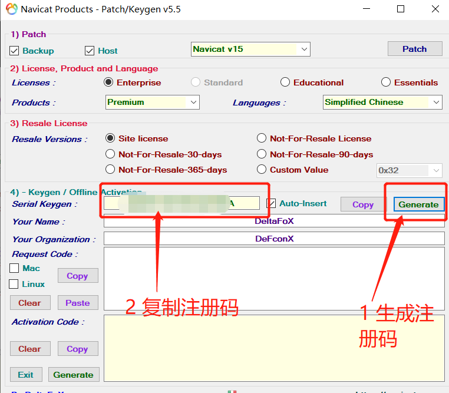

# 坚决抵制盗版！！！

# 坚决抵制盗版！！！

# 坚决抵制盗版！！！

这一次写这个博客记录，是想曝光一下那些去破解`Navicat`的人的破解过程，好让`Navicat`厂商能及时找到解决方法。

# 坚决抵制盗版！！！

# 坚决抵制盗版！！！

# 坚决抵制盗版！！！

# 第一步 解压

解压`Navicat Premium for Windows 15.0.14 with Keygen.zip`

得到软件和破解文件

# 第二步 安装

安装 `Navicat `

点击 `navicat150_premium_cs_x64.exe`后

 勾选同意 ，点击下一步 

 选择安装路径，尽量不要装在C盘，点击下一步 

 点击下一步 

 点击下一步 

 点击安装 

 等待安装完成后，点击完成即可 

完成后，千万不要立刻打开软件！！！

完成后，千万不要立刻打开软件！！！

完成后，千万不要立刻打开软件！！！

# 第三步 破解

将 `Navicat Keygen Patch v5.6.0 DFoX.exe`复制到 `C:\Program Files\PremiumSoft\Navicat Premium 15`这个路径，如果你没改默认安装路径的话，如果改了，自己找。

打开破解软件

 出现下列界面说明路径添加成功 

 生成及复制注册码 

打开`Navicat`进行注册

首次打开`Navicat`会弹出下述界面，选择注册

 将复制的注册码填入，点击激活 

 选择手动激活 

 会产生请求码，将请起码复制到激活软件中，生成激活码 

 点击generate生成激活码，复制激活码，点击激活 

 点击确定---永久激活 

# 失败解决方案

 1.可能你没有断网
2.如果在已经断网的情况下，你以前装过这个软件，需要彻底卸载，具体步骤如下
通过命令行`win+R`打开命令行，输入`regedit`打开注册表，找到下述路径
`HKEY_CURRENT_USER\Software\PremiumSoft`，删除即可，在去其他盘中删除与`navicat`相关的文件夹
3.重新安装之后，首先不要打开`navicat`客户端，而是直接打开破解软件，直接点`patch`，如果出现`cracked`！表示成功，打开`navicat`客户端将激活码复制至客户端，再按照步骤操作即可。
4.如果重新安装后还出现问题的话，无需再次卸载，重新点击安装包重新安装即可，再按照上述3的描述进行破解即可
5需要注意的是：安装完成后不要直接打开`navicat`客户端，而是先打开破解软件，点解`patch `

# 坚决抵制盗版！！！

# 坚决抵制盗版！！！

还是希望大家支持正版，软件开发不容易。