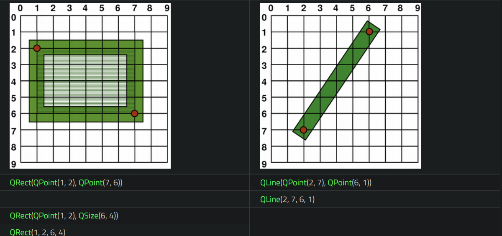
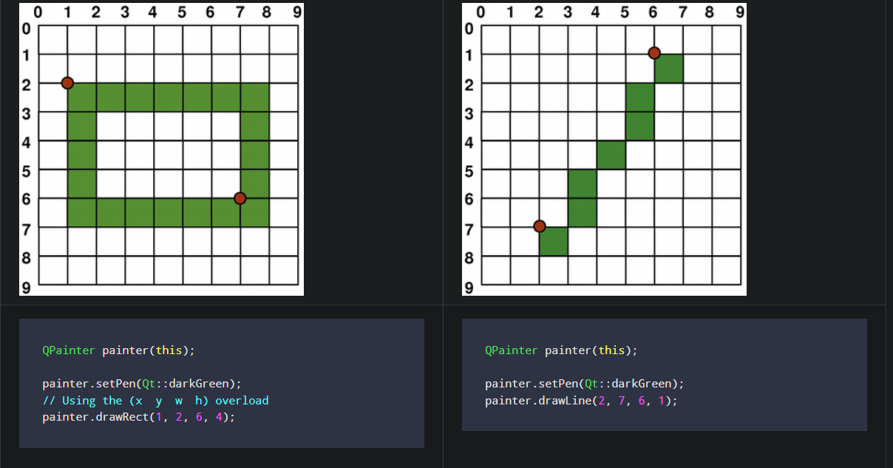
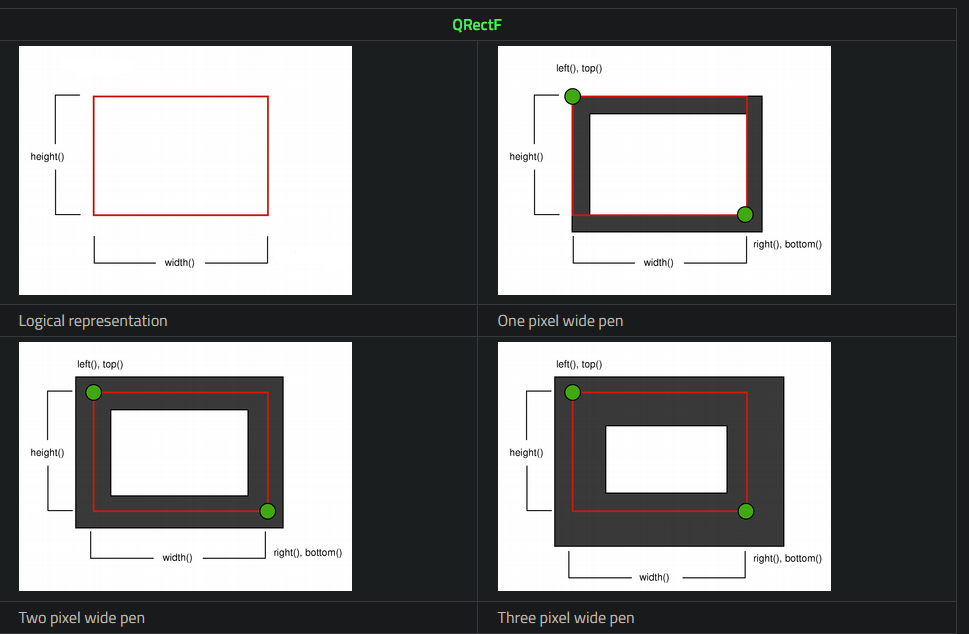
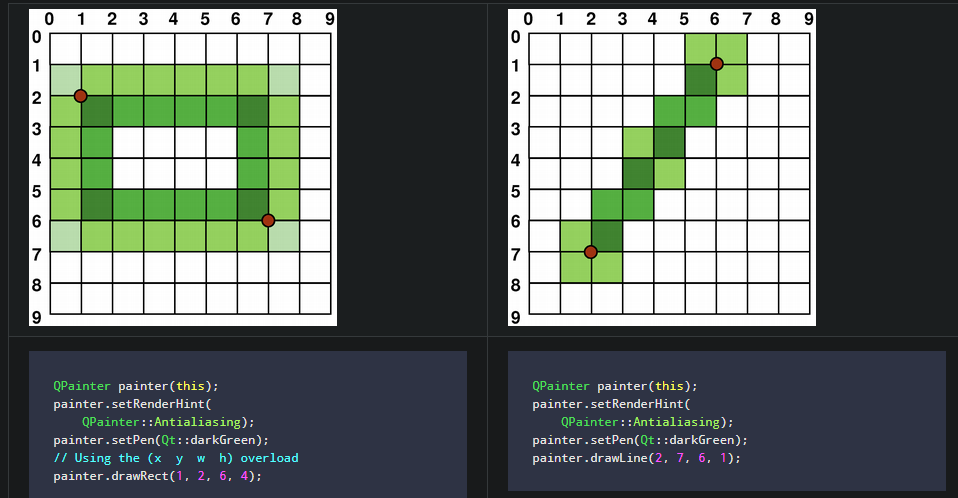
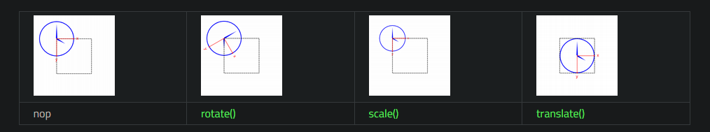
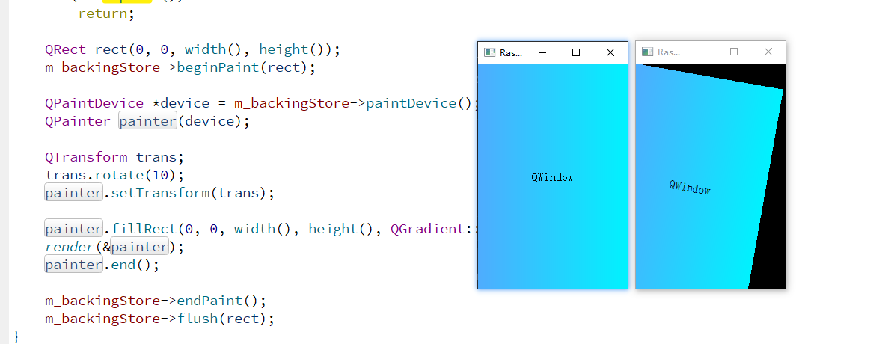

# Coordinate System

The coordinate system is controlled by the [QPainter](https://doc.qt.io/qt-5/qpainter.html) class. Together with the [QPaintDevice](https://doc.qt.io/qt-5/qpaintdevice.html) and [QPaintEngine](https://doc.qt.io/qt-5/qpaintengine.html) classes, [QPainter](https://doc.qt.io/qt-5/qpainter.html) form the basis of Qt's painting system, Arthur. [QPainter](https://doc.qt.io/qt-5/qpainter.html) is used to perform drawing operations, [QPaintDevice](https://doc.qt.io/qt-5/qpaintdevice.html) is an abstraction of a two-dimensional space that can be painted on using a [QPainter](https://doc.qt.io/qt-5/qpainter.html), and [QPaintEngine](https://doc.qt.io/qt-5/qpaintengine.html) provides the interface that the painter uses to draw onto different types of devices.

The [QPaintDevice](https://doc.qt.io/qt-5/qpaintdevice.html) class is the base class of objects that can be painted: Its drawing capabilities are inherited by the [QWidget](https://doc.qt.io/qt-5/qwidget.html), [QImage](https://doc.qt.io/qt-5/qimage.html), [QPixmap](https://doc.qt.io/qt-5/qpixmap.html), [QPicture](https://doc.qt.io/qt-5/qpicture.html), and [QOpenGLPaintDevice](https://doc.qt.io/qt-5/qopenglpaintdevice.html) classes. The default coordinate system of a paint device has its origin at the top-left corner. The *x* values increase to the right and the *y* values increase downwards. The default unit is one pixel on pixel-based devices and one point (1/72 of an inch) on printers.

The mapping of the logical [QPainter](https://doc.qt.io/qt-5/qpainter.html) coordinates to the physical [QPaintDevice](https://doc.qt.io/qt-5/qpaintdevice.html) coordinates are handled by [QPainter](https://doc.qt.io/qt-5/qpainter.html)'s transformation matrix, viewport and "window". The logical and physical coordinate systems coincide by default. [QPainter](https://doc.qt.io/qt-5/qpainter.html) also supports coordinate transformations (e.g. rotation and scaling).

> Qt 的坐标系统由这三个类来控制
>
> * QPainter：执行绘图操作
>
>   ~~~c++
>   class Q_GUI_EXPORT QPainter
>   {
>       void setPen(const QColor &color);
>       void setPen(const QPen &pen);
>       void setPen(Qt::PenStyle style);
>       const QPen &pen() const;
>   
>       void setBrush(const QBrush &brush);
>       void setBrush(Qt::BrushStyle style);
>       const QBrush &brush() const;
>   
>       void drawLines(const QPointF *pointPairs, int lineCount);
>       inline void drawLines(const QVector<QPointF> &pointPairs);
>       void drawLines(const QLine *lines, int lineCount);
>       inline void drawLines(const QVector<QLine> &lines);
>       void drawLines(const QPoint *pointPairs, int lineCount);
>       inline void drawLines(const QVector<QPoint> &pointPairs);
>   
>       inline void drawRect(const QRectF &rect);
>       inline void drawRect(int x1, int y1, int w, int h);
>       inline void drawRect(const QRect &rect);
>       ...
>   }
>   ~~~
>
>   
>
> * QPaintDevice：二维空间的抽象，就是绘图设备，所有可绘制对象的基类
>
>   *  [QWidget](https://doc.qt.io/qt-5/qwidget.html), [QImage](https://doc.qt.io/qt-5/qimage.html), [QPixmap](https://doc.qt.io/qt-5/qpixmap.html), [QPicture](https://doc.qt.io/qt-5/qpicture.html), and [QOpenGLPaintDevice](https://doc.qt.io/qt-5/qopenglpaintdevice.html) 
>   * 默认左上角为 (0,0) 点，一个像素为 1 / 72 inch
>
>   ~~~c++
>   class Q_GUI_EXPORT QPaintEngine
>   {
>   protected:
>       QPaintDevice() noexcept;
>       virtual int metric(PaintDeviceMetric metric) const;
>       virtual void initPainter(QPainter *painter) const;
>       virtual QPaintDevice *redirected(QPoint *offset) const;
>       virtual QPainter *sharedPainter() const;
>   
>       ushort        painters;                        // refcount
>   private:
>       Q_DISABLE_COPY(QPaintDevice)
>   
>       QPaintDevicePrivate *reserved;
>   
>       friend class QPainter;
>       friend class QPainterPrivate;
>       friend class QFontEngineMac;
>       friend class QX11PaintEngine;
>       friend Q_GUI_EXPORT int qt_paint_device_metric(const QPaintDevice *device, PaintDeviceMetric metric);
>       ...
>   }
>   ~~~
>
>   
>
> * QPaintEngine：绘图引擎，用于在不同设备上绘图
>
>   ~~~c++
>   class Q_GUI_EXPORT QPaintEngine
>   {
>       Q_DECLARE_PRIVATE(QPaintEngine)
>   public:
>       enum PolygonDrawMode {
>           OddEvenMode,
>           WindingMode,
>           ConvexMode,
>           PolylineMode
>       };
>   
>       explicit QPaintEngine(PaintEngineFeatures features=PaintEngineFeatures());
>       virtual ~QPaintEngine();
>   
>       bool isActive() const { return active; }
>       void setActive(bool newState) { active = newState; }
>   
>       virtual bool begin(QPaintDevice *pdev) = 0;
>       virtual bool end() = 0;
>   
>       virtual void updateState(const QPaintEngineState &state) = 0;
>   
>       virtual void drawRects(const QRect *rects, int rectCount);
>       virtual void drawRects(const QRectF *rects, int rectCount);
>       ...
>   }
>   ~~~
>
>  
>
> **坐标映射**
>
> QPainter 的逻辑坐标映射到 物理坐标靠的是 [QPainter](https://doc.qt.io/qt-5/qpainter.html)'s transformation matrix，viewport and "window".默认情况，逻辑坐标和物理坐标是重合的

## Rendering

### Logical Representation

The size (width and height) of a graphics primitive always correspond to its mathematical model, ignoring the width of the pen it is rendered with:

### Aliased Painting  反走样

When drawing, the pixel rendering is controlled by the [QPainter::Antialiasing](https://doc.qt.io/qt-5/qpainter.html#RenderHint-enum) render hint.

The [RenderHint](https://doc.qt.io/qt-5/qpainter.html#RenderHint-enum) enum is used to specify flags to [QPainter](https://doc.qt.io/qt-5/qpainter.html) that may or may not be respected by any given engine. The [QPainter::Antialiasing](https://doc.qt.io/qt-5/qpainter.html#RenderHint-enum) value indicates that the engine should antialias edges of primitives if possible, i.e. smoothing the edges by using different color intensities.

But by default the painter is *aliased* and other rules apply: When rendering with a one pixel wide pen the pixels will be rendered to the *right and below the mathematically defined points*. For example:

When rendering with a pen with an even number of pixels, the pixels will be rendered symetrically around the mathematical defined points, while rendering with a pen with an odd number of pixels, the spare pixel will be rendered to the right and below the mathematical point as in the one pixel case. See the [QRectF](https://doc.qt.io/qt-5/qrectf.html) diagrams below for concrete examples.

Note that for historical reasons the return value of the [QRect::right](https://doc.qt.io/qt-5/qrect.html#right)() and [QRect::bottom](https://doc.qt.io/qt-5/qrect.html#bottom)() functions deviate from the true bottom-right corner of the rectangle.

[QRect](https://doc.qt.io/qt-5/qrect.html)'s [right()](https://doc.qt.io/qt-5/qrect.html#right) function returns [left()](https://doc.qt.io/qt-5/qrect.html#left) + [width()](https://doc.qt.io/qt-5/qrect.html#width) - 1 and the [bottom()](https://doc.qt.io/qt-5/qrect.html#bottom) function returns [top()](https://doc.qt.io/qt-5/qrect.html#top) + [height()](https://doc.qt.io/qt-5/qrect.html#height) - 1. The bottom-right green point in the diagrams shows the return coordinates of these functions.

We recommend that you simply use [QRectF](https://doc.qt.io/qt-5/qrectf.html) instead: The [QRectF](https://doc.qt.io/qt-5/qrectf.html) class defines a rectangle in the plane using floating point coordinates for accuracy ([QRect](https://doc.qt.io/qt-5/qrect.html) uses integer coordinates), and the [QRectF::right](https://doc.qt.io/qt-5/qrectf.html#right)() and [QRectF::bottom](https://doc.qt.io/qt-5/qrectf.html#bottom)() functions *do* return the true bottom-right corner.

:ex  Alternatively, using [QRect](https://doc.qt.io/qt-5/qrect.html), apply [x()](https://doc.qt.io/qt-5/qrect.html#x) + [width()](https://doc.qt.io/qt-5/qrect.html#width) and [y()](https://doc.qt.io/qt-5/qrect.html#y) + [height()](https://doc.qt.io/qt-5/qrect.html#height) to find the bottom-right corner, and avoid the [right()](https://doc.qt.io/qt-5/qrect.html#right) and [bottom()](https://doc.qt.io/qt-5/qrect.html#bottom) functions.

### Anti-aliased Painting 抗锯齿

If you set [QPainter](https://doc.qt.io/qt-5/qpainter.html)'s [anti-aliasing](https://doc.qt.io/qt-5/qpainter.html#RenderHint-enum) render hint, the pixels will be rendered symetrically on both sides of the mathematically defined points:

## Transformations

By default, the [QPainter](https://doc.qt.io/qt-5/qpainter.html) operates on the associated device's own coordinate system, but it also has complete support for affine coordinate transformations.

You can scale the coordinate system by a given offset using the [QPainter::scale](https://doc.qt.io/qt-5/qpainter.html#scale)() function, you can rotate it clockwise using the [QPainter::rotate](https://doc.qt.io/qt-5/qpainter.html#rotate)() function and you can translate it (i.e. adding a given offset to the points) using the [QPainter::translate](https://doc.qt.io/qt-5/qpainter.html#translate)() function.

You can also twist the coordinate system around the origin using the [QPainter::shear](https://doc.qt.io/qt-5/qpainter.html#shear)() function. All the transformation operations operate on [QPainter](https://doc.qt.io/qt-5/qpainter.html)'s transformation matrix that you can retrieve using the [QPainter::worldTransform](https://doc.qt.io/qt-5/qpainter.html#worldTransform)() function. A matrix transforms a point in the plane to another point.

If you need the same transformations over and over, you can also use [QTransform](https://doc.qt.io/qt-5/qtransform.html) objects and the [QPainter::worldTransform](https://doc.qt.io/qt-5/qpainter.html#worldTransform)() and [QPainter::setWorldTransform](https://doc.qt.io/qt-5/qpainter.html#setWorldTransform)() functions. You can at any time save the [QPainter](https://doc.qt.io/qt-5/qpainter.html)'s transformation matrix by calling the [QPainter::save](https://doc.qt.io/qt-5/qpainter.html#save)() function which saves the matrix on an internal stack. The [QPainter::restore](https://doc.qt.io/qt-5/qpainter.html#restore)() function pops it back.

One frequent need for the transformation matrix is when reusing the same drawing code on a variety of paint devices. Without transformations, the results are tightly bound to the resolution of the paint device. Printers have high resolution, e.g. 600 dots per inch, whereas screens often have between 72 and 100 dots per inch.

> ~~~c++
> void QPainter::setTransform(const QTransform &transform, bool combine )
> {
>     setWorldTransform(transform, combine);
> }
> 
> void QPainter::save()
> {
> #ifdef QT_DEBUG_DRAW
>     if (qt_show_painter_debug_output)
>         printf("QPainter::save()\n");
> #endif
>     Q_D(QPainter);
>     if (!d->engine) {
>         qWarning("QPainter::save: Painter not active");
>         return;
>     }
> 
>     if (d->extended) {
>         d->state = d->extended->createState(d->states.back());
>         d->extended->setState(d->state);
>     } else {
>         d->updateState(d->state);
>         d->state = new QPainterState(d->states.back());
>         d->engine->state = d->state;
>     }
>     d->states.push_back(d->state);
> }
> ~~~
>
> 