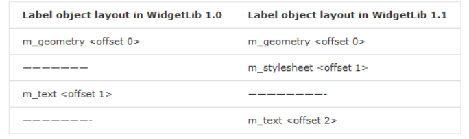
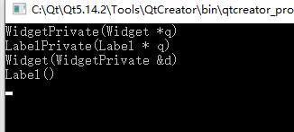

# C++的二进制兼容

先了解两个概念

**进制兼容和源码兼容。**

- 二进制兼容：在升级库文件的时候，不必**重新编译**使用此库的可执行文件或其他库文件，并且程序的功能不被破坏。
- 源码兼容：在升级库文件的时候，不必**修改**使用此库的可执行文件或其他库文件的**源代码**，只需重新编译应用程序，即可使程序的功能不被破坏。

## `ABI`和`API`

> 应用二进制接口（application binary interface，缩写为 `ABI`）描述了应用程序（或者其他类型）和操作系统之间或其他应用程序的低级接口。`ABI`涵盖了各种细节，如：数据类型的大小、布局和对齐；调用约定等。

在了解二进制兼容和源码兼容两个定义以后，我们再看与其类似且对应的两个概念：`ABI`和`API`。`ABI`不同于`API`（应用程序接口），`API`定义了源代码和库之间的接口，因此同样的代码可以在支持这个`API`的任何系统中编译，然而`ABI`允许编译好的目标代码在使用兼容`ABI`的系统中无需改动就能运行。

举个例子，在Qt和Java两种跨平台程序中，`API`像是Qt的接口，Qt有着通用接口，源代码只需要在支持Qt的环境下编译即可。`ABI`更像是`Jvm`，只要支持`Jvm`的系统上，都可以运行已有的Java程序。

## C++的`ABI`

`ABI`更像是一个产品的使用说明书，同理C++的`ABI`就是如何使用C++生成可执行程序的一张说明书。编译器会根据这个说明书，生成二进制代码。C++的`ABI`在不同的编译器下会略有不同。

C++`ABI`的部分内容举例：

- 函数参数传递的方式，比如 `x86-64` 用寄存器来传函数的前 4 个整数参数
- 虚函数的调用方式，通常是 `vptr/vtbl` 然后用 `vtbl[offset]` 来调用
- `struct `和 `class` 的内存布局，通过偏移量来访问数据成员

综上所述，**如果可执行程序通过以上说明书访问动态链接库A，以及此库的升级版本A+，若按此说明书上的方法，可以无痛的使用A和A+，那么我们就称库A的这次升级是二进制兼容的。**

## 破坏二进制兼容的几种常见方式

- 添加新的虚函数
- 不导出或者移除一个导出类
- 改变类的继承
- 改变虚函数声明时的顺序（偏移量改变，导致调用失败）
- 添加新的非静态成员变量（类的内存布局改变，偏移量也发生变化）
- 改变非静态成员变量的声明顺序

## 不会破坏二进制兼容的几种常见方式

- 添加非虚函数（包括构造函数）
- 添加新的类
- 添加Qt中的信号槽
- 在已存在的枚举类型中添加一个枚举值
- 添加新的静态成员变量
- 修改成员变量名称（偏移量未改变）
- 添加`Q_OBJECT`,`Q_PROPERTY`, `Q_ENUMS` ,`Q_FLAGS`宏，添加这些宏都是修改了`moc`生成的文件，而不是类本身

只要我们知道了程序是以什么方式访问动态库的（C++的`ABI`)，那么我们就很好判断，哪些操作会破坏二进制兼容。更多方式请参见[Policies/Binary Compatibility Issues With C++](https://community.kde.org/Policies/Binary_Compatibility_Issues_With_C%2B%2B)


# `PImpl`机制以及`Qt`的`D-Pointer`实现

`PImpl`是 `Pointer to implementation`的缩写， 是C++ 在构建导出库接口时特有的技术手段。 即是将类`Class`中所有私有变量以及私有方法，封装在一单独的实现类`ClassImpl`中。我们在`Class`中通过一指向`ClassImpl`的私有指针，访问这些私有数据。而`ClassImpl`类的具体定义和实现，我们放入`cpp`中。Qt中的`D-Pointer`技术，便是`PImpl`机制的一种实现方式。

优点：

- 使得程序接口有着稳定的`ABI`（应用程序二进制接口），即不会打破二进制兼容。
- 降低了程序编译依赖，从而缩短编译时间。
- 数据隐藏，使得头文件很干净，不包含实现细节，可以直接作为 `API` 参考。

缺点：

- 实现者需要做更多工作。
- 由于子类需要访问，此机制对`protected`方法不奏效。
- 由于数据的隐藏，多少造成了代码可读性下降。
- 运行时性能被轻微的连累，尤其调用的函数为虚函数时。


## 实现细节

* `Person.h`

  ~~~c++
  class PersonPrivate;
  class Person
  {
      Q_DECLARE_PRIVATE(Person)
  public:
      Person();
      ~Person();
      QString name() const;
      void setName(const QString &name);
  signals:
      void calcRequested();
  private:
      QScopedPointer<PersonPrivate> d_ptr;
  };
  ~~~

  * `Person_p.h`

  ~~~c++
  #include "Person.h"
  class PersonPrivate
  {
      Q_DECLARE_PUBLIC(Person)
  public:
      PersonPrivate(Person *parent);
      
      void calc();
      
      QString name;
  private:
      Person * const q_ptr;
  };
  ~~~

  * `Person.cpp`

  ~~~c++
  #include "Person_p.h"
  Person::Person() : d_ptr(new PersonPrivate(this))
  {
  }
  ~Person() {}
  QString Person::name() const
  {
      Q_D(const Person);
      return d->name;
  }
  void Person::setName(const QString &name)
  {
      Q_D(const Person);
      d->name = name;
  }
  PersonPrivate::PersonPrivate(Person *parent) : q_ptr(parent)
  {
    
  }
  void PersonPrivate::calc()
  {
      Q_Q(Person);
      emit q->calcRequested();
  }
  ~~~

## 相关宏定义及作用

以上所有用到的宏定义，均放在`qglobal.h`中。下面我们一一介绍。

### Q_DECLARE_PRIVATE、Q_D

~~~c++
template <typename T> static inline T *qGetPtrHelper(T *ptr) { return ptr; }
template <typename Wrapper> static inline typename Wrapper::pointer qGetPtrHelper(const Wrapper &p) { return p.data(); }
#define Q_DECLARE_PRIVATE(Class) \
    inline Class##Private* d_func() { return reinterpret_cast<Class##Private *>(qGetPtrHelper(d_ptr)); } \
    inline const Class##Private* d_func() const { return reinterpret_cast<const Class##Private *>(qGetPtrHelper(d_ptr)); } \
    friend class Class##Private;
    
#define Q_D(Class) Class##Private * const d = d_func()
~~~

`Q_DECLARE_PRIVATE`看似复杂，其实就是封装了`d_func()`函数，目的就是让我们在多种不同情况下，可以方便地拿到并使用私有类指针`d_ptr` 。`Q_D`宏对`d_func()`进行再次封装，让我们可以免去每次定义的繁琐，直接使用`d`指针，此指针即为我们想要的`d_ptr`。下面我们进行更详细的理解以及相关注意事项：

- 利用`d_func()`函数，可以避免我们每次直接拿`d_ptr`指针进行类型转换（因为我们有可能会在子类中使用此方法，具体我们将在后面的拓展中详述）。
- 在`d_func()`中，我们为什么不直接使用`d_ptr` ，而要借助`qGetPtrHelper()`函数呢？利用此函数，是为了**适配我们使用智能指针的情况**，因为此时我们要拿到真正的指针，需要调用`d_ptr.data()`。
- 在`const`函数中使用`Q_D`，此时将调用`d_func()`的`const`版本，我们必须要利用`Q_D(const Person)`这种写法拿到正确的`const`指针（否则会提示无法转换）。这样封装也间接保证了程序的正确性，而不是直接拿到`d_ptr`指针进行操作 。
- `d_ptr`的定义是要放在暴露给用户的头文件中，如此命名有时会打破我们的命名规范，此时可以利用`Q_DECLARE_PRIVATE_D(m_dPtr, Person)`这个宏来进行自定义的命名。看到这个宏，我们不得不感慨Qt封装的细致得当。
- 既然上面提到了使用智能指针，这里多说几句，我们利用**前置声明的方式**来使用`QScopedPointer`时，我们必须要有非内联的构造、析构、赋值运算符。即不可以用默认生成的。具体可参见`QScopedPointer`文档中的`Forward Declared Pointers`部分。

### Q_DECLARE_PUBLIC、Q_Q

~~~c++
#define Q_DECLARE_PUBLIC(Class)                                    \
    inline Class* q_func() { return static_cast<Class *>(q_ptr); } \
    inline const Class* q_func() const { return static_cast<const Class *>(q_ptr); } \
    friend class Class;
    
#define Q_Q(Class) Class * const q = q_func()
~~~

同理，我们在私有类中，有时候需要调用主类的方法，这两个宏的作用就是为了可以在私有类中拿到主类的指针。我们在私有类的构造函数中传入主类指针，并赋值给`q_ptr`。因为这里是拿到主类的指针，并不存在智能指针的问题，所以此处并没有借助`qGetPtrHelper()`函数。

## 拓展

有了上面的讲解，我们到这里可以思考一个问题，假如我们的类有很多的子类，那么我们岂不是每一个子类都需要定义一个`d_ptr`。每一个`private`类都需要有一个`q_ptr`的指针么？Qt中当然不会如此实现，所以就有了下面的优化版本。

首先我们在基类`QObject`中将`d_ptr`变为`protected`类型，并在基类中添加一`protected`类型的构造函数，供子类使用。

~~~c++
class QObject
{
protected：
    QObject(QObjectPrivate &dd, QObject *parent = 0); 
    QScopedPointer<QObjectData> d_ptr;
    ...
};
~~~

所有的私有类均继承于`QObjectPrivate`

```c++
class QWidgetPrivate : public QObjectPrivate
{
    Q_OBJECT
    Q_DECLARE_PUBLIC(QWidget)
    ...
};
```

下面我们在看看`QWidget`和`QObject`的构造函数：

```
QWidget::QWidget(QWidget *parent, Qt::WindowFlags f)     
        : QObject(*new QWidgetPrivate, 0), QPaintDevice()  
{ 
    ... 
}

QObject::QObject(QObject *parent)
    : d_ptr(new QObjectPrivate)
{
    Q_D(QObject);
    d_ptr->q_ptr = this;
};

QObject::QObject(QObjectPrivate &dd, QObject *parent)
    : d_ptr(&dd)
{
    Q_D(QObject);
    d_ptr->q_ptr = this;
};
```

到这里，总算真相大白，`QWidget`中并没有出现`d_ptr`指针，原来是从`Qbject`继承而来。`QObject`中我们新添加的那个`protected`构造函数传入一个`QWidgetPrivate`，用此给`QObject`中的`d_ptr`赋值，而这便是我们唯一的`d_ptr`。现在总算真正理解之前`d_func()`中那些类型转换的作用，就是**保证我们可以拿到当前正确类型的private指针**。

那么同理，`ObjectPrivate`是继承于`QObjectData`，而在`QObjectData`中有着`QObject *q_ptr;`。 所有`QObject`子类的私有类，均继承于`ObjectPrivate`，故而子类中也不会出现`q_ptr`，在`QObject`的构造函数中，我们把`this`指针给其赋值，在通过使用`Q_Q`宏，我们**同样可以拿到正确类型的主类`q`指针**。

## 总结

我们完全可以不借助`Qt`这些宏来实现`PImpl`，其实只需要构建`private`类，将其放入`cpp`中，就已经实现了`PImpl`。不过利用这些宏，可以简单的实现出`Qt`风格的数据隐藏，我们可以利用上面`Person`类的简化版实现，当然假如我们的类需要被继承，我们也可以参考拓展中的方式，利用继承`ObjectPrivate`类的方式实现，不过需要注意，想要使用此类，我们需要在`pro`中添加`QT += core-private`。


# Qt之美（一）：d指针/p指针详解

## **1.二进制兼容性**

   这里，先简单解释一下什么破坏了代码的二进制兼容性（至于二进制兼容性是什么，相信Xizhi Zhu的文章和KDE上的[这篇文章](http://techbase.kde.org/Policies/Binary_Compatibility_Issues_With_C%2B%2B)，已经说的很清楚了，有时间的话再翻译一下）。换句话说，在对程序做了什么样的改变需要我们重新编译呢？看下面的例子：

~~~c++
class Widget {
 
 ...
 
private:
 
 Rect m_geometry;
 
};
 
class  Label :public Widget {
 
 ...
 
 String text()const{return m_text; }
 
private:
 
 String m_text;
 
};
 
~~~

在这里工程名为`CuteApp`，Widget类包含一个私有成员变量m_geometry。我们编译Widget类，并且将其发布为`WidgetLib 1.0`。对于`WidgetLib 1.1`版本，我们希望加入对样式表的支持。在Widget类中我们相应的加入了新的数据成员。

```cpp

class  Widget {
 
 ...
 
private:
 
 Rect m_geometry;
 
 String m_stylesheet; // NEW in WidgetLib 1.1
 
};
 
class  Label :public Widget {
 
public:
 
 ...
 
 String text()const{return m_text; }
 
private:
 
 String m_text;
 
} ;

```

经过上述改变后，我们发现工程`CuteApp`可以通过编译，但是当运行调用`WidgetLib1.0`时，程序崩溃。
为什么会运行出错呢？
是因为我们在加入成员变量`m_stylesheet`后，改变了`Widget`和`Label`类的对象布局。这是由于当编译器在编译程序时，它是用所谓的`offsets`来标记在类中的成员变量。我们将对象布局简化，其在内存中大致形象如下所示：



在`WidegetLib 1.0`中，Label类的成员变量m_text还在<offset 1>。被编译器编译后，将Label::text()方法解释为获取Label对象的<offset 1>。而在`WidegetLib 1.1`中，由于添加新的数据成员，导致m_text的标记位变为<offset 2>。<font color=red>由于工程没有重新编译</font>，c++编译器还会将在编译和运行时的对象大小认为一致。也就是说，在编译时，编译器为Label对象按照其大小在内存上分配了空间。而在运行时，由于Widget中`m_stylesheet`的加入导致Label的构造函数重写了已经存在的内存空间，导致了程序崩溃。
所以只要版本已发布，除非重新编译工程，否则就不能更改类的结构和大小。那么，为了能够为原有类方便的引入新的功能，这就是Qt引入D指针的目的。

## **2.D指针**

` `保持一个库中的所有公有类的大小恒定的问题可以通过单独的私有指针给予解决。这个指针指向一个包含所有数据的私有数据结构体。这个结构体的大小可以随意改变而不会产生副作用，应用程序只使用相关的公有类，所使用的对象大小永远不会改变，它就是该指针的大小。这个指针就被称作D指针。

~~~c++
/* widget.h */
// 私有数据结构体声明。 其定义会在 widget.cpp 或是
//  widget_p.h，总之不能在此头文件
class   WidgetPrivate; 
 
class   Widget {
   ...
   Rect geometry()const;
   ...
private:
   // d指针永远不能在此头文件中被引用
   // 由于WidgetPrivate没有在此头文件中被定义, 
   // 任何访问都会导致编译错误。
   WidgetPrivate *d_ptr;
}; 
 
/* widget_p.h */(_p 指示private)
struct WidgetPrivate {
    Rect geometry;
    String stylesheet;
}; 
 
/* widget.cpp */
#include "widget_p.h"
Widget::Widget() 
    : d_ptr(new WidgetPrivate)// 初始化 private 数据 {
} 
 
Rect Widget::geoemtry()const{
    // 本类的d指针只能被在自己的库内被访问
    return d_ptr->geometry;
} 
 
/* label.h */
class   LabelPrivate;
class  Label :publicWidget {
   ...
   String text();
private:
   // 自己类对应自己的d指针
   LabelPrivate *d_ptr;
}; 
 
/* label.cpp */
// 这里将私有结构体在cpp中定义
struct LabelPrivate {
    String text;
}; 
  
Label::Label() 
    : d_ptr(new LabelPrivate) {
} 
 
String Label::text() {
    return d_ptr->text;
} 
~~~

有了上面的结构，`CuteApp`就不会与d指针直接打交道。因为d指针只能在`WidgetLib`中被访问，在每一次对Widget修改之后都要对其重新编译，私有的结构体可以随意更改，而不需要重新编译整个工程项目。

## 3.D指针的其他好处

除了以上优点，d指针还有如下优势：
1.隐藏实现细节——我们可以不提供`widget.cpp`文件而只提供`WidgetLib`和相应的头文件和二进制文件。
2.头文件中没有任何实现细节，可以作为`API`使用。
3.由于原本在头文件的实现部分转移到了源文件，所以编译速度有所提高。
其实以上的点都很细微，自己跟过源代码的人都会了解，qt是隐藏了d指针的管理和核心源的实现。像是在`_p.h`中部分函数的声明，qt也宣布在以后版本中将会删除。（ `This file is not part of the Qt API. It exists purely as an implementation detail. This header file may change from version to version without notice, or even be removed`.）

## 4.Q指针

到目前为止，我们已经熟悉了指向私有结构体的d指针。而在实际中，往往它将包含私有方法（helper函数）。例如，`LabelPrivate`可能会有`getLinkTargetFromPoint（）`(helper函数）以当按下鼠标时去找到相应的链接目标。在很多场合，这些helper函数需要访问公有类，例如访问一些属于`Label`类或是其基类`Widget`的函数。
比方说，一个帮助函数`setTextAndUpdateWidget()`可能会调用`Widget::update()`函数去重新绘制`Widget`。因此，我们同样需要`WidgetPrivate`存储一个指向公有类的q指针。

~~~c++
/* widget.h */
class  WidgetPrivate; 
 
class  Widget {
   ...
   Rect geometry()const;
   ...
private:
      WidgetPrivate *d_ptr;
};
 
/* widget_p.h */
struct     WidgetPrivate {
    // 初始化q指针
    WidgetPrivate(Widget *q) : q_ptr(q) { }
    Widget *q_ptr;// q-ptr指向基类API
    Rect geometry;
    String stylesheet;
};
 
/* widget.cpp */
#include "widget_p.h"
// 初始化 private 数据，将this指针作为参数传递以初始化 q-ptr指针
Widget::Widget()
    : d_ptr(new WidgetPrivate(this)) {
}
 
Rect Widget::geoemtry()const{
    
    return d_ptr->geometry; 
}
 
/* label.h */
class   LabelPrivate;
class  Label :public Widget {
   ...
   String text()const;
private:
   LabelPrivate *d_ptr;};
 
/* label.cpp */ 
struct LabelPrivate {
    LabelPrivate(Label *q) : q_ptr(q) { }
    Label *q_ptr; //Label中的q指针
    String text;
};
  
Label::Label()
    : d_ptr(new LabelPrivate(this)) {
}
 
String Label::text() {
    return d_ptr->text;
}
~~~

## 5.进一步优化

在以上代码中，每产生一个Label对象，就会为相应的`LabelPrivate`和`WidgetPrivate`分配空间。如果我们用这种方式使用Qt的类，那么当遇到像`QListWidget`(此类在继承结构上有6层深度），就会为相应的`Private`结构体分配6次空间。
在下面示例代码中，将会看到，我们用私有类结构去实例化相应构造类，并在其继承体系上全部通过d指针来初始化列表。

~~~c++
/* widget.h */
class  Widget {
public:
   Widget();
    ...
protected:
   // 只有子类会访问以下构造函数
   Widget(WidgetPrivate &d);// 允许子类通过它们自己的私有结构体来初始化
   WidgetPrivate *d_ptr;
};
 
 /* widget_p.h */ 
 struct  WidgetPrivate {
     WidgetPrivate(Widget *q) : q_ptr(q) { } 
     Widget *q_ptr; 
     Rect geometry;
     String stylesheet;
 };
 
/* widget.cpp */
Widget::Widget()
  : d_ptr(new WidgetPrivate(this)) {
}
  
Widget::Widget(WidgetPrivate &d)
  : d_ptr(&d) {
}
 
/* label.h */
class Label :public Widget {
public:
   Label();
    ...
protected:
   Label(LabelPrivate &d);// 允许Label的子类通过它们自己的私有结构体来初始化
   //  注意Label在这已经不需要d_ptr指针，它用了其基类的d_ptr
};
 
/* label.cpp */
#include "widget_p.h" 
 
class LabelPrivate :public WidgetPrivate {
public:
    LabelPrivate(Label * q) : WidgetPrivate(q)
    {
    };
    String text;
};
 
Label::Label()
   : Widget(*new LabelPrivate)//用其自身的私有结构体来初始化d指针
}
  
Label::Label(LabelPrivate &d)
   : Widget(d) {
}
~~~

这时候，我觉得我体会到了不一样的感觉，有点意思了吧，说不美的，可以想个更好的解决方案么？
当我们建立一个Label对象时，它就会建立相应的`LabelPrivate`结构体（其是`WidgetPrivate`的子类）。它将其d指针传递给Widget的保护构造函数。这时，建立一个Label对象仅需为其私有结构体申请一次内存。Label同样也有一个保护构造函数可以被继承Label的子类使用，以提供自己对应的私有结构体。



## 6.将`q-ptr`和`d-ptr`转换成正确类型

前面一步优化导致的副作用是`q-ptr`和`d-ptr`分别是`Widget`和`WidgetPrivate`类型。这就意味着下面的操作是不起作用的。

~~~c++
void Label::setText(constString &text) {
    // 不起作用的，因为d_ptr是WidgetPrivate类型的，即使其指向LabelPrivate对象
    d_ptr->text = text;
}
~~~

所以为了在子类能够使用d指针，我们用static_cast来做强制转换。

~~~c++
void Label::setText(const String &text) { 
    LabelPrivate *d =static_cast<LabelPrivate *>(d_ptr);// cast to our private type 
    d->text = text;
} 
~~~

为了不让所有地方都飘满static_cast，我们才引入宏定义。

~~~c++
// global.h (macros)
#define DPTR(Class) Class##Private *d = static_cast<Class##Private *>(d_ptr)
#define QPTR(Class) Class *q = static_cast<Class *>(q_ptr)
 
// label.cpp
void Label::setText(constString &text) {
    DPTR(Label);
    d->text = text;
}
 
void LabelPrivate::someHelperFunction() {
    QPTR(label);
    q->selectAll();// 我们现在可以通过此函数来访问所有Label类中的方法
}
~~~


# 参考

* [C++的二进制兼容](https://zhangrunnan.com/cpp-binary-compatibility/)

* [`PImpl`机制以及`Qt`的`D-Pointer`实现](https://zhangrunnan.com/cpp-pimpl/)

* [Qt之美（一）：d指针/p指针详解](https://blog.csdn.net/mznewfacer/article/details/6976293)

