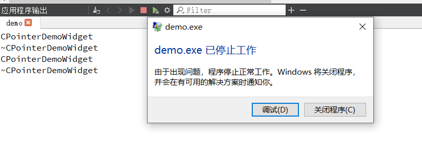

# 描述

A guarded pointer, QPointer<T>, behaves like a normal C++ pointer `T *`, except that it is automatically cleared when the referenced object is destroyed (unlike normal C++ pointers, which become "dangling pointers" in such cases). `T` must be a subclass of [QObject](https://doc.qt.io/qt-5/qobject.html).

就是说，删除他以后，自动设置为 nullptr，不像一般c++ ，删除后，是还有值的，所以，这个安全一点。

# 测试代码

~~~c++
#include <QWidget>
#include <QDebug>
#include <QPointer>

class CPointerDemoWidget : public QWidget
{
public:
    explicit CPointerDemoWidget(QWidget* parent = nullptr, Qt::WindowFlags f = Qt::WindowFlags())
        : QWidget(parent, f)
    {
        qDebug() << __FUNCTION__ ;
    }

    ~CPointerDemoWidget()
    {
        qDebug() << __FUNCTION__ ;
    }

    static void test()
    {
        QPointer<CPointerDemoWidget> pQPointerDemoWidget = new CPointerDemoWidget;
        delete pQPointerDemoWidget;

        // 不会显示
        if(pQPointerDemoWidget)
            pQPointerDemoWidget->show();

        CPointerDemoWidget * pDemoWidget = new CPointerDemoWidget;
        delete pDemoWidget;

        // 崩溃
        if(pDemoWidget)
            pDemoWidget->show();
    }
};
~~~

# 测试结果

