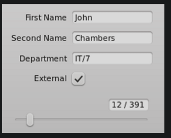
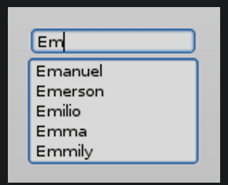
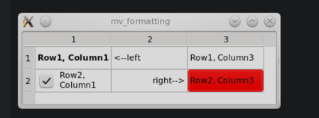

# 模型视图框架

传统的方法，就一个控件里面有一个内部容器用来存放数据，这个情况，可能很直观，但**会导致数据同步的问题**，因此模型视图的出现就避免了这个问题，因为，他只是提供一些标准化的接口，而不维护内部数据容器，所以，没有这个问题。

所以，下面，我们将通过下面的几章节来了解一下模型视图中的基础技术

* 标准控件和模型视图控件的不同
* UI 和model 的适配器
* 编一个简单的模型视图应用程序
* 预定义模型
* 中间主题
  * tree views
  * selection
  * delegates
  * debugging with model test

# 简介

模型视图是一种 `UI / data sets` 分离的技术，标准控件则未设计数据与UI分离，所以，Qt，里面有两套这个widgets

**！！！两种组件看起来相同，但是和数据的交互方式是不同的**

| Standard widgets use data that is part of the widget. |  |
| ----------------------------------------------------- | -------------------------------------------------------- |
| View classes operate on external data (the model)     |       |

## 标准控件

表格小部件是用户可以更改的数组元素的二维数组，通过读取和写入表格小部件提供的数据元素，表格小部件可以集成到程序流中。这种方法再许多应用程序中非常直观和有用。

但是使用标准小部件展示和编辑数据是有问题的，因为必须协调两个副本，所以，开发困难。

因为和数据紧耦合，所以，开发变得更困难。

## 模型视图

模型/视图加紧提供使用更通用架构的解决方案。模型/视图消除了标准小部件可能出现的数据一致性问题。模型/视图还可以更轻松地使用相同数据的多个视图，因为一个模型可以传递给多个视图。最重要的区别是模型/视图小部件不将数据存储在表格单元格后面。事实上，它们直接根据您的数据进行操作。由于视图类不知道您的数据结构，您需要提供一个包装器以使您的数据符合 `QAbstractItemModel` 接口。视图使用此接口读取和写入数据。实现 `QAbstractItemModel` 的类的任何实例都称为模型。一旦视图收到指向模型的指针，它将读取并显示其内容并成为其编辑器。

**！！！就是继承自 `QAbstractItemModel`的类，就是模型，可以自己维护里面的数据，但是要继承自这个类** 

~~~c+=
MyModel : public QAbstractItemModel
{

	QList<int> m_list;		// 比如，这个list 是维护的数据，那么就可以自己维护这个 list 
}
~~~

### Overview of the Model/View Widgets

|                            Widget                            |      Standard Widget (an item based convenience class)       |      Model/View View Class (for use with external data)      |
| :----------------------------------------------------------: | :----------------------------------------------------------: | :----------------------------------------------------------: |
|            |    [QListWidget](https://doc.qt.io/qt-5/qlistwidget.html)    |      [QListView](https://doc.qt.io/qt-5/qlistview.html)      |
|           |   [QTableWidget](https://doc.qt.io/qt-5/qtablewidget.html)   |     [QTableView](https://doc.qt.io/qt-5/qtableview.html)     |
|            |    [QTreeWidget](https://doc.qt.io/qt-5/qtreewidget.html)    |      [QTreeView](https://doc.qt.io/qt-5/qtreeview.html)      |
|          |                                                              | [QColumnView](https://doc.qt.io/qt-5/qcolumnview.html) shows a tree as a hierarchy of lists |
|  | [QComboBox](https://doc.qt.io/qt-5/qcombobox.html) can work as both a view class and also as a traditional widget |                                                              |

### Using Adapters between Forms and Models

在表单和模型之间拥有适配器会派上用场。

我们可以直接从表本身编辑存储在表中的数据，但在文本字段中编辑数据要舒服得多。没有直接的模型/视图对应物可以将操作一个值（[QLineEdit](https://doc.qt.io/qt-5/qlineedit.html)，[QCheckBox](https://doc.qt.io/qt-5/qcheckbox.html) ...）而不是数据集的小部件的数据和视图分开，因此我们需要一个适配器来将表单连接到数据源。

[QDataWidgetMapper](https://doc.qt.io/qt-5/qdatawidgetmapper.html)是一个很好的解决方案，因为它将表单小部件映射到表格行，并且可以很容易地为数据库表构建表单。

适配器的另一个例子是[QCompleter](https://doc.qt.io/qt-5/qcompleter.html)。Qt 有[QCompleter](https://doc.qt.io/qt-5/qcompleter.html)用于在 Qt 小部件（例如[QComboBox](https://doc.qt.io/qt-5/qcombobox.html)和如下所示的[QLineEdit](https://doc.qt.io/qt-5/qlineedit.html) ）中提供自动完成功能。[QCompleter](https://doc.qt.io/qt-5/qcompleter.html)使用模型作为其数据源。

# A Simple Model/View Application

从一个小例子了解 model view 

> Below are 7 very simp
>
> le and independent applications that show different sides of model/view programming. The source code can be found inside the `examples/widgets/tutorials/modelview` directory.

## A Read Only Table

We start with an application that uses a [QTableView](https://doc.qt.io/qt-5/qtableview.html) to show data. We will add editing capabilities later.

(`file source: examples/widgets/tutorials/modelview/1_readonly/main.cpp`)

~~~c++
// main.cpp
#include <QApplication>
#include <QTableView>
#include "mymodel.h"

int main(int argc, char *argv[])
{
    QApplication a(argc, argv);
    QTableView tableView;
    MyModel myModel;
    tableView.setModel(&myModel);
    tableView.show();
    return a.exec();
}
~~~

创建了一个 Model ，并传递指针数进去，`tableView` 将调用它收到的指针

的方法来找出两件事

* 应该显示多少行和列
* 每个单元格应该打印什么内容

该模型要有一些数据来响应上面的内容

我们有一个表数据集，所以让我们从 `QAbstractTableModel` 开始，因为它比更通用的 `QAbstractItemModel` 更容易使用。

`(file source: examples/widgets/tutorials/modelview/1_readonly/mymodel.h)`

~~~c++
// mymodel.h
#include <QAbstractTableModel>

class MyModel : public QAbstractTableModel
{
    Q_OBJECT
public:
    MyModel(QObject *parent = nullptr);
    int rowCount(const QModelIndex &parent = QModelIndex()) const override;
    int columnCount(const QModelIndex &parent = QModelIndex()) const override;
    QVariant data(const QModelIndex &index, int role = Qt::DisplayRole) const override;
};
~~~

重写了三个  `QAbstractTableModel`的虚函数

`(file source: examples/widgets/tutorials/modelview/1_readonly/mymodel.cpp)`

~~~c++
// mymodel.cpp
#include "mymodel.h"

MyModel::MyModel(QObject *parent)
    : QAbstractTableModel(parent)
{
}

int MyModel::rowCount(const QModelIndex & /*parent*/) const
{
   return 2;
}

int MyModel::columnCount(const QModelIndex & /*parent*/) const
{
    return 3;
}

QVariant MyModel::data(const QModelIndex &index, int role) const
{
    if (role == Qt::DisplayRole)
       return QString("Row%1, Column%2")
                   .arg(index.row() + 1)
                   .arg(index.column() +1);

    return QVariant();
}
~~~

行数和列数由 `MyModel::rowCount() `和 `MyModel::columnCount()` 提供。当视图必须知道单元格的文本是什么时，它调用方法 `MyModel::data()`。行列信息用参数索引指定，角色设置为`Qt::DisplayRole`。其他角色将在下一节中介绍。在我们的示例中，生成了应该显示的数据。在实际应用程序中，`MyModel` 将有一个名为 `MyData` 的成员，它充当所有读写操作的目标。

这个小例子展示了模型的被动性质。该模型不知道何时使用或需要哪些数据。它只是在每次视图请求时提供数据。

当模型的数据需要更改时会发生什么？视图如何意识到数据发生了变化，需要再次读取？该模型必须发出一个信号，表明哪些细胞范围发生了变化。这将在 2.3 节中演

[Extending the Read Only Example with Roles]https://doc.qt.io/qt-5/modelview.html#2-2-extending-the-read-only-example-with-roles

# 参考

[modelview 官方文档](https://doc.qt.io/qt-5/modelview.html)

[Model/View Programming](https://doc.qt.io/qt-5/model-view-programming.html)