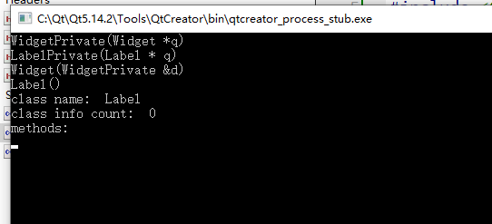
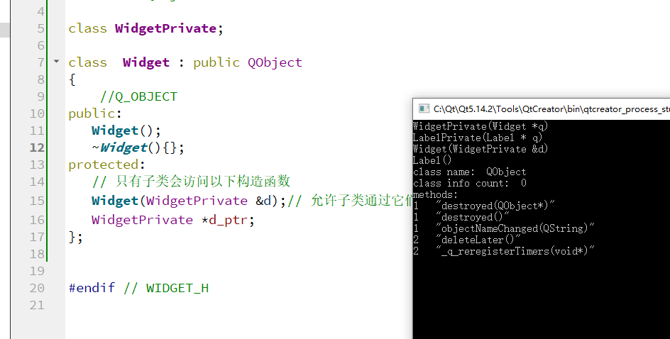
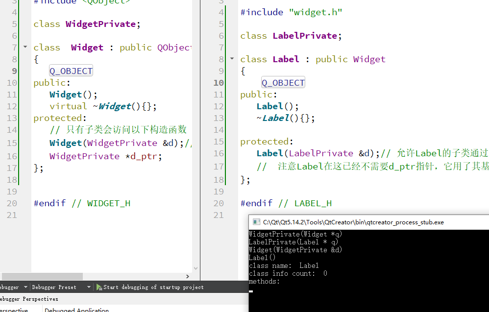

# 元对象

**Q_OBJECT**

该宏提供了对元对象的访问，使得能够使用比如信号和槽等`QObject`的更多特性。元对象提供了诸如类名、属性和方法等的信息，也被称为“[反射](http://en.wikipedia.org/wiki/Reflection_(computer_science))”。

通过使用`QMetaObject`，我们能够用如下代码显示一些类的信息：

~~~c++
QObject obj;  
const QMetaObject *metaObj = obj.metaObject();  
qDebug() << "class name: " << metaObj->className();  
qDebug() << "class info count: " << metaObj->classInfoCount();  
qDebug() << "methods: ";  
// 从QMetaObject::methodOffset()开始打印，使其不会显示父类的方法  
for (int i = metaObj->methodOffset(); i < metaObj->methodCount(); ++i)  
  qDebug() << metaObj->method(i).methodType() << " " << metaObj->method(i).signature();  
~~~

由于C++并没有提供对这些信息的任何支持，Qt引入了[元对象编译器](http://doc.trolltech.com/moc.html)（`moc`）来完成相应的工作。`moc`会读取每个头文件，如果发现其中定义的类是继承自`QObject`，且定义了*Q_OBJECT*宏，便会创建一个相应的C++源代码文件（`moc_*.cpp`），来完成这些工作。通过代码生成的工作，Qt不仅能够获得诸如Java等语言的**灵活性**，还能很好的保证继承自C++的**性能和可扩展性**。


这个和 C# 里面的差不太多啊

假设我们有如下所示的简单类：

~~~c++
class MyObject : public QObject  
{  
  Q_OBJECT  
public:  
  explicit MyObject(QObject *parent = 0);  
  void myFunc();  
public slots:  
  void mySlot(int myParam);  
signals:  
  void mySignal(int myParam);  
};  
~~~

`moc`会自动创建以下信息：

~~~c++
// 保存在QMetaObject::d.data指向的空间，其起始部分是一个QMetaObjectPrivate结构体  
static const uint qt_meta_data_MyObject[] = {  
  5,       // 版本号，其内部结构在Qt开发中有所改变  
  0,       // 类名，其值为字符串qt_meta_stringdata_MyObject的偏移量  
  // 以下值为（数量，索引）对  
  0,    0, // 类信息  
  2,   14, // 这里定义了两个方法，其起始索引为14（即signal部分）  
  0,    0, // 属性  
  0,    0, // 枚举  
  0,    0, // 构造函数  
  0,       // 标识  
  1,       // signal数量  
  // 对于signal、slot和property，其signature和parameters为字符串qt_meta_stringdata_MyObject的偏移量  
  // signals: signature, parameters, type, tag, flags  
  18,   10,    9,    9, 0x05,  
  // slots: signature, parameters, type, tag, flags  
  32,   10,    9,    9, 0x0a,  
  0        // eod  
};  
// 保存在QMetaObject::d.stringdata指向的空间  
static const char qt_meta_stringdata_MyObject[] = {  
  "MyObject/0/0myParam/0mySignal(int)/0"  
  "mySlot(int)/0"  
};  
~~~

以上信息，及其基类的相关信息，都保存在该类对应的元对象中：

~~~c++
const QMetaObject MyObject::staticMetaObject = {  
  { &QObject::staticMetaObject, // 指向其基类的元对象，保存在QMetaObject::d.superdata  
    qt_meta_stringdata_MyObject, qt_meta_data_MyObject, 0 }  
};  
~~~

这样，如果我们希望对`QObject`的对象*进行类型转换，就不需使用开销较大的运算符*dynamic_cast*， 而能够直接使用`qobject_cast`。该模板函数利用了元对象系统的信息，避免了在运行时进行类型转换：

~~~c++
template <class T> inline T qobject_cast(QObject *object)  
{  
#if !defined(QT_NO_QOBJECT_CHECK)  
  reinterpret_cast(0)->qt_check_for_QOBJECT_macro(*reinterpret_cast(object));  
#endif  
  return static_cast(reinterpret_cast(0)->staticMetaObject.cast(object));  
}  
~~~

这里，目标类型的元对象仅仅检查其是否从自身继承而来：

~~~c++
const QObject *QMetaObject::cast(const QObject *obj) const  
{  
  if (obj) {  
    const QMetaObject *m = obj->metaObject();  
    do {  
      if (m == this)  
        return obj;  
    } while ((m = m->d.superdata));  
  }  
  return 0;  
}  
~~~

此外，`moc`会为每一个**信号**创建相应函数。当信号被emit时，该函数会被自动调用：

~~~c++
void MyObject::mySignal(int _t1)  
{  
  void *_a[] = { 0, const_cast<void*>(reinterpret_cast<const void*>(&_t1)) };  
  // 检查链接到该信号的所有slot，并根据链接类型进行调用  
  QMetaObject::activate(this, &staticMetaObject, 0, _a);  
}  
~~~

最后，这些信号都会通过`moc`创建的`qt_metacall`函数被调用：

~~~c++
int MyObject::qt_metacall(QMetaObject::Call _c, int _id, void **_a)  
{  
  // 如果该函数已被基类调用，则直接返回  
  _id = QObject::qt_metacall(_c, _id, _a);  
  if (_id < 0)  
    return _id;  
  // 根据函数的ID进行调用  
  if (_c == QMetaObject::InvokeMetaMethod) {  
    switch (_id) {  
    case 0: mySignal((*reinterpret_cast< int(*)>(_a[1]))); break;  
    case 1: mySlot((*reinterpret_cast< int(*)>(_a[1]))); break;  
    default: ;  
    }  
    // 删除被该类“消耗”的ID，使得其子类类在处理时ID总是从0开始，而返回值-1则表示该函数已被调用  
    _id -= 2;  
  }  
  return _id;  
}  
~~~


# Qt Meta Object System-元对象系统


## 元对象系统的构成

1. `QObject`为所有需要利用元对象系统的对象提供一个基类。
2. `Q_OBJECT`宏，在类的声明体内激活`meta-object`功能，比如动态属性、信号和槽。
3. `Meta Object Compiler（MOC）`，为每个`QObject`派生类生成代码，以支持`meta-object`功能。
4. `QObject`定义了从一个`QObject`对象访问`meta-object`功能的接口，`Q_OBJECT`宏用来告诉编译器该类需要激活`meta-object`功能，编译器在扫描一个源文件时，如果发现类的声明中有这个宏，就会生成一些代码来为支持`meta-object`功能——主要是生成该类对应`MetaObject`类以及对`QObject`的函数override（重载）。


## `QObject`和`QMetaObject`

`QMetaObject`包含了`QObject`的所谓的元数据，也就是`QObject`信息的一些描述信息：除了类型信息外，还包含`QT`中特有的`signal&slot`信息。

```
virtual QObject::metaObject();
```

该方法返回一个`QObject`对应的`metaObject`对象，如上文所说，如果一个类的声明中包含了`Q_OBJECT`宏，编译器会生成代码来实现这个类对应的`QMetaObject`类，并重载`QObject：：metaObject()`方法来返回这个`QMetaObject`类的实例引用。这样当通过`QObject`类型的引用调用`metaObejct`方法时，返回的是这个引用的所指的真实对象的`metaobject`。

如果一个类从`QObject`派生，确没有声明`Q_OBJECT`宏，那么这个类的`metaobject`对象不会被生成，这样这个类所声明的`signal slot`都不能使用，而这个类实例调用`metaObject()`返回的就是其父类的`metaobject`对象，这样导致的后果就是你从这个类实例获得的元数据其实都是父类的数据，这显然给你的代码埋下隐患。因此如果一个类从`QOBject`派生，它都应该声明`Q_OBJECT`宏，不管这个类有没有定义`signal&slot`和`Property`。

这样每个`QObject`类都有一个对应的`QMetaObject`类，形成一个平行的类型层次。

### 测试

~~~c++
int main(int argc, char *argv[])
{
    QCoreApplication a(argc, argv);
    
    Label obj;
    const QMetaObject *metaObj = obj.metaObject();
    qDebug() << "class name: " << metaObj->className();
    qDebug() << "class info count: " << metaObj->classInfoCount();
    qDebug() << "methods: ";
    // 从QMetaObject::methodOffset()开始打印，使其不会显示父类的方法
    for (int i = metaObj->methodOffset(); i < metaObj->methodCount(); ++i)
      qDebug() << metaObj->method(i).methodType() << " " << metaObj->method(i).methodSignature();


    return a.exec();
}
~~~



如果父类没有虚析构函数，则显示信息为父类的



### 对比



## `QMetaObject`提供的信息

下面通过`QMetaObject`的接口来解释`QMetaObject`提供的信息。

1）基本信息

~~~c++
struct Q_CORE_EXPORT QMetaObject
{
       const char *className() const;
       const QMetaObject *superClass() const;　　　　
　　　　 struct { // private data        const QMetaObject *superdata; //父类QMetaObject实例的指针
        const char *stringdata;  //一段字符串内存块，包含MetaObject信息之字符串信息
        const uint *data;  //一段二级制内存块，包含MetaObject信息之二进制信息
        const void *extradata; //额外字段，暂未使用
     } d;　　　...
};
~~~

2）`classinfo`：提供额外的类信息-名值对。用户可以在类的生命中以`Q_CLASSINFO(name,value)`的方式添加。

~~~c++
 int classInfoOffset() const;
 int classInfoCount() const;
 int indexOfClassInfo(const char *name) const;
 QMetaClassInfo classInfo(int index) const;
~~~

example：

~~~c++
class MyClass : public QObject
{
    Q_OBJECT
    Q_CLASSINFO("author", "Sabrina Schweinsteiger")
    Q_CLASSINFO("url", "http://doc.moosesoft.co.uk/1.0/")

public:
    ...
};
~~~

3）constructor：提供该类的构造方法信息。

~~~c++
int constructorCount() const;
 int indexOfConstructor(const char *constructor) const;
 QMetaMethod constructor(int index) const;
~~~

4）`enum`：描述该类声明体重所包含的枚举类型信息。

```
 int enumeratorOffset() const;
 int enumeratorCount() const;
 int indexOfEnumerator(const char *name) const;
 QMetaEnum enumerator(int index) const;
```

5）method：描述类中所包含方法信息：包括property，signal，slot等。

```
 int methodOffset() const;
 int methodCount() const;
 int indexOfMethod(const char *method) const;
 int indexOfSignal(const char *signal) const;
 int indexOfSlot(const char *slot) const;
 QMetaMethod method(int index) const;
```

6）property：类型的属性信息。

```
 int propertyOffset() const;
 int propertyCount() const;
 int indexOfProperty(const char *name) const;
 QMetaProperty property(int index) const;
```

注意：对于类里面定义的函数，构造函数，枚举，只有加上一些宏才表示你希望为方法提供meta信息。比如 `Q_ENUMS` 用来注册宏，`Q_INVACABLE`用来注册方法（包括构造函数）。Qt这么设计的原因应该是避免meta信息的臃肿。

## 举例说明MOS(Meta Object System)

`TestObject`继承`QObject`，定义了两个`Property：PropertyA`和`PropertyB`；两个`classinfo：Author,version`；一个枚举：`TestEnum`。

~~~c++
#include <QObject>  
    class TestObject : public QObject  
    {  
        Q_OBJECT  
        Q_PROPERTY(QString propertyA  READ getPropertyA WRITE getPropertyA RESET resetPropertyA DESIGNABLE true SCRIPTABLE true STORED true USER false)  
        Q_PROPERTY(QString propertyB  READ getPropertyB WRITE getPropertyB RESET resetPropertyB)  
        Q_CLASSINFO("Author", "Long Huihu")  
        Q_CLASSINFO("Version", "TestObjectV1.0")  
        Q_ENUMS(TestEnum)  
    public:  
        enum TestEnum {  
            EnumValueA,  
            EnumValueB  
        };  
    public:  
        TestObject();  
    signals:  
        void clicked();  
        void pressed();  
    public slots:  
        void onEventA(const QString &);  
        void onEventB(int );  
    }
~~~

`TestObject`的`moc`文件：

~~~c++
#include "TestObject.h"  
    #if !defined(Q_MOC_OUTPUT_REVISION)  
    #error "The header file 'TestObject.h' doesn't include <QObject>."  
    #elif Q_MOC_OUTPUT_REVISION != 62  
    #error "This file was generated using the moc from 4.6.0. It"  
    #error "cannot be used with the include files from this version of Qt."  
    #error "(The moc has changed too much.)"  
    #endif  
    QT_BEGIN_MOC_NAMESPACE  
    static const uint qt_meta_data_TestObject[] = {  
     // content:  
           4,       // revision  
           0,       // classname  
           2,   14, // classinfo  
           4,   18, // methods  
           2,   38, // properties  
           1,   44, // enums/sets  
           0,    0, // constructors  
           0,       // flags  
           2,       // signalCount  
     // classinfo: key, value  
          22,   11,  
          44,   29,  
     // signals: signature, parameters, type, tag, flags  
          53,   52,   52,   52, 0x05,  
          63,   52,   52,   52, 0x05,  
     // slots: signature, parameters, type, tag, flags  
          73,   52,   52,   52, 0x0a,  
          91,   52,   52,   52, 0x0a,  
     // properties: name, type, flags  
         113,  105, 0x0a095007,  
         123,  105, 0x0a095007,  
     // enums: name, flags, count, data  
         133, 0x0,    2,   48,  
     // enum data: key, value  
         142, uint(TestObject::EnumValueA),  
         153, uint(TestObject::EnumValueB),  
           0        // eod  
    };  
    static const char qt_meta_stringdata_TestObject[] = {  
        "TestObject\0Long Huihu\0Author\0"  
        "TestObjectV1.0\0Version\0\0clicked()\0"  
        "pressed()\0onEventA(QString)\0onEventB(int)\0"  
        "QString\0propertyA\0propertyB\0TestEnum\0"  
        "EnumValueA\0EnumValueB\0"  
    };  
    const QMetaObject TestObject::staticMetaObject = {  
        { &QObject::staticMetaObject, qt_meta_stringdata_TestObject,  
          qt_meta_data_TestObject, 0 }  
    };  
    #ifdef Q_NO_DATA_RELOCATION  
    const QMetaObject &TestObject::getStaticMetaObject() { return staticMetaObject; }  
    #endif //Q_NO_DATA_RELOCATION  
    const QMetaObject *TestObject::metaObject() const  
    {  
        return QObject::d_ptr->metaObject ? QObject::d_ptr->metaObject : &staticMetaObject;  
    }  
    void *TestObject::qt_metacast(const char *_clname)  
    {  
        if (!_clname) return 0;  
        if (!strcmp(_clname, qt_meta_stringdata_TestObject))  
            return static_cast<void*>(const_cast< TestObject*>(this));  
        return QObject::qt_metacast(_clname);  
    }  
    int TestObject::qt_metacall(QMetaObject::Call _c, int _id, void **_a)  
    {  
        _id = QObject::qt_metacall(_c, _id, _a);  
        if (_id < 0)  
            return _id;  
        if (_c == QMetaObject::InvokeMetaMethod) {  
            switch (_id) {  
            case 0: clicked(); break;  
            case 1: pressed(); break;  
            case 2: onEventA((*reinterpret_cast< const QString(*)>(_a[1]))); break;  
            case 3: onEventB((*reinterpret_cast< int(*)>(_a[1]))); break;  
            default: ;  
            }  
            _id -= 4;  
        }  
    #ifndef QT_NO_PROPERTIES  
          else if (_c == QMetaObject::ReadProperty) {  
            void *_v = _a[0];  
            switch (_id) {  
            case 0: *reinterpret_cast< QString*>(_v) = getPropertyA(); break;  
            case 1: *reinterpret_cast< QString*>(_v) = getPropertyB(); break;  
            }  
            _id -= 2;  
        } else if (_c == QMetaObject::WriteProperty) {  
            void *_v = _a[0];  
            switch (_id) {  
            case 0: getPropertyA(*reinterpret_cast< QString*>(_v)); break;  
            case 1: getPropertyB(*reinterpret_cast< QString*>(_v)); break;  
            }  
            _id -= 2;  
        } else if (_c == QMetaObject::ResetProperty) {  
            switch (_id) {  
            case 0: resetPropertyA(); break;  
            case 1: resetPropertyB(); break;  
            }  
            _id -= 2;  
        } else if (_c == QMetaObject::QueryPropertyDesignable) {  
            _id -= 2;  
        } else if (_c == QMetaObject::QueryPropertyScriptable) {  
            _id -= 2;  
        } else if (_c == QMetaObject::QueryPropertyStored) {  
            _id -= 2;  
        } else if (_c == QMetaObject::QueryPropertyEditable) {  
            _id -= 2;  
        } else if (_c == QMetaObject::QueryPropertyUser) {  
            _id -= 2;  
        }  
    #endif // QT_NO_PROPERTIES  
        return _id;  
    }  
    // SIGNAL 0  
    void TestObject::clicked()  
    {  
        QMetaObject::activate(this, &staticMetaObject, 0, 0);  
    }  
    // SIGNAL 1  
    void TestObject::pressed()  
    {  
        QMetaObject::activate(this, &staticMetaObject, 1, 0);  
    }  
    QT_END_MOC_NAMESPACE
~~~

1. `qt_meta_data_TestObject`：定义的正是`QMetaObject::d.data`指向的信息块；
2. `qt_meta_stringdata_TestObject`：定义的是`QMetaObject::d.dataString`指向的信息块；
3. `const QMetaObject TestObject::staticMetaObject`：定义`TestObject`类的`MetaObject`实例，从中可以看出`QMetaObject`各个字段是如何被赋值的；
4. `const QMetaObject *TestObject::metaObject() const`：重写了`QObject::metaObject`函数，返回上述的`MetaObject`实例指针。
5. `TestObject::qt_metacall()`是重写`QObject`的方法，依据传入的参数来调用signal&slot或访问property，动态方法调用属性访问正是依赖于这个方法。
6. `TestObject：：clicked()`和`TestObject：：pressed()`正是对两个signal的实现，可见，signal其实就是一种方法，只不过这种方法由qt meta system来实现，不用我们自己实现。

 `TestObject`类的所有meta信息就存储在`qt_meta_data_TestObject`和`qt_meta_stringdata_TestObject`这两个静态数据中。 `QMetaObject`的接口的实现正是基于这两块数据。下面就对这两个数据进行分块说明。

~~~c++
static const uint qt_meta_data_TestObject[] = { 

数据块一：
        // content:
       4,       // revision
       0,       // classname

       2,   14, // classinfo   

       4,   18, // methods

       2,   38, // properties
       1,   44, // enums/sets
       0,    0, // constructors
       0,       // flags
       2,       // signalCount

这块数据可以被看做meta信息的头部，正好和QMetaObjectPrivate数据结构相对应，在QMetaObject的实现中，正是将这块数据映射为QMetaObjectPrivate进行使用的。

第一行数据“4”：版本号；

第二行数据“0”：类型名，该值是qt_meta_stringdata_TestObject的索引，qt_meta_stringdata_TestObject[0]这个字符串不正是类型名“TestObject”吗。

第三行数据“2,14”，第一个表明有2个classinfo被定义，第二个是说具体的 classinfo信息在qt_meta_data_TestObject中的索引，qt_meta_data_TestObject[14]的位置两个 classinfo名值对的定义；

第四行数据“4,18”，指明method的信息，模式同上；

第五行数据“2,38”，指明property的信息，模式同上；
第六行数据“1,14”，指明enum的信息，模式同上。 

数据块二：
 // classinfo: key, value
      22,   11,
      44,   29,

classinfo信息块。第一行“22,11”，22表明 qt_meta_stringdata_TestObject[22]处定义的字符串是classinfo的key，11表明 qt_meta_stringdata_TestObject[11]处的字符串就是value。第二行“44,29”定义第二个classinfo。

数据块三：
 // signals: signature, parameters, type, tag, flags
      53,   52,   52,   52, 0x05,
      63,   52,   52,   52, 0x05,

signal信息块。第一行“53,   52,   52,   52, 0x05”定义第一个signal clicked()。qt_meta_stringdata_TestObject[53]是signal名称字符串。parameters 52, type 52, tag 52, flags如何解释暂未知。

数据块四：
 // slots: signature, parameters, type, tag, flags
      73,   52,   52,   52, 0x0a,
      91,   52,   52,   52, 0x0a,

slots信息，模式类似signal。

数据块五：
 // properties: name, type, flags
     113,  105, 0x0a095007,
     123,  105, 0x0a095007,

property性信息，模式类signal和slots，105如何和type对应暂未知。

数据块六：
 // enums: name, flags, count, data
     133, 0x0,    2,   48,
 // enum data: key, value
     142, uint(TestObject::EnumValueA),
     153, uint(TestObject::EnumValueB),

enum信息，第一行定义的是枚举名，flag，值的数目，data48不知是什么。

几行定义的是各枚举项的名称和值。名称同上都是qt_meta_stringdata_TestObject的索引值。

       0        // eod
};

static const char qt_meta_stringdata_TestObject[] = {

这块数据就是meta信息所需的字符串。是一个字符串的序列。
    "TestObject\0Long Huihu\0Author\0"
    "TestObjectV1.0\0Version\0\0clicked()\0"
    "pressed()\0onEventA(QString)\0onEventB(int)\0"
    "QString\0propertyA\0propertyB\0TestEnum\0"
    "EnumValueA\0EnumValueB\0"
};
~~~


# 参考

* [Qt之美（二）元对象](https://blog.csdn.net/seanyxie/article/details/6120040?ops_request_misc=&request_id=&biz_id=102&utm_term=qt%E4%B9%8B%E7%BE%8E&utm_medium=distribute.pc_search_result.none-task-blog-2~blog~sobaiduweb~default-1-6120040.pc_v2_rank_blog_default)

* [Qt Meta Object System-元对象系统](https://www.cnblogs.com/lsgxeva/p/7819437.html)
