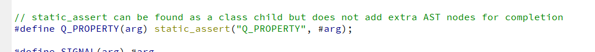
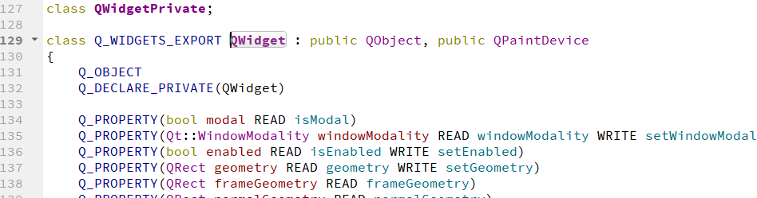
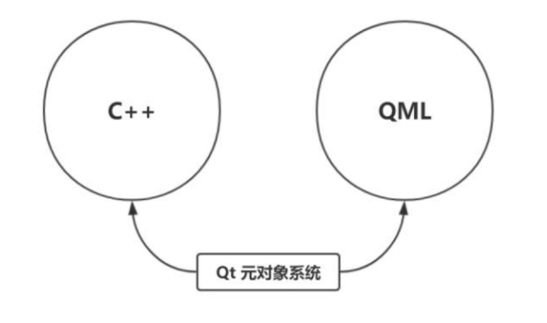

# 感谢

## 官方文档

* [The Property System](https://doc.qt.io/qt-5/properties.html)

## 一去、二三里

* [Qt 之属性系统](https://blog.csdn.net/liang19890820/article/details/52022714)

## 南理汉子

* [Qt 中的属性系统（Property System）](https://zhuanlan.zhihu.com/p/43348546)


# The Property System

https://doc.qt.io/qt-5/properties.html

其实第三篇也有很多参考官方文档的，相当于一个翻译



> 【1】assert 与 #error
>
> 我们知道，C++现有的标准中就有assert、#error两个方法是用来检查错误的，除此而外还有一些第三方的静态断言实现。
>
> assert是运行期断言，它用来发现运行期间的错误，不能提前到编译期发现错误，也不具有强制性，也谈不上改善编译信息的可读性。
>
> 既然是运行期检查，对性能肯定是有影响的，所以经常在发行版本中，assert都会被关掉。
>
> \#error可看作是预编译期断言（甚至都算不上断言），仅仅能在预编译时显示一个错误信息，可以配合#ifdef/ifndef参与预编译的条件检查。
>
> 由于它无法获得编译信息，当然，也就做不了更进一步分析了。
>
> 在stastic_assert提交到C++0x标准之前，为了弥补assert和#error的不足，出现了一些第三方解决方案，可以作编译期的静态检查：
>
> 例如：BOOST_STATIC_ASSERT和LOKI_STATIC_CHECK，但由于它们都是利用了一些编译器的隐晦特性实现的trick，可移植性、简便性都不是太好，还会降低编译速度，而且功能也不够完善。
>
> 比如BOOST_STATIC_ASSERT就不能定义错误提示文字，而LOKI_STATIC_CHECK则要求提示文字满足C++类型定义的语法。
>
> 【2】静态断言
>
> C++11中引入了static_assert这个关键字，用来做编译期间的断言，因此叫作静态断言。
>
> 语法：
>
> ```
> static_assert(常量表达式，"提示字符串")
> ```
>
> 注解：如果第一个参数常量表达式的值为false，会产生一条编译错误。错误位置就是该static_assert语句所在行，第二个参数就是错误提示字符串。
>
> 【3】总结
>
> 使用static_assert，可以在编译期发现更多的错误，用编译器来强制保证一些契约，帮助我们改善编译信息的可读性，尤其是用于模板时。
>
> 使用注意点：
>
> [1]使用范围：static_assert可以用在全局作用域中，命名空间中，类作用域中，函数作用域中，几乎可以不受限制的使用。
>
> [2]常量表达式：static_assert的断言表达式的结果必须是在编译时期可以计算的表达式，即必须是常量表达式，示例如下：
>
> ```
> //该static_assert用来确保编译仅在32位的平台上进行，不支持64位的平台
> //该语句可放在文件的开头处，这样可以尽早检查，以节省失败情况下耗费的编译时间
> static_assert(sizeof(int) == 4, "64-bit code generation is not supported.");
> ```
>
> 如果读者使用了变量，则会导致错误。示例如下：
>
> ```
> int positive(const int n)
> {
>     static_assert(n > 0, "value must > 0");
>     return 0;
> }
> ```
>
> n作为一个变量，在编译期根本无法确定值（无能为力），估属于应用错误范畴。
>
> [3]模板参数：编译器在遇到一个static_assert语句时，通常立刻将其第一个参数作为常量表达式进行演算。
>
> 但如果该常量表达式依赖于某些模板参数，则延迟到模板实例化时再进行演算，这就让检查模板参数也成为了可能。
>
> 示例如下：
>
> [](javascript:void(0);)
>
> ```
>  1 #include <cassert>
>  2 #include <cstring>
>  3 using namespace std;
>  4 
>  5 template <typename T, typename U> int bit_copy(T& a, U& b)
>  6 {
>  7     assert(sizeof(b) == sizeof(a));
>  8     //static_assert(sizeof(b) == sizeof(a), "template parameter size no equal!");
>  9     memcpy(&a, &b, sizeof(b));
> 10 };
> 11 
> 12 int main()
> 13 {
> 14     int varA = 0x2468;
> 15     double varB;
> 16     bit_copy(varA, varB);
> 17     getchar();
> 18     return 0;
> 19 }
> ```
>
> [](javascript:void(0);)
>
> [4]性能方面：由于static_assert是编译期间断言，不生成目标代码，因此static_assert不会造成任何运行期性能损失。


# Qt 之属性系统

## 简述

Qt提供一个类似于其它编译器供应商提供的复杂属性系统（Property System）。然而，作为一个编译器和平台无关的库，Qt不能够依赖于那些非标准的编译器特性，比如：`__property`或者`[property]`。Qt的解决方案适用于Qt支持平台下的任何标准C++编译器。它依赖于元对象系统（`Meta Object Sytstem`） - 通过信号和槽提供对象间通讯机制。

## 声明属性的要求

要声明一个属性，在继承`QObject`的类中使用`Q_PROPERTY()`宏。

~~~c+=
Q_PROPERTY(type name
           (READ getFunction [WRITE setFunction] |
            MEMBER memberName [(READ getFunction | WRITE setFunction)])
           [RESET resetFunction]
           [NOTIFY notifySignal]
           [REVISION int]
           [DESIGNABLE bool]
           [SCRIPTABLE bool]
           [STORED bool]
           [USER bool]
           [CONSTANT]
           [FINAL])
~~~



~~~c++
Q_PROPERTY(bool focus READ hasFocus)
Q_PROPERTY(bool enabled READ isEnabled WRITE setEnabled)
Q_PROPERTY(QCursor cursor READ cursor WRITE setCursor RESET unsetCursor)
~~~


下面的示例，展示了如何使用MEMBER关键字将类成员变量导出为Qt属性。<font color= red>注意：NOTIFY信号必须被指定，这样才能被QML使用。</font>

~~~c++
    Q_PROPERTY(QColor color MEMBER m_color NOTIFY colorChanged)
    Q_PROPERTY(qreal spacing MEMBER m_spacing NOTIFY spacingChanged)
    Q_PROPERTY(QString text MEMBER m_text NOTIFY textChanged)
    ...
signals:
    void colorChanged();
    void spacingChanged();
    void textChanged(const QString &newText);

private:
    QColor  m_color;
    qreal   m_spacing;
    QString m_text;
~~~

一个属性的行为就像一个类的数据成员，但它有通过元对象系统访问的附加功能。

如果`MEMBER`关键字没有被指定，则一个`READ`访问函数是必须的。它被用来读取属性值。理想的情况下，一个`const`函数用于此目的，并且它必须返回的是属性类型或`const`引用。比如：`QWidget::focus`是一个只读属性，通过`READ`函数`QWidget::hasFocus()`访问。

一个`WRITE`访问函数是可选的，用于设置属性的值。它必须返回`void`并且只能接受一个参数，属性的类型是类型指针或引用，例如：`QWidget::enabled`具有`WRITE`函数`QWidget::setEnabled()`。只读属性不需要WRITE函数，例如：`QWidget::focus`没有`WRITE`函数。

如果`READ`访问函数没有被指定，则`MEMBER`变量关联是必须的。这使得给定的成员变量可读和可写，而不需要创建`READ`和`WRITE`访问函数。如果需要控制变量访问，仍然可以使用`READ`和`WRITE`函数而不仅仅是`MEMBER`（但别同时使用）。

一个`RESET`函数是可选的，用于将属性设置为上下文指定的默认值。例如：`QWidget::cursor`有`READ`和`WRITE`函数`QWidget::cursor()`和`QWidget::setCursor()`，同时也有一个`RESET`函数`QWidget::unsetCursor()`，因为没有可用的`QWidget::setCursor()`调用可以确定的将`cursor`属性重置为上下文默认的值。`RESET`函数必须返回`void`类型，并且不带任何参数。

一个`NOTIFY`信号是可选的。如果定义了`NOTIFY`，则需要在类中指定一个已存在的信号，该信号在属性值发生改变时发射。与`MEMBER`变量相关的`NOTIFY`信号必须有零个或一个参数，而且必须与属性的类型相同。参数保存的是属性的新值。`NOTIFY`信号应该仅当属性值真正的发生变化时发射，以避免被`QML`重新评估。例如：当需要一个没有显式`setter`的`MEMBER`属性时，Qt会自动发射信号。

一个`REVISION`数字是可选的。如果包含了该关键字，它定义了属性并且通知信号被特定版本的`API`使用（通常是`QML`）；如果没有包含，它默认为0。

`DESIGNABLE`属性指定了该属性在`GUI`设计器（例如：Qt Designer）里的编辑器中是否可见。大多数的属性是`DESIGNABLE` （默认为true）。除了true或false，你还可以指定boolean成员函数。

`SCRIPTABLE`属性表明这个属性是否可以被一个脚本引擎操作（默认是true）。除了true或false，你还可以指定boolean成员函数。

`STORED`属性表明了该属性是否是独立存在的还是依赖于其它属性。它也表明在保存对象状态时，是否必须保存此属性的值。大多数属性是`STORED`（默认为true）。但是例如：`QWidget::minmunWidth()`的`STROED`为`false`，因为它的值从`QWidget::minimumSize()`（类型为`QSize`）中的width部分取得。

`USER`属性指定了属性是否被设计为用户可见和可编辑的。通常情况下，每一个类只有一个`USER`属性（默认为false）。例如： `QAbstractButton::checked`  是`（checkable）buttons`的用户可修改属性。注意：`QItemDelegate`获取和设置`widget`的`USER`属性。

`CONSTANT`属性的出现表明属性是一个常量值。对于给定的`object`实例，常量属性的`READ`函数在每次被调用时必须返回相同的值。对于不同的`object`实例该常量值可能会不同。一个常量属性不能具有`WRITE`函数或`NOYIFY`信号。

`FINAL`属性的出现表明属性不能被派生类所重写。有些情况下，这可以用于效率优化，但不能被`moc`强制执行。必须注意不能覆盖一个`FINAL`属性。

属性类型可以是`QVariant`支持的任何类型，或者是用户定义的类型。在这个例子中，类`QDate`被看作是一个用户定义的类型。

~~~c++
Q_PROPERTY(QDate date READ getDate WRITE setDate)
~~~

因为`QDate`是用户自定义的，当声明属性时，必须包含<QDate>头文件。

对于`QMap`、`QList`和`QValueList`属性，属性的值是一个`QVariant`，它包含整个`list`或`map`。注意：`Q_PROPERTY`字符串不能包含逗号，因为逗号会分割宏的参数。因此，你必须使用`QMap`作为属性的类型而不是`QMap<QString,QVariant>`。为了保持一致性，也需要用`QList`和`QValueList`而不是`QList<QVariant>`和`QValueList<QVariant>`。   :question:

## 通过元数据对象系统读写属性

一个属性可以使用常规函数`QObject::property()`和`QObject::setProperty()`进行读写，除了属性的名字，不用知道属性所在类的任何细节。下面的代码中，调用`QAbstractButton::setDown()`和`QObject::setProperty()`来设置属性`“down”`。

~~~c++
QPushButton *button = new QPushButton;
QObject *object = button;

button->setDown(true);
object->setProperty("down", true);
~~~

通过`WRITE`操作器来设置属性值比上述两者都好，因为它效率更高而且在编译时期有更好的诊断。但是这需要你在编译实际了解整个类（能够访问其定义）。通过名称访问属性，能够让你在编译时访问不了解的类。你可以在运行时期通过`QObject`、`QMetaObject`和`QMetaProperties`查询类属性。

~~~c++
QObject *object = ...
const QMetaObject *metaobject = object->metaObject();
int count = metaobject->propertyCount();
for (int i=0; i<count; ++i) {
    QMetaProperty metaproperty = metaobject->property(i);
    const char *name = metaproperty.name();
    QVariant value = object->property(name);
    ...
}
~~~

上面的代码片段中，`QMetaObject::property()`用于获取未知类中每个属性的`metadata`。从`metadata`中获取属性名，然后传给`QObject::property()`来获取当前对象的属性值。

## 一个简单的示例

假设我们有一个类`MyClass`，它从`QObject`派生并且在其`private`区域使用了`Q_OBJECT`宏。我们想在`MyClass`类中声明一个属性来追踪一个`priority`值。属性的名称是`priority`，它的类型是定义在`MyClass`中的`Priority`枚举。

我们在类的`private`区域使用`Q_PROPERTY()`来声明属性。`READ`函数名为`priority`，并且我们包含一个名为`setPriority`的`WRITE`函数，枚举类型必须使用`Q_ENUM()`注册到元对象系统中。注册一个枚举类型使得枚举的名字可以在调用`QObject::setProperty()`时使用。我们还必须为`READ`和`WRITE`函数提供我们自己的声明。

`MyClass`的声明看起来应该是这样的：

~~~c++
class MyClass : public QObject
{
    Q_OBJECT
    Q_PROPERTY(Priority priority READ priority WRITE setPriority NOTIFY priorityChanged)

public:
    MyClass(QObject *parent = 0);
    ~MyClass();

    enum Priority { High, Low, VeryHigh, VeryLow };
    Q_ENUM(Priority)

    void setPriority(Priority priority)
    {
        m_priority = priority;
        emit priorityChanged(priority);
    }
    Priority priority() const
    { return m_priority; }

signals:
    void priorityChanged(Priority);

private:
    Priority m_priority;
};
~~~

READ函数是`const`的并且返回属性的类型。`WRITE`函数返回`void`并且具有一个属性类型的参数。元对象编译器强制做这些事情。

给定一个指向`MyClass`实例的指针，或一个指向`QObject`（`MyClass`实例）的指针时，我们有两种方法来设置`priority`属性：

~~~C++
MyClass *myinstance = new MyClass;
QObject *object = myinstance;

myinstance->setPriority(MyClass::VeryHigh);
object->setProperty("priority", "VeryHigh");
~~~

在此例子中，定义在`MyClass`中的枚举类型是属性的类型，而且被`Q_ENUM()`宏注册在元对象系统中。这使得枚举值可以在调用`setProperty()`时做为字符串使用。如果枚举类型在其它类中声明，那么需要使用枚举的全名（例如：`OtherClass::Priority`)，而且这个类也必须从`QObject`派生，并且使用`Q_ENUM()`宏注册枚举类型。

另一个简单的宏`Q_FLAGS()`也是可用的，就像`Q_ENUMS()`，它注册一个枚举类型，但是它把枚举类型作为一个`flag`集合，也就是，值可以用`OR`操作来合并。一个`I/O`类可能具有枚举值`Read`和`Write`并且`QObject::setProperty()`可以接受`Read | Write`。应使用`Q_FLAGS()`来注册此枚举类型。

## 动态属性

`QObject::setProperty()`也可以用来在运行时期向一个类的实例添加新的属性。当使用一个名字和值调用它时，如果`QObject`中一个指定名称的属性已经存在，并且如果给定的值与属性的类型兼容，那么，值就被存储到属性中，然后返回`true`。如果值与属性类型不兼容，属性的值就不会发生改变，会返回`false`。但是如果`QObject`中一个指定名称的属性不存在（例如：未用`Q_PROPERTY()`声明），一个带有指定名称和值的新属性就被自动添加到`QObject`中，但是依然会返回`false`。这意味着返回值不能用于确定一个属性是否被设置值，除非事先知道这个属性已经存在于`QObject`中。

注意：动态属性被添加到每一个实例中，即：它们被添加到`QObject`中，而不是`QMetaObject`。一个属性可以从一个实例中删除，通过传入属性名和非法的`QVariant`值给`QObject::setProperty()`。默认的`QVariant`构造器会构造一个非法的`QVariant`。

动态属性可用`QObject::property()`来查询，就像使用`Q_PROPERTY()`声明的属性一样。

## 属性和自定义类型

被属性使用的自定义类型需要使用`Q_DECLARE_METATYPE()`宏注册，以便它们的值能被保存在`QVariant`对象中。这使得它们适用于在类定义时使用`Q_PROPERTY()`宏声明的静态属性，以及运行时创建的动态属性。

## 为类添加附加信息

与属性系统相对应的是一个附加宏 - `Q_CLASSINFO()`。用于添加name-value对到类的元对象中。例如：

~~~c++
Q_CLASSINFO("Version", "3.0.0")
~~~

和其它`meta-data`一样，类信息可以在运行时通过`meta-object`访问，详情见：`QMetaObject::classInfo() `。


# Qt 中的属性系统（Property System）

## 如何理解“属性系统”这个概念？

一般我们说一个类有什么属性，指的就是这个类有啥成员变量。比如 `People` 类中有个 `int age` 的私有成员变量，我们就可以说这个 `People` 类有个“年龄”属性可以更改读取。

`Qt` 提供的这个属性系统，作用就是把类的信息暴露出来成为通用的大家都认识的信息。比如用 `C++` 语言写的`People` 类中有个 `int age` 变量，但是如果用 `QML` 语言去读取就会出问题，因为 `QML` 有自己的规则，它不认识` C++` 啊。怎么办呢？用 `Qt `的属性系统就可以解决这个问题。属性系统可以这样理解：当一个类的成员变量或者成员函数用属性系统处理一下，它们就从` C++` 内部中暴露出来，而且大家都认得。

> 属性系统是专门为元对象系统服务的。



## 如何声明一个属性并赋予读/写操作？

Qt 有自己的语法，只需要在 `QObject` 及其子类中用 `Q_PROPERTY `宏写就可以了。比如 `QWidget `这个类，其中使用属性系统的代码如下所示：

~~~c++
Q_PROPERTY(QCursor cursor  READ cursor  WRITE setCursor  RESET unsetCursor)
~~~

上面这一行代码就声明了一个 `cursor` 属性，指明了它是 `QCursor` 类型的，而且指明了需要用自己的 `cursor()` 函数来读取这个属性值，指明了用自己的 `setCursor()` 函数来修改属性值，还指明了用自己的 `unsetCursor()` 函数进行默认值设置。一行语句就把一个属性声明好了，代码还算是很简洁的。

## 如何将类的变量导出为一个属性值？

注意上述的属性值 `cursor` 可不是 `QWidget` 的一个成员变量，要想将 `QWidget` 类中的某个变量导出成为一个属性值，应该用 `MEMBER` 关键字将变量注册到 Qt 的属性系统。如下：

~~~c++
   Q_PROPERTY(QColor  color  MEMBER m_color  NOTIFY colorChanged)
   ...
signals:
   void colorChanged();
private:
   QColor m_color;
~~~

上面的代码把 `QWidget` 类中的 `m_color `成员变量导出为一个属性值，并且起了个新名字`“color”`。那么外界所能看到的或者说只认可的属性值只有` color` 而不是 `m_color`。

<font color=red>**我们要时刻记住，一个属性在行为上是类似于类的成员变量的。**</font>

## Q_PROPERTY 中的常用格式

我们声明了一个属性值，常用的操作无非就是读、写、将成员变量导出为属性值、关联信号等。下文就从语法的角度来说说怎么做。

- **指定读取属性值的函数**

假设有个布尔类型的属性值 `focus`，用 `READ` 来指定读取的函数为 `hasFocus()`。因为是读操作，所以养成好的习惯，`hasFocus()` 函数最好也是` const `类型的。代码如下：

~~~c++
Class Widget : public QObject
{
    Q_PROPERTY(bool focus READ hasFocus)
    Q_OBJECT
public:
    bool hasFocus() const;
}
~~~

- **指定修改属性值的函数**

还是 `focus `这个属性值，要对它进行操作，用 `WRITE` 关键字来指定修改属性值的函数为 `setFocus()`。设置函数有个限制，就是函数返回值必须是` void`。这也好理解，我就是修改数值而已，不需要返回什么。第二个限制是函数参数只能有一个，把目标值作为参数即可。代码如下：

~~~C++
Class Widget : public QObject
{
    Q_PROPERTY(bool focus WRITE setFocus)
    Q_OBJECT
public:
    bool hasFocus() const;
    void setFocus(bool on);
}
~~~

- **导出成员变量为一个属性值**

上面两个读/写的属性值都不是类中的成员变量，是凭空声明出来的一个属性值。要想将类中已有的成员变量设置为属性值，需要用 `MEMBER` 关键字。这样的话 `focus` 这个属性值就变的可读可写了。要读的话用类自己的 `hasFocus() `函数，要写的话用自带的 `setFocus()` 修改 `m_focus `变量就可以了，属性值会自动跟着变的。

虽然 `READ`、``WRITE`、`MEMBER` 这三个关键字都可以赋予属性值可读可写的特性，但是 `READ`、`WRITE` 和 `MEMBER` 不能同时使用，赋予可读可写特性一次就够了，不能赋予两次。就好像一个对象不能被析构两次一样。

代码如下：

~~~c++
Class Widget : public QObject
{
    Q_PROPERTY(bool focus MEMBER m_focus)
    Q_OBJECT
public:
    bool hasFocus() const;
    void setFocus(bool on);
private:
    bool m_focus;
}
~~~

- **给属性值设置关联的信号**

如果我们希望某个属性值变化时能发射出信号，Qt 的属性系统是用 `NOTIFY` 关键字来指定信号。代码如下：

~~~c++
Class Widget : public QObject
{
    Q_PROPERTY(bool focus MEMBER m_focus NOTIFY focusChanged)
    Q_OBJECT
public:
    bool hasFocus() const;
    void setFocus(bool on);
signals:
    void focusChanged();
private:
    bool m_focus;
} 
~~~

以上就是最常用的几个操作。除此之外还有 `RESET`、`REVISION`、`DESIGNABLE`、`SCRIPTABLE`、`STORED`、`USER`、`CONSTANT`、`FINAL`。这些关键字的含义及用法参考官方文档 The Property System。

## **实际操作一下读/写属性值？**

上文我们创建了 `QObject` 的子类 `Widget`，并且指定了修改 `focus` 属性值的函数，现在我们创建 `Widget `类的一个对象 w 来看看实际代码中如何写。

由于赋予属性值读/写有两种办法（方法一是用 `READ`、`WRITE`；方法二是 `MEMBER` ），那么实际使用中针对这两种方式使用略有不同。

如果是用` READ`、`WRITE`，那么直接调用指定的函数即可，如：

~~~c++
Widget *w = new Widget;
w->setFocus(true);
~~~

如果是用 `MEMBER`，那么用 `QObject` 的` property() `和 `setProperty() `两个函数，如：

~~~c++
Widget *w = new Widget;
w->property("focus");
w->setProperty("focus", true);
~~~

## **两种方法哪个好？**

当然是 `WRITE`。它的效率跟高、速度更快，而且在编译阶段就可以进行类型检查。缺点就是还没运行前你就得了解这个类是有 `setFocus() `这个函数。而采用 `MEMBER` 方式时，我们不需要知道这个类有啥函数、有啥变量，只需要知道这个类有一个叫`“focus”`的属性值就可以了。

## **我怎么知道一个类中有啥属性？**

那既然` MEMBER `的好处是只需要知道这个类有一个叫` focus `的属性值，再极端点，我连这个类有啥属性值都不知道时怎么办？Qt 的元对象系统是如此的强大，已经为你准备好了相关的函数了。那就是` QMetaObject`、`QMetaProperties`。下列代码输出了 `Widget` 类中所有的属性名称和属性值：

~~~c++
Widget *w = new Widget;

const QMetaObject *metaobject = w->metaObject();
int count = metaobject->propertyCount();

for (int i = 0; i < count; ++i) {
    QMetaProperty metaproperty = metaobject->property(i);
    const char *name = metaproperty.name();
    QVariant value = w->property(name);
    ...
} 
~~~

## **完整的示例**

上文讲解的 Widget 类由于代码分散在各处，可能对一个类如何操作属性值没有直观的感受，下面用完整的代码来演示属性的一系列操作。

**声明代码**

~~~c++
class Widget : public QObject
{
    Q_OBJECT
    Q_PROPERTY(bool focus READ hasFocus WRITE setFocus NOTIFY focusChanged)
public:
    Widget(QObject *parent = 0);
    ~Widget();

    bool hasFocus() const
    {
        return m_focus;
    }

    void setFocus(bool on)
    {
        m_focus = on;
    }
signals:
    void focusChanged();

private:
    bool m_focus;
}
~~~

**解读**

我们有一个继承于 `QObject` 的 `Widget` 类。我们用 `Q_PROPERTY` 宏声明了一个属性来跟踪私有变量 `m_focus` 值，属性名使用 `focus`，属性类型是个布尔类型。用 READ 指定了读取函数` hasFocus()`，用 `WRITE` 指定了修改函数 `setFocus`，用 `NOTIFY` 指定了发射信号` focusChanged()`。

**使用代码**

现在我们有个 `Widget` 指针和一个 `QObject `指针，设置属性值的方法是：

~~~c++
Widget *w = new Widget;
w->setFocus(true);

QObject *o = w;
o->setProperty("focus", true);
~~~

## **在程序运行过程中添加属性**

`QObject::setProperty() `函数也可以用于在运行期添加新的属性。如果对象中已经存在该属性，则新添加的属性值会更改原有值并返回true；如果对象中不存在该属性，那么会自动添加到`QObject`中，注意了，此时返回值仍有可能是 false。所以根据返回值是不能确定属性值是否被设置成功。

说的有点拗口，这样说吧，在已知类中存在某属性的情况下，可以根据返回值判断是否设置成功。如果添加新的属性值，就不能用返回值判断是否设置成功。

**注意事项**

因为是在程序运行过程中新增的属性，所以这个属性可以理解为是“临时的”。它们只会加到 `QObject` 实例中，不会加到最为核心的 `QMetaObject` 实例中。就好比一个公司已经发展起来了，后来新入职的员工就不是核心人员。

那么要想删除这个“临时的”属性，只需要掉用 `QObject::setProperty()` 函数将空的 `QVariant` 值传进去即可。

## **如何自定义属性类型？**

自定义的属性类型，需要用 `Q_DECLARE_METATYPE` 宏进行注册，这样就可以存储在`QVariant`中了。

## **如何给类添加额外的属性信息？**

除了正规常用的属性外，我们还可以用 `Q_CLASSINFO` 宏给类添加额外的属性信息，语法就是“键值-对”形式。例如：

```text
Q_CLASSINFO("Version", "3.0.0")
```

那么在程序运行的过程中，随时都可以调用 `QMetaObject::classInfo() `函数来获取这些额外属性信息。


# 总结

那就是说，属性系统相当于对外暴露的一个属性，主要是为了  `QML` 和 `C++` 共同使用方便

好比，c++ 中直接定义一个成员变量，在 C++ 代码中可以访问，但是 `QML` 就不能够了 ，所以，要对 `QML`也进行暴露一下，这就使用这个宏来。

当然，这个宏也是定义属性的一个方法。