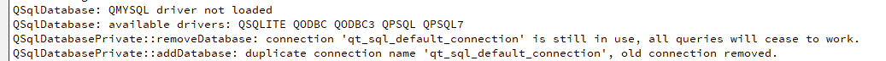
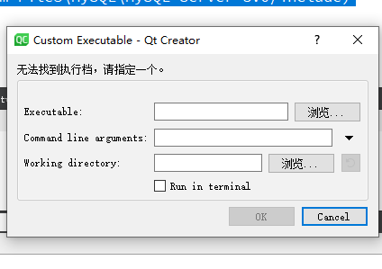

# 问题描述

~~~c++
    QSqlDatabase staticecgdb = QSqlDatabase::addDatabase("QMYSQL");
    staticecgdb.setHostName("127.0.0.1");
    staticecgdb.setDatabaseName("");
    staticecgdb.setUserName("");
    staticecgdb.setPassword("");
~~~

`QMYSQL driver not loaded`

当然，这是个老问题了，其实也就是记录一下，之前也知道这个问题原因在哪里。

# `Qt`数据库

因为 `QtSql`采用驱动插件的方式，而其他类封装了与不同数据库通信的借口。所以，`Qt`与数据库的通信与平台无关。当然，因为版权限制，所以，有些就没提供了，就比如说，`MySQL`，所以，这个就需要自己下载咯。

比如我的就需要把 `.dll`放入下面的地址，就qt的插件驱动目录文件夹。

~~~txt
C:\Qt\Qt5.14.2\5.14.2\mingw73_64\plugins\sqldrivers
~~~

所以，下载下面两个咯

* `qsqlmysql.dll`
* `qsqlmysqld.dll`

找半天，没找到，算了，自己编译吧。

找到源码下的 `mysql.pro`，打开。

~~~txt
C:\Qt\Qt5.14.2\5.14.2\Src\qtbase\src\plugins\sqldrivers\mysql
~~~

配置 pro文件

~~~properties
TARGET = qsqlmysql

HEADERS += $$PWD/qsql_mysql_p.h
SOURCES += $$PWD/qsql_mysql.cpp $$PWD/main.cpp

#QMAKE_USE += mysql  #！！注意要注释掉

OTHER_FILES += mysql.json

PLUGIN_CLASS_NAME = QMYSQLDriverPlugin
# ！！mysql的lib路径
LIBS += -L $$quote(C:\Program Files\MySQL\MySQL Server 8.0\lib) -llibmysql
# ！！mysql的include路径
INCLUDEPATH += $$quote(C:\Program Files\MySQL\MySQL Server 8.0/include)
# ！！mysql的include路径
DEPENDPATH += $$quote(C:\Program Files\MySQL\MySQL Server 8.0/include)

include(../qsqldriverbase.pri)

~~~

出现下面这个界面就编译好了

打开 `C:\plugins\sqldrivers`

拷贝这两个文件到 qt 相应的驱动目录

`C:\Qt\Qt5.14.2\5.14.2\mingw73_64\plugins\sqldrivers`

好了，完成一半了，剩下把 `mysql` 的`dll`转移到

`C:\Qt\Qt5.14.2\5.14.2\mingw73_64\bin`

但是遇到这么个报错

。。。。

咋回事啊，咋不按计划进行啊~~~

