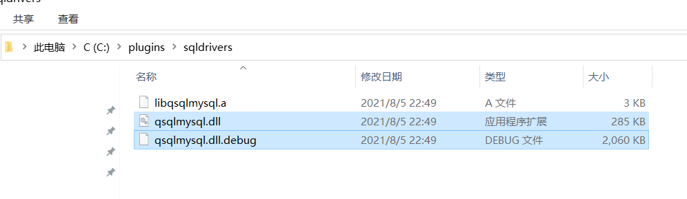
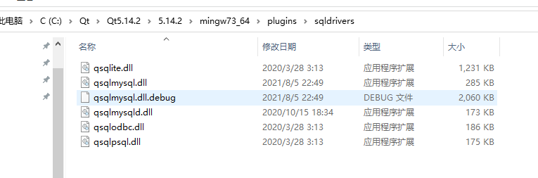
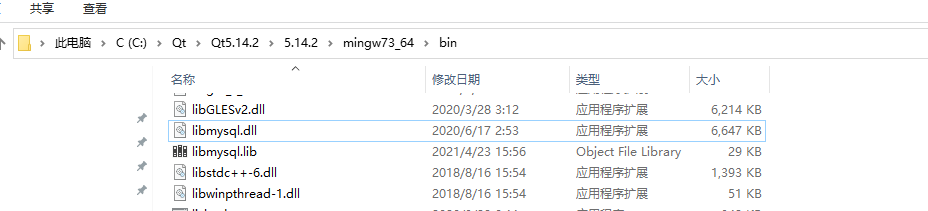
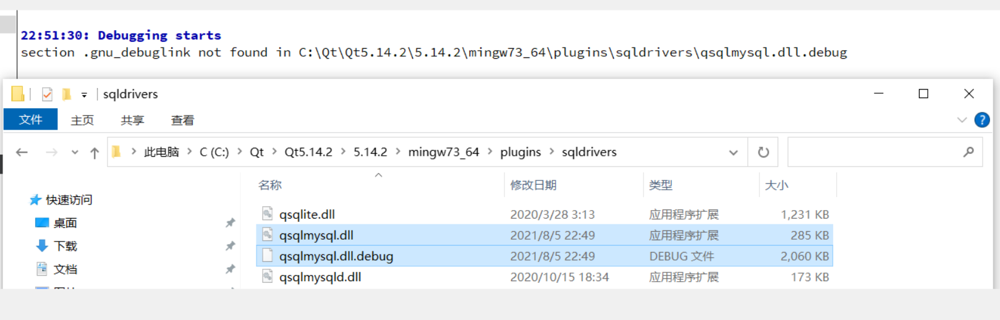

# 问题描述

~~~c++
    QSqlDatabase staticecgdb = QSqlDatabase::addDatabase("QMYSQL");
    staticecgdb.setHostName("127.0.0.1");
    staticecgdb.setDatabaseName("");
    staticecgdb.setUserName("");
    staticecgdb.setPassword("");
~~~

`QMYSQL driver not loaded`

当然，这是个老问题了，其实也就是记录一下，之前也知道这个问题原因在哪里。

# `Qt`数据库

因为 `QtSql`采用驱动插件的方式，而其他类封装了与不同数据库通信的借口。所以，`Qt`与数据库的通信与平台无关。当然，因为版权限制，所以，有些就没提供了，就比如说，`MySQL`，所以，这个就需要自己下载咯。

比如我的就需要把 `.dll`放入下面的地址，就qt的插件驱动目录文件夹。

~~~txt
C:\Qt\Qt5.14.2\5.14.2\mingw73_64\plugins\sqldrivers
~~~

所以，下载下面两个咯

* `qsqlmysql.dll`
* `qsqlmysqld.dll`

找半天，没找到，算了，自己编译吧。

找到源码下的 `mysql.pro`，打开。

~~~txt
C:\Qt\Qt5.14.2\5.14.2\Src\qtbase\src\plugins\sqldrivers\mysql
~~~

配置 pro文件

~~~properties
TARGET = qsqlmysql

HEADERS += $$PWD/qsql_mysql_p.h
SOURCES += $$PWD/qsql_mysql.cpp $$PWD/main.cpp

#QMAKE_USE += mysql  #！！注意要注释掉

OTHER_FILES += mysql.json

PLUGIN_CLASS_NAME = QMYSQLDriverPlugin
# ！！mysql的lib路径
LIBS += -L $$quote(C:\Program Files\MySQL\MySQL Server 8.0\lib) -llibmysql
# ！！mysql的include路径
INCLUDEPATH += $$quote(C:\Program Files\MySQL\MySQL Server 8.0/include)
# ！！mysql的include路径
DEPENDPATH += $$quote(C:\Program Files\MySQL\MySQL Server 8.0/include)

include(../qsqldriverbase.pri)

~~~

出现下面这个界面就编译好了

打开 `C:\plugins\sqldrivers`

拷贝这两个文件到 qt 相应的驱动目录

`C:\Qt\Qt5.14.2\5.14.2\mingw73_64\plugins\sqldrivers`

好了，完成一半了，剩下把 `mysql` 的`dll`转移到

`C:\Qt\Qt5.14.2\5.14.2\mingw73_64\bin`

但是遇到这么个报错

。。。。

咋回事啊，咋不按计划进行啊~~~，百度，必应，谷歌，群里，都没找到合适的答案啊。

先放着，继续写，看能否运行。

编写代码测试一下

~~~C++
    QSqlDatabase staticecgdb = QSqlDatabase::addDatabase("QMYSQL");
    staticecgdb.setHostName("localhost");
    staticecgdb.setPort(3306);
    staticecgdb.setDatabaseName("alan");
    staticecgdb.setUserName("root");
    staticecgdb.setPassword("");

    if(staticecgdb.open())
    {
        QSqlTableModel *model = new QSqlTableModel( nullptr, staticecgdb);
        model->setTable("userinfo");
        model->setEditStrategy(QSqlTableModel::OnManualSubmit);

        if(model->select())
        {
            model->setHeaderData(0, Qt::Horizontal, "id");
            model->setHeaderData(1, Qt::Horizontal, "username");
            model->setHeaderData(1, Qt::Horizontal, "password");

            QTableView *view = new QTableView;
            view->setModel(model);
            view->show();
        }
    }
~~~

得到结果，正确

任然有一个报错。

~~~txt
QSqlDatabasePrivate::removeDatabase: connection 'qt_sql_default_connection' is still in use, all queries will cease to work.
QSqlDatabasePrivate::addDatabase: duplicate connection name 'qt_sql_default_connection', old connection removed.
~~~

说，已经有一个这个默认连接名存在了，重复了。摊牌了，我是亿万富翁

装什么装，查看代码

~~~C++
int main(int argc, char *argv[])
{
    QApplication a(argc, argv);
    //MainWindow w;
    //w.show();

    //添加数据库驱动
    QSqlDatabase db = QSqlDatabase::addDatabase("QSQLITE");
    //设置数据库名称
    db.setDatabaseName(":memory:");
    //打开数据库
    if(!db.open())
    {
        return false;
    }

    //以下执行相关sql语句
    QSqlQuery query;

    //新建student表，id设置为主键，还有一个name项
    query.exec("create table student(id int primary key,name varchar)");

    //向表中插入3条记录
    query.exec("insert into student values(1,'xiaogang')");
    query.exec("insert into student values(2,'xiaoming')");
    query.exec("insert into student values(3,'xiaohong')");

    //查找表中id >=2 的记录的id项和name项的值
    query.exec("select id,name from student where id >= 2");

    //query.next()指向查找到的第一条记录，然后每次后移一条记录
    while(query.next())
    {
        //query.value(0)是id的值，将其转换为int型
        int value0 = query.value(0).toInt();
        QString value1 = query.value(1).toString();
        //输出两个值
        qDebug() << value0 << value1 ;
    }

    db.close();

#if 1
    QSqlDatabase::removeDatabase(":memory:");
#else
    QString name;
    {
        name = QSqlDatabase::database().connectionName();
    }//超出作用域，隐含对象QSqlDatabase::database()被删除。
    QSqlDatabase::removeDatabase(name);
#endif

    QSqlDatabase staticecgdb = QSqlDatabase::addDatabase("QMYSQL");
    staticecgdb.setHostName("localhost");
    staticecgdb.setPort(3306);
    staticecgdb.setDatabaseName("alan");
    staticecgdb.setUserName("root");
    staticecgdb.setPassword("kangrulai");

    if(staticecgdb.open())
    {
        QSqlTableModel *model = new QSqlTableModel( nullptr, staticecgdb);
        model->setTable("userinfo");
        model->setEditStrategy(QSqlTableModel::OnManualSubmit);

        if(model->select())
        {
            model->setHeaderData(0, Qt::Horizontal, "id");
            model->setHeaderData(1, Qt::Horizontal, "username");
            model->setHeaderData(1, Qt::Horizontal, "password");

            QTableView *view = new QTableView;
            view->setModel(model);
            view->show();
        }
    }

    return a.exec();
}

~~~

在链接 `MySQL`的时候，已经有一个连接（`QSQLITE`）了，他使用的也是默认连接，所以，冲突咯~~~~

**文档**

**查看文档咯：**[QSqlDatabase](https://doc.qt.io/qt-5/qsqldatabase.html#QSqlDatabase)

~~~C++
QSqlDatabase QSqlDatabase:: addDatabase (const QString & type , const QString & connectionName = QLatin1String(defaultConnection))
~~~

使用驱动程序*类型*和连接名称`connectionName`将数据库添加到数据库连接列表中。如果已经存在名为`connectionName`的数据库连接，则删除该连接。

数据库连接由`connectionName`引用。返回新添加的数据库连接。

如果*类型*不可用或无法加载，则[isValid](https://doc.qt.io/qt-5/qsqldatabase.html#isValid) () 返回`false`。

如果未指定`connectionName`，则新连接将成为应用程序的默认连接，后续不带连接名称参数的[database](https://doc.qt.io/qt-5/qsqldatabase.html#database) () 调用将返回默认连接。如果此处提供了`connectionName`，请使用 database( `connectionName`) 检索连接。

**警告：**如果添加与现有连接同名的连接，新连接将替换旧连接。如果您在未指定`connectionName`的情况下多次调用此函数，则默认连接将被替换。

当然，也可以通过一系列操作，不要这个警告，我们看到，`QSqlDatabase`中， 有一个 `removeDatabase`函数

[removeDatabase](https://doc.qt.io/qt-5/qsqldatabase.html#removeDatabase)： 删除数据库连接的`connectionName`从数据库连接列表。 

当然，也有个 `warrning`: 

**警告：**调用此函数时，数据库连接上不应有打开的查询，否则会发生资源泄漏。 

再说一次，`qt`的官方文档是真的好啊，例子都给你举齐了

~~~c++
// WRONG
QSqlDatabase db = QSqlDatabase::database("sales");
QSqlQuery query("SELECT NAME, DOB FROM EMPLOYEES", db);
QSqlDatabase::removeDatabase("sales"); // will output a warning
// "db" is now a dangling invalid database connection,
// "query" contains an invalid result set

//correct
{
    QSqlDatabase db = QSqlDatabase::database("sales");
    QSqlQuery query("SELECT NAME, DOB FROM EMPLOYEES", db);
}
// Both "db" and "query" are destroyed because they are out of scope
QSqlDatabase::removeDatabase("sales"); // correct
~~~

为什么这样就可以了？别忘了**作用域**，在出大括号后，db就释放了

 要删除默认连接，该连接可能是通过调用[addDatabase](https://doc.qt.io/qt-5/qsqldatabase.html#addDatabase) () 而未指定连接名称创建的，您可以通过对由[database](https://doc.qt.io/qt-5/qsqldatabase.html#database) ()返回的[数据库](https://doc.qt.io/qt-5/qsqldatabase.html#database)调用[connectionName](https://doc.qt.io/qt-5/qsqldatabase.html#connectionName) ()来检索默认连接名称。请注意，如果尚未创建默认数据库，则将返回无效数据库。 

[database](https://doc.qt.io/qt-5/qsqldatabase.html#database)

~~~c++
QSqlDatabase QSqlDatabase::database(const QString &connectionName = QLatin1String(defaultConnection), bool open = true)
~~~

 返回名为`connectionName`的数据库*连接*。数据库连接必须是之前用[addDatabase](https://doc.qt.io/qt-5/qsqldatabase.html#addDatabase) ()添加的。如果*open*为 true（默认值）并且数据库连接尚未打开，则现在将其打开。如果没有`connectionName`中*指定使用默认的连接。如果*`connectionName`中没有在数据库列表中存在，则返回一个无效的连接。 

**源码**

所以，这个的引用是添加的引用计数模式，所以就在最外面添加一层 `{}`，释放他咯

~~~c++
#include "mainwindow.h"

#include <QApplication>
#include <QSqlDatabase>
#include <QSqlQuery>
#include <QDebug>
#include <QSqlError>

#include <QSqlTableModel>
#include <QTableView>

int main(int argc, char *argv[])
{
    QApplication a(argc, argv);
    //MainWindow w;
    //w.show();

    {
        //添加数据库驱动
        QSqlDatabase db = QSqlDatabase::addDatabase("QSQLITE");
        //设置数据库名称
        db.setDatabaseName(":memory:");
        //打开数据库
        if(!db.open())
        {
            return false;
        }

        //以下执行相关sql语句
        QSqlQuery query;

        //新建student表，id设置为主键，还有一个name项
        query.exec("create table student(id int primary key,name varchar)");

        //向表中插入3条记录
        query.exec("insert into student values(1,'xiaogang')");
        query.exec("insert into student values(2,'xiaoming')");
        query.exec("insert into student values(3,'xiaohong')");

        //查找表中id >=2 的记录的id项和name项的值
        query.exec("select id,name from student where id >= 2");

        //query.next()指向查找到的第一条记录，然后每次后移一条记录
        while(query.next())
        {
            //query.value(0)是id的值，将其转换为int型
            int value0 = query.value(0).toInt();
            QString value1 = query.value(1).toString();
            //输出两个值
            qDebug() << value0 << value1 ;
        }

        db.close();

    }

#if 0
    QSqlDatabase::removeDatabase(":memory:");
#else
    QString name;
    {
        name = QSqlDatabase::database().connectionName();
    }//超出作用域，隐含对象QSqlDatabase::database()被删除。
    QSqlDatabase::removeDatabase(name);
#endif

    QSqlDatabase staticecgdb = QSqlDatabase::addDatabase("QMYSQL", "MySQL_alan");
    staticecgdb.setHostName("localhost");
    staticecgdb.setPort(3306);
    staticecgdb.setDatabaseName("alan");
    staticecgdb.setUserName("root");
    staticecgdb.setPassword("kangrulai");

    if(staticecgdb.open())
    {
        QSqlTableModel *model = new QSqlTableModel( nullptr, staticecgdb);
        model->setTable("userinfo");
        model->setEditStrategy(QSqlTableModel::OnManualSubmit);

        if(model->select())
        {
            model->setHeaderData(0, Qt::Horizontal, "id");
            model->setHeaderData(1, Qt::Horizontal, "username");
            model->setHeaderData(1, Qt::Horizontal, "password");

            QTableView *view = new QTableView;
            view->setModel(model);
            view->show();
        }
    }

    return a.exec();
}
~~~

# 遗留问题

~~~txt
section .gnu_debuglink not found in C:\Qt\Qt5.14.2\5.14.2\mingw73_64\plugins\sqldrivers\qsqlmysql.dll.debug
~~~

# 参考

[Qt源码](https://github.com/qt)

[QSqlDatabase](https://doc.qt.io/qt-5/qsqldatabase.html)

[博客](https://www.cnblogs.com/codingmylife/archive/2010/04/27/1722404.html)