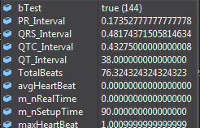
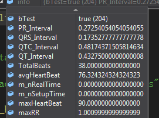
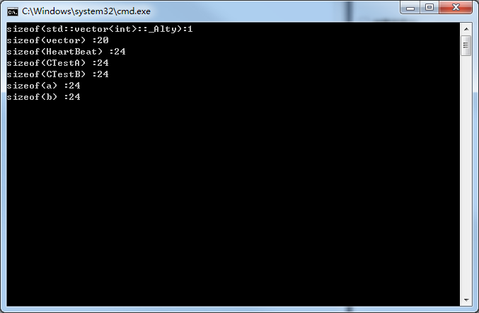

## 问题类

~~~c++
#ifdef CREATDLL_EXPORTS
#define DLL_API __declspec(dllexport)
#else
#define DLL_API __declspec(dllimport)
#endif

typedef std::vector<HeartBeat>		HeartBeatVect;

class DLL_API aly_alogrithm
{
public:
   /*
   部分接口
   */
public:
#if TestA	// error
	HeartBeatVect heart_beat_; 
	Aly_Result result_;
#else		// correct
    Aly_Result result_;
	HeartBeatVect heart_beat_;    
#endif
};
~~~

## 问题描述

​		今天遇到一个奇怪的问题，我用 `VS2019` 写了一个依赖项的 `dll`，在调用完 `dll` 最后一个接口后（主调项目为2010写的），去获取 `dll`的一个 `public`的成员变量，数据怎么获取都是错误，而且这个错误还挺有特色，好家伙，就差 8 个字节的偏移。

### 在外部获取成员变量

~~~c++
aly::Aly_Result result = dll.result_;
~~~

结果：值错误

* 类里面的数据值

* 类外的数据值

### 将结果作为返回值

#### Result 作为结果返回

直接将结果result_作为返回值，返回是正确的的。

#### 将`HeartBeatVect`作为返回值

直接返回heart_beat_结果正确

但是这里发现一个问题，因为 vector 会额外增加一部分数组大小作为备用，会不会是这一个原因导致了数据错误。

## 分析

### 字节对齐问题

就差 8 个字节的偏移，这里面肯定有文章。所以去检查了一下数据结构，类里面的成员是这样定义的。因为就差了 8 个字节，所以，可以考虑字节对齐的问题。可以作为一个测试点。但是考虑到如果单独返回，则程序结果又是正确的，所以这个也不太像是正确方向，倒是可以测试下vector所占字节数。

### `vector`容量问题

清除多余的容量 

~~~c++
vector::shrink_to_fit();
~~~

### DLL方向上的问题

### 2019和2010版本问题

## 测试

### 字节对齐问题

首先解释下 `sizeof()` 函数

 **sizeof** is a [unary operator](https://en.wikipedia.org/wiki/Unary_operator) in the programming languages [C](https://en.wikipedia.org/wiki/C_(programming_language)) and [C++](https://en.wikipedia.org/wiki/C%2B%2B). It generates the storage size of an expression or a [data type](https://en.wikipedia.org/wiki/Data_type), measured in the number of *char*-sized units.  

#### 程序

所以写程序测试：

~~~c++
// TestVector.cpp : 定义控制台应用程序的入口点。
//

#include "stdafx.h"

#include <vector>
#include <iostream>

using namespace std;

struct HeartBeat
{
	HeartBeat(){}
	int a;
	double b;
	int c;
};

class CTestA
{
public:
	int a;
	vector<HeartBeat > v;
};

class CTestB
{
public:
	vector<HeartBeat > v;
	int b;
};

int _tmain(int argc, _TCHAR* argv[])
{

	cout << "sizeof(std::vector<int>::_Alty):" << sizeof(std::vector<int>::_Alty) << endl;
	cout << "sizeof(vector) :"  <<  sizeof(vector<int>) << endl;
	cout << "sizeof(HeartBeat) :"  <<  sizeof(HeartBeat) << endl;
	cout << "sizeof(CTestA) :"  <<  sizeof(CTestA) << endl;
	cout << "sizeof(CTestB) :"  <<  sizeof(CTestB) << endl;

	CTestA a;
	a.v.push_back(HeartBeat());
	a.v.push_back(HeartBeat());
	a.v.push_back(HeartBeat());
	a.v.push_back(HeartBeat());

	CTestB b;
	b.v.push_back(HeartBeat());
	b.v.push_back(HeartBeat());
	b.v.push_back(HeartBeat());
	b.v.push_back(HeartBeat());

	cout << "sizeof(a) :"  <<  sizeof(a) << endl;
	cout << "sizeof(b) :"  <<  sizeof(b) << endl;

	getchar();
	return 0;
}

//
		// TEMPLATE CLASS _Vector_val
template<class _Ty,
	class _Alloc>
	class _Vector_val
		: public _Container_base
	{	// base class for vector to hold data
public:
	typedef typename _Alloc::template rebind<_Ty>::other _Alty;

 #if _ITERATOR_DEBUG_LEVEL == 0
	_Vector_val(_Alloc _Al = _Alloc())
		: _Alval(_Al)
		{	// construct allocator from _Al
		_Myfirst = 0;
		_Mylast = 0;
		_Myend = 0;
		}

	~_Vector_val()
		{	// destroy proxy
		}

 #else /* _ITERATOR_DEBUG_LEVEL == 0 */
	_Vector_val(_Alloc _Al = _Alloc())
		: _Alval(_Al)
		{	// construct allocator from _Al
		typename _Alloc::template rebind<_Container_proxy>::other
			_Alproxy(_Alval);
		this->_Myproxy = _Alproxy.allocate(1);
		_Cons_val(_Alproxy, this->_Myproxy, _Container_proxy());
		this->_Myproxy->_Mycont = this;

		_Myfirst = 0;
		_Mylast = 0;
		_Myend = 0;
		}

	~_Vector_val()
		{	// destroy proxy
		typename _Alloc::template rebind<_Container_proxy>::other
			_Alproxy(_Alval);
		this->_Orphan_all();
		_Dest_val(_Alproxy, this->_Myproxy);
		_Alproxy.deallocate(this->_Myproxy, 1);
		this->_Myproxy = 0;
		}
 #endif /* _ITERATOR_DEBUG_LEVEL == 0 */

	typedef typename _Alty::size_type size_type;
	typedef typename _Alty::difference_type difference_type;
	typedef typename _Alty::pointer pointer;
	typedef typename _Alty::const_pointer const_pointer;
	typedef typename _Alty::reference reference;
	typedef typename _Alty::const_reference const_reference;
	typedef typename _Alty::value_type value_type;

	pointer _Myfirst;	// pointer to beginning of array
	pointer _Mylast;	// pointer to current end of sequence
	pointer _Myend;	// pointer to end of array
	_Alty _Alval;	// allocator object for values
	};
~~~

测试结果：

两种类型的 `vector`类所占字节数相同。查看 `vector`源码，所占字节数。

>  类对象的存储空间大小 = 基类的存储空间 + 派生类特有的非static数据成员的存储空间 + 每一个类的虚函数存储空间（`sizeof(h)` = 12(E基类的存储空间) + 4(G特有的非static数据成员的存储空间) + 4（E类的虚函数的存储空间，如果E类中有多个虚函数，只算一次）+ 4（H类的虚函数的存储空间，如果H类中有多个虚函数，只算一次））。 

### `vector`容量问题

在程序 `dll`中 最后增加了 `shrink_to_fit() `后，仍然会出现那个问题。所以这个方向也排除。

### `DLL`方向上的问题

前面的测试和分析都排除了相应方向，可以考虑 `DLL` 方向上的问题，但是 `DLL` 和 `EXE`，加载到进程后系统分配空间。应该不会越过进程边界把。

## 结论

暂时未找到原因，但是把 两个成员的声明调换一下，结果就正确了，暂时先这样更改。后续可以了解一下  `dll` 相关知识，重新在深入了解下汇编，看一下类的编译结果，再来查看。

