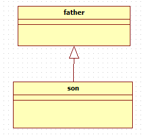

> 上次面试的时候，总监问到我这个问题，但是我只是知道使用，还不知道专业名字，现在来记录一下

# 总述

在面向对象的程序设计中，类的关系有6种关系

* 继承    is a					 是一个            Generalization
* 组合    has a                 有一个
* 聚合    one of one(s)    是总体中的一个
* 关联   
* 依赖    
* 实现    虚基类

# 继承(Generalization)

继承是面向对象的三大特征之一，是一种最能体现面向对象代码复用的类关系，对于继承，可以使用**"is a"**来表示，比如，小轿车(类B)**"is a"**车(类A)，是对车(类A)的进一步刻画，那么这两个类就是"继承"关系。

~~~c++
class Person
{
};
class  Worker : public Person {
    //子类扩展属性和方法
};
~~~

## **概念：**

泛化是一种**一般与特殊**、**一般与具体**之间关系的描述，具体描述建立在一般描述的基础之上，并对其进行了扩展。在`java`中用来表示继承的关系。

## **表示方法：**

用实线空心三角箭头表示。

# 组合(Composition)

组合是将一个对象（部分）放到另一个对象里（组合）。它是一种 **"has-a"** 的关系。相比"聚合"，组合是一种强所属关系，组合关系的两个对象往往具有相同的生命周期，被组合的对象是在组合对象创建的同时或者创建之后创建，在组合对象销毁之前销毁。

一般来说被组合对象不能脱离组合对象独立存在，而且也只能属于一个组合对象。比如，鸟类和翅膀类就是组合关系，在创建一个鸟类对象时，一定要同时或之后创建一个翅膀类对象，销毁一个鸟类对象时，一定要先同时或之前销毁翅膀对象。

在C++语法中，使用在一个类中包含另外一个类类型的成员来实现组合。

~~~c++
class Wing{ // 翅膀
};
class Bird{
    Wing wing;
};
~~~

## 概念：

组合也是关联关系的一种特例。组合是一种整体与部分的关系，即contains-a的关系，比聚合更强。部分与整体的生命周期一致，整体的生命周期结束也就意味着部分的生命周期结束，组合关系不能共享。程序中组合和关联关系是一致的，只能从语义级别来区分。

## 表示方法：

尾部为实心菱形的实现箭头（也可以没箭头），类A指向类B

# 聚合(Aggregation)

聚合是一种弱所属关系，比如一只大雁和雁群，就是一种"聚合"关系。和组合相比，被聚合的对象可以属于多个聚合对象，比如，一只大雁可能属于多个雁群。
在C++语法中，通过类的指针来实现聚合。

~~~c++
class Goose{	// 一只
};
class Geese{	// 多只
    public:
        Goose member[10];
};
~~~

## 概念：

聚合关联关系的一种特例，是强的关联关系。聚合是整体和个体之间的关系，即has-a的关系，整体与个体可以具有各自的生命周期，部分可以属于多个整体对象，也可以为多个整体对象共享。程序中聚合和关联关系是一致的，只能从语义级别来区分；

## 表示方法：

尾部为空心菱形的实线箭头（也可以没箭头），类A指向类B

# 关联(Association)

关联也是一种弱关系，但并不是从属关系，关联的连个的类可以看作是平等的，比如一只大雁和老鹰的关系，就可以看作关联关系
C++中，通过定义其他类指针类型的成员来实现关联，下面是双向关联的实现方法

~~~c++
class Egle{
    class Goose *food;
};
class Goose{
    class Egle *predator;
};
~~~

## **概念：**

表示类与类之间的联接,它使一个类知道另一个类的属性和方法，这种关系比依赖更强、不存在依赖关系的偶然性、关系也不是临时性的，一般是长期性的。`java`中一个类的全局变量引用了另一个类，就表示关联了这个类

## **表示方法：**

实线箭头，类A指向类B

# 依赖(Dependency)

一个对象的某种行为依赖于另一个类，比如，大雁的迁徙行为受季节影响，那么，大雁和季节就会有"依赖"关系。

C++语法中，通过将一个类作为另一类方法的参数的形式实现两个类之间的依赖关系

~~~c++
class Season{
}; 
class Goose{
    public:
       void Migrate(Season season); //或Migrate(Season *season)、Migrate(Season &season)
};
~~~

## **概念：**

是一种**使用**的关系，即一个类的实现需要另一个类的协助。`java`中，方法参数需要传入另一个类的对象，就表示依赖这个类。

## 表示方法：

虚线箭头，类A指向类B。

# 实现(Realization)

实现对应的是面向对象中的"接口"，即动物都要移动，但是每种移动的方式不一样，鸟要实现自己独有的移动的方法。
在C++中，接口通过的纯虚函数来实现，C++的多态就是通过虚函数来实现的。类似的桥接模式。

~~~c++
class Animal{
    public:
        vitual void move();
};
class Bird: public Animal{
    void move(){
        //鸟的移动方式，飞
    }
};
~~~

## **概念：**

实现是一种**类与接口**的关系，表示类是接口所有特征和行为的实现，在程序中一般通过类实现接口来描述

## **表示方法：**

空心三角形箭头的虚线，实现类指向接口

