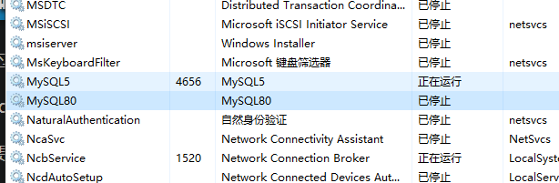
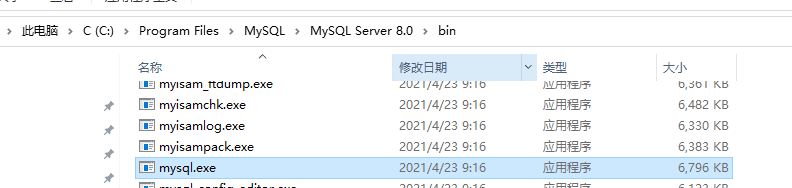
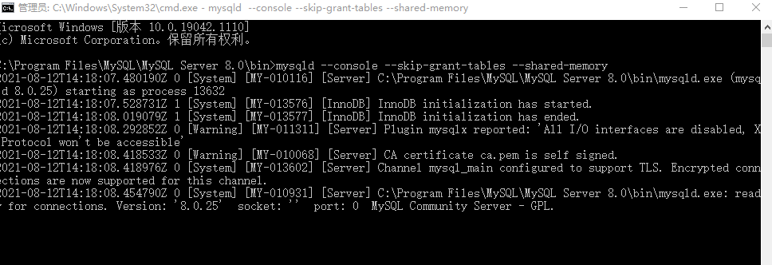
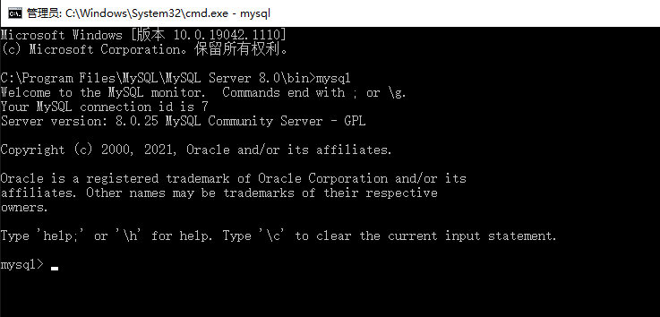
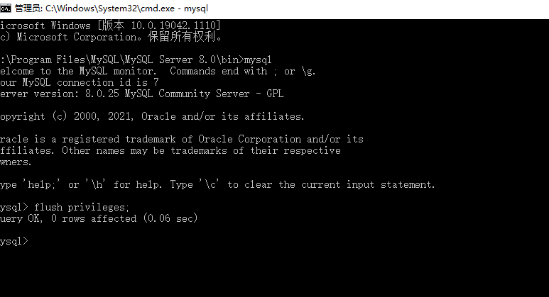
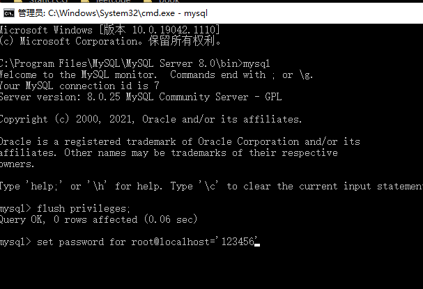
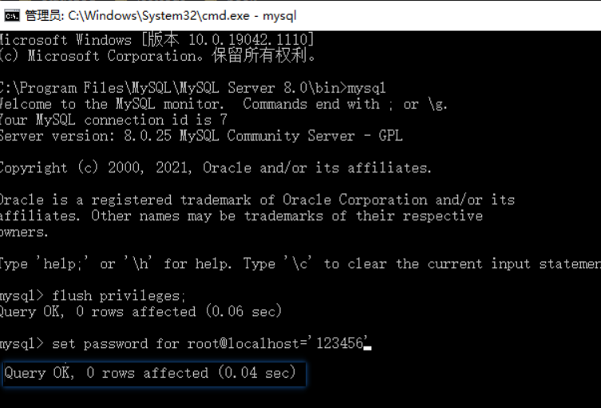
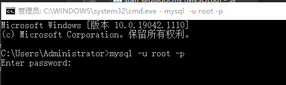
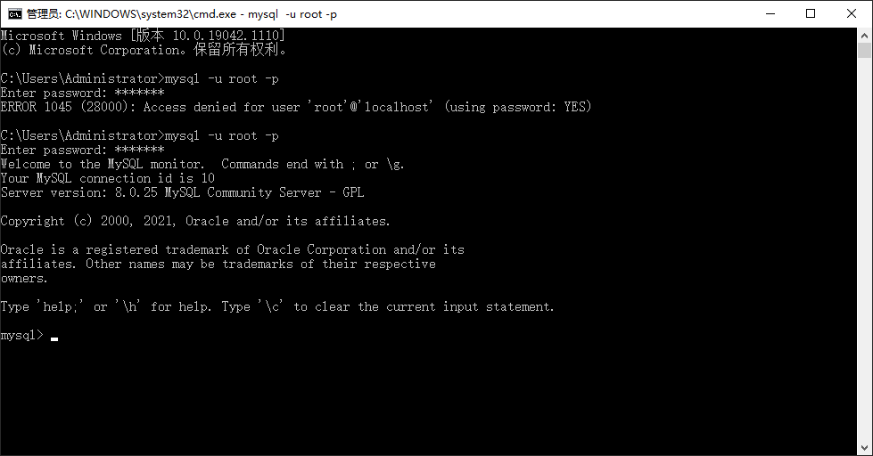
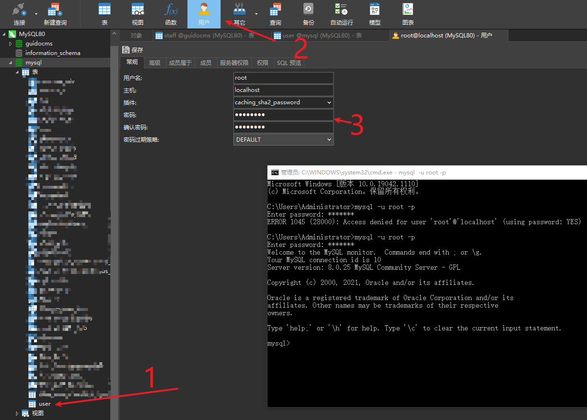

终究还是错付了~

终于还是把密码忘记了

记录 `MySQL` 密码修改

# 停止服务

`cmd` 或者直接服务管理界面关闭都可以，服务名看你自己的设置。

~~~shell
net stop MySQL80
~~~

# `CMD`打开`mysql`

打开`cmd`窗口

# 设置跳过密码

~~~shell
mysqld --console --skip-grant-tables --shared-memory
~~~

这时候是 光标一直闪，再打开一个 `terminal`

# 新开`terminal`

直接输入 `mysql` ，可以看到，已经能打开了

# 刷新权限

~~~shell
 flush privileges;
~~~

# 设置密码

比如设置 `123456`

~~~shell
set password for root@localhost='123456'
~~~

注意，最后还要加一个  `;`

# 成功

# 测试

## 打开服务

~~~shell
net start mysql80
~~~

## 打开终端

~~~shell
mysql -u root -p
~~~

# 另一种

