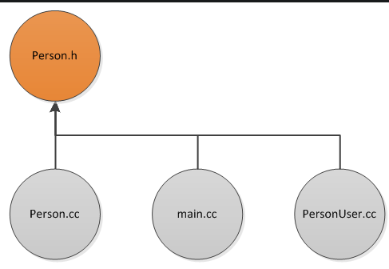
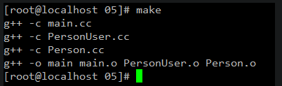
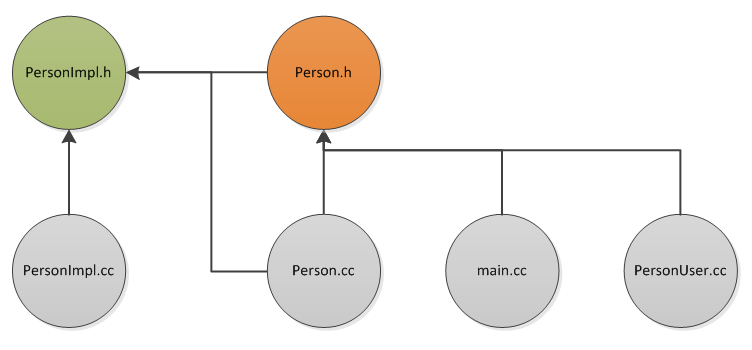
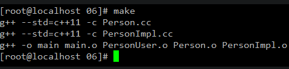

# 感谢

## [loverszhaokai](https://www.cnblogs.com/lovers/)

[PIMPL1](https://www.cnblogs.com/lovers/p/pimpl.html)

[PIMPL2](https://www.cnblogs.com/lovers/p/pimpl2.html)

《effective C++》 条款31：将文件间的编译关系降至最低

PIMPL Idiom： http://c2.com/cgi/wiki?PimplIdiom

# 场景

# PIMPL

​		PIMPL是指pointer to implementation。通过使用**指针的方式隐藏对象的实现细节**。是实现“将文件间的编译依存关系降至最低”的方法之一。另一个方式是通过接口实现，但其原理一样。

​		PIMPL又称作“编译防火墙”、“笑脸猫技术”，它只在C/C++等编译语言中起作用。

## 为什么要使用PIMPL

### 理论分析

庞大的项目，修改一个文件之后，重新编译，所有依赖该文件的文件都需要重新编译，导致编译时间太长。

## 工程实例

通过描述一个实例来证明上一小节的理论。

定义一个头文件，和几个依赖项来说明

### 不使用PIMPL

#### 示例

　文件间的依赖关系如图：

　有三个源文件依赖“Person.h”，实际中可以有更多个文件依赖它，为了说明意思，我源码写的都非常简单，主要是为了表明文件间的依赖关系而已。

~~~c++
// Person.h

#ifndef PERSON_H_
#define PERSON_H_
struct Person
{
  void print();
};
#endif
~~~

~~~c++
// Person.cc

#include "Person.h"
#include <iostream>

void
Person::print()
{
  std::cout << "Person::print()" << std::endl;
}
~~~

~~~c++
// PersonUser.cc

#include "Person.h"
~~~

~~~c++
// main.cc
#include "Person.h"
int main()
{
  return 0;
}
~~~

修改 ”Person.h“ 文件

~~~c++
#ifndef PERSON_H_
#define PERSON_H_

struct Person
{
  int i; // add int i
  void print();
};#endif
~~~

然后make，结果如下：

#### 结论

**依赖 ”Person.h“ 的头文件都被重新编译了，生成了链接文件 .o**

### 使用PIMPL

#### 示例

使用PIMPL需要将Person类的实现移到PersonImpl类中，使用指针的方式将实现隐藏，相当于Person.h只是一个傀儡而已，而以前依赖它的文件依旧依赖之，文件间的依赖关系如图：

有三个源文件依赖“Person.h”，实际中可以有更多个文件依赖它，有两个源文件和一个头文件依赖“PersonImpl.h”。

~~~c++
// main.cc
#include "Person.h"

int main()
{
  return 0;
}

~~~

~~~c++
// Person.h

#ifndef PERSON_H_
#define PERSON_H_
#include <memory>

struct PersonImpl;
struct Person
{
  void print();
 private:
  std::shared_ptr<PersonImpl> pImpl;
};
#endif
~~~

~~~c++
// Person.cc

#include "Person.h"
#include "PersonImpl.h"

void Person::print()
{
  pImpl->print();
}

~~~

~~~c++
//  PersonImpl.h
#ifndef PERSONIMPL_H_
#define PERSONIMPL_H_

struct PersonImpl
{
  void print();
};
#endif
~~~

~~~c++
// PersonImpl.cc

#include "PersonImpl.h"
#include <iostream>

void PersonImpl::print()
{
  std::cout << "PersonImpl::print()" << std::endl;
}

~~~

~~~c++
//  PersonUser.cc
#include "Person.h"
~~~

现在我们开始修改`PersonImpl.h`文件，注意这时候`Person.h`已经是傀儡了，如果想给`Person`增加属性那应该修改`PersonImpl.h`文件：

~~~c++
#ifndef PERSONIMPL_H_
#define PERSONIMPL_H_

struct PersonImpl
{
  int i; // add int i
  void print();
};
#endif
~~~

然后make，结果如下：

依赖`PersonImpl.h`的两个文件都重新编译了，而依赖于`“Person.h”`的文件`main.cc`和`PersonUser.cc`都没有重新编译。

### 对比结论

　　同样是一件事情，为`Person`类增加属性**`int i`**；两种方法导致编译的过程就不同，我们举得例子比较小，如果有100个类似`PersonUser`这样的文件，那么使用`PIMPL`，编译时还是只有`Person.cc`和`PersonImpl`两个文件重新编译了；但是不使用`PIMPL`的话，就是“`main.cc`”，“`Person.cc`”和100个类似“`PersonUser.cc`”这样的文件重新编译，那就是102个文件。

　　通过上面的实例就可证明理论分析部分了。

## 如何使用PIMPL

有多种方式实现PIMPL，这里按照《Effective C++》中介绍的方式。

### 基本步骤

假设原有Person如下：

~~~c++
// Person.h
struct Person
{
 public:
  Person(const int _age);
  void print();

 private:
  int age;
};
~~~

~~~c++
// Person.cc
Person::Person(const int _age)
    : age(_age)
{}

void Person::print()
{
  std::cout << "Person::print::age=" << age << std::endl;
}
~~~

#### 将Person改名为PersonImpl

~~~c++
// PersonImpl.h
struct PersonImpl
{
 public:
  PersonImpl(const int _age);
  void print();

 private:
  int age;
};
~~~

~~~c++
//  PersonImpl.cc
PersonImpl::PersonImpl(const int _age)
    : age(_age)
{}

void PersonImpl::print()
{
  std::cout << "PersonImpl::print::age=" << age << std::endl;
}
~~~

#### 抽象public和protected方法

将`PersonImpl`中的`public`和`protected`方法成`Person`。`Person`中的方法实际调用的是`PersonImpl`中对应的方法，`Person`的定义中需要使用`PersonImpl`，在`Person.h`文件中绝对不能`#include “PersonImpl.h”`，这样就是做无用功了。

- **为什么不能将PersonImpl的对象作为Person的成员变量？**

　　因为`Person`类的定义中需要知道该类的大小，如果直接使用`PersonImpl`的对象，那么就必须知道`PersonImpl`的定义，而我们恰恰希望在`Person`的定义中隐藏`PersonImpl`的定义。这时候，指针就大显神通了。因为指针的大小只与操作系统的位数有关（32位的机器都占4个字节，64位的机器都占8个字节），所以我们可以使用指针指向`PersonImpl`，从而只需要前置声明就可以了。这就是暗度陈仓吧。

~~~c++
// Person.h
struct PersonImpl;  // 前置声明，PIMPL的关键

struct Person
{
 public:
  Person(const int _age);
  void print();

 private:
  std::shared_ptr<PersonImpl> pImpl;  // 指针，暗度陈仓
};
~~~

~~~c++
// Person.cc
Person::Person(const int _age)
    : pImpl(new PersonImpl(_age))
{}

void Person::print()
{
  pImpl->print();
}
~~~

#### 使用Person

在其它地方我们就可以使用Person了，例如：

~~~c++
int main()
{
  Person p(1);
  p.print();
  
  return 0;
}
~~~

# 优缺点

## 优点

- 改变类的私有成员无需重新编译依赖它的文件，所以整个工程重新编译的速度会快很多。
- 头文件中采用声明式，因此编译时间会快很多。
- 接口与实现的分离，更有利于单元测试。

## 缺点

- 实现者需要做更多的工作。
- 代码会变得不易理解。
- 运行时动态的获取要执行的方法，性能降低。
- 需要注意定义拷贝构造换函数或将其禁用。

# 总结

　　如《Effective C++》中所说：

- 　　**如果使用`object reference`或`object pointers`可以完成任务，就不要使用`objects`**。
- 　　**尽量以`class`声明式替换`class`定义式**。

# 感悟

Qt 的 D指针技术应该也是借鉴了这个技术，