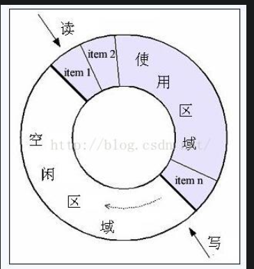

生产者生成数据，消费者消费数据，再拿鸭脖举例子。

比如，A 生产鸭脖，B，C，D 吃鸭脖，A 生产一个，B，C，D就需要吃一个鸭脖。假设 A 要生产100个。

如果 A生产贼快， B，C，D都是些老头儿老太太，啃不动鸭脖，那么 A 生产完第三个鸭脖的时候，就需要等待 B  C D啃完鸭脖再去生产了，因为生产了没人吃，所以就不能生产了。

那么，这时候就可以在中间放一个桶，A生产完了就往桶里面放，才不去管 B，C，D吃得慢不慢，啃得动不动。B，C，D吃完了就去桶里面再拿一个，你吃着火锅唱着歌都不管我 A 的事情，我只管生产我的。我生产完了，我也去刷权游了。

所以，这就抽象出一个蓝图

## 数据单元

此例子中就是**鸭脖**，在分析 数据单元 的时候，需要考虑下面的特性。

* **必须关联到某种逻辑。**

  > 此例中，鸭脖必须有人生产，有人吃，这才像话，没人生产，没人吃，生产有毛用啊

* **完整性**

  > 在传输过程中，要保证数据单元的完整，要么整个拿来吃，要不就不要拿，不允许你说拿半截鸭脖。

* **独立性**

  > 就是各个鸭脖之间没有依赖，鸭脖1坏了没有被吃不能影响鸭脖2被吃。当然，也不能影响鸭脖3号的生产。如果鸭脖没砍断（有依赖） 那么， 1号鸭脖快了就会影响 2号鸭脖的被吃，当然就会影响到 3号鸭脖的生产。这样也是不行的，所以需要相互独立。

* **颗粒性**

  > 有时候，会把 N 个数据单元打包 给一个逻辑处理，好比， B 一次可以拿 2 个鸭脖，那么这个考虑就需要 N 的设置大小了，如果 N 太大，一次拿 10 个，B老头吃都吃不下，嗝屁了咋办。一次嘴巴里面嚼两个还是可以的，那么就把这个颗粒性设置为 2。

## 缓冲区

### 优点

* **解耦**

  生产者 A 和 消费者 B，C，D 不需要知道之间的关系，就那上面的说，就是，不管你吃得慢不慢，快不快，不关我事。嘿嘿。

  > 转换到代码中：
  >
  > 就好比 A是一个类，B，C，D分别是一个类，你 B C D 有什么更改，我 A 不需要知道。就好比下面代码，你 B C D 以后将 `void GetFromBuffer()`更改为 `void GetFromBuffer1()` 我 A 不需要知道，我只管 `ToBuffer()`就行了。
  >
  > ~~~c++
  > class A
  > {
  > 	void ToBuffer(); 
  > };
  > class B
  > {
  > 	void GetFromBuffer();
  > 	void GetFromBuffer1();  
  > };
  > class C
  > {
  > 	void GetFromBuffer();  
  > };
  > class D
  > {
  > 	void GetFromBuffer();  
  > };
  > ~~~

* **支持并发**

  上述已经说了，如果没有缓冲区，那么 A需要直接调用 B C D的接口，那么在多线程的时候，如果A 生产贼快， B C D 贼慢，那么 A就要去等待，所以这个时间就浪费了。所以，增加缓冲区，就可以让 A 不依赖 B C D，直接继续生产。

* **支持闲忙不均**

  如果 A 快， B，C，D 慢那么，就可以将多生产的鸭脖放在桶里面了。

### 缓冲区方式

#### 队列缓冲区

好比一个水管

##### 线程方式

优缺点

* 内存分配的性能

  > A，B，C，D都是线程，A 生产了鸭脖，就把往水管里面放，B，C，D就从队列中拿出来，如果队列满了，A 就休息一哈，等B，C，D这几个老头儿老太太啃完了来再生产。
  >
  > 上述过程有一个问题就是，对于常见的队列，每次 push 的时候，就会涉及到内存堆的分配，每次 pop 的时候，会涉及到内存的释放。假如 A , B，C，D都很快，那么频繁的内存分配和释放开销就会很大。（ 分配堆内存（new或malloc）会有加锁的开销和用户态／核心态切换的开销。 ）	

* 同步和互斥的性能

  > 如果 B，C，D 都用同一个队列，那么可能会涉及线程间的同步，互斥，死锁等让人变得更强的问题（秃头），

* 适用队列的场合

  > 上面都是队列的缺点，优点就是 **不用造轮子** 可以捡现成的使用，如果在数据量不大的情况下，那么可以采用。主要还是方便。

##### 进程方式

跨进程的生产者和消费者就需要靠进程间通信（`IPC`）了。

* 匿名管道

  > 生产者生产，往管道里面丢，消费者去取就行了，这个和线程的区别就在于，不需要我们去操心线程安全和内存分配等问题。
  >
  > 生产者进程和消费者进程必须得在同一台主机上，无法跨机器通讯。
  >
  > 在一对一的情况下，这种方式挺合用。但如果要扩展到一对多或者多对一，那就有点棘手了。 
  >
  > 由于管道是shell创建的，对于两边的进程不可见（程序看到的只是stdio）。在某些情况下，导致程序不便于对管道进行操纵（比如调整管道缓冲区尺寸）。这个缺点不太明显。 
  >
  > 这种方式只能单向传数据。好在大多数情况下，消费者进程不需要传数据给生产者进程。万一你确实需要信息反馈（从消费者到生产者），那就费劲了。可能得考虑换种`IPC`方式。 

* SOCKET（TCP方式）

  > 可跨机器，那么就可以实现分布式，比如，重庆，南京（主机）都建一个厂，上海，北京（主机）的老头都可以吃。
  >
  > 可扩展成 一对多，或者多对一的方式，比如重庆，南京的厂，都往北京运，或者 重庆的厂发往上海和北京。
  >
  > 也可以设置阻塞或者非阻塞。
  >
  > 支持双向通信，比如重庆，南京的厂，都往北京运后，北京老头说你这个太辣了，给我弄个芝麻酱味道的，那重庆的可能没办法（兽人永不为奴，辣椒永不离嘴），南京的生产下一批的时候就可以给北京的弄麻将味道的。
  >
  >  
  >
  > 虽然 TCP 还是不错的，但是跨服聊天，总有想不到的事情，比如，妈老汉拔你网线？？？？？？所以，这时候我TM就裂了啊，没问题，这时候就需要新的对策。我在本地存储一下下，嘿嘿。发现发不上去了，检查网线有毛病了，我去把网线插上，再发送给北京老头。完美~~~~
  >
  > 所以抽象蓝图就可以这样
  >
  > 
  >
  > 再建立一个发送线程，从本地缓冲区拿数据。本地缓冲区就可以是本地的数据库啊这些了撒，**就好比离线操作，上线的时候再同步。**

#### 环形缓冲区

普通队列。一端写入  push 一端写出  pop。队列空的时候，不能读取数据。队列满时，不能写入。环形缓冲区外部使用也一样，内部就不同了，突出在  环 。

所以，可以想成一个操场，警察 追 法外狂徒张三，当 P 追上 Z 的时候，就把抓到了，那就没有坏人抓了，就相当于空了，如果，Z 都追上（增加Z） P 了，那么操场上就全是坏人了。就相当于缓冲区满了。

所以，这里相对于队列缓冲区的优势就出来了：

鸭脖和鸭脖的大小空间相等，那么鸭脖1号被吃了，鸭脖2号就可以占鸭脖一号的坑。不用在申请一块空间去放鸭脖2号了。少了很多缓冲区元素控件的释放和分配。